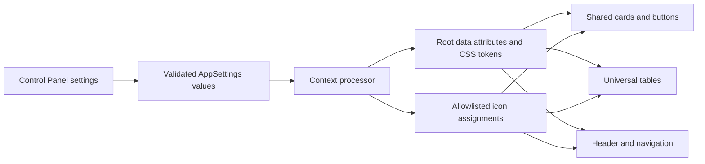
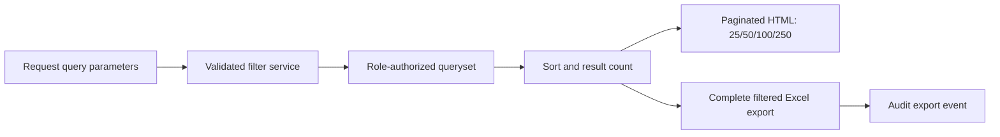
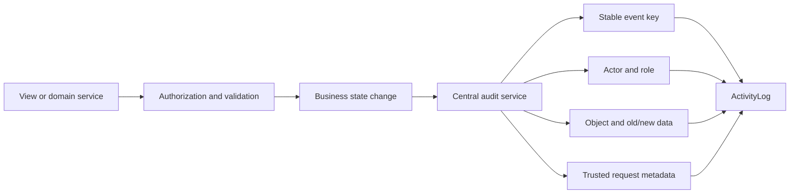

# QCMS UI/UX Standardization Master Plan

## 1. Purpose

This document defines a professional, enterprise-grade UI/UX standardization roadmap for QCMS. It is based on a repository-wide review of the Django templates, shared styles, page-specific styles, navigation configuration, table implementations, notification interface, profile interface, and `ActivityLog` usage.

The plan is intentionally implementation-oriented. It establishes one configurable design system while preserving the existing business workflows, role permissions, table action alignment, and responsive behavior.

## 2. Executive Assessment

QCMS has a useful foundation: shared sidebar, table, notification, and UI styles already exist, and the main application areas use recognizable patterns. The current experience is nevertheless inconsistent because shared styles are frequently overridden by page-level CSS and inline template styles.

The highest-impact issues are:

1. Cards use several unrelated radii, shadows, hover distances, and interaction models.
2. Buttons are redefined in multiple files, producing inconsistent height, radius, hover, focus, disabled, and cursor behavior.
3. Icons come from embedded SVG masks, emoji, text glyphs, and bitmap images.
4. Collection tables do not share a complete search/filter/export/pagination contract.
5. Pagination defaults currently vary between 8, 10, and 20 records.
6. Profile identity is not consistently shown in the application header.
7. Notification administration is named and positioned like an end-user inbox rather than a control function.
8. Activity logging covers many administrative changes but does not yet provide complete workflow, security, notification, export, or settings coverage.

The recommended direction is a server-rendered QCMS design system built from CSS design tokens, reusable Django partials, narrowly scoped JavaScript controllers, allowlisted Lucide icons, and admin-managed appearance settings. Avoid introducing a second frontend framework solely for standardization.

## 3. Current UI Inventory

### 3.1 Layouts and navigation

- Admin pages inherit from `frontend/templates/admin_panel/admin_base.html`.
- User, HOD, and Management pages inherit from `frontend/templates/user_panel/base_user.html`.
- Sidebar appearance is largely centralized in `frontend/static/shared/sidebar.css`.
- Admin and role-based menus are assembled separately in backend view helpers.
- Header identity is text-only; the notification bell is appended beside the welcome message.
- Admin navigation currently exposes `Control Panel`, `Notifications`, and `Logs` as peer items.

### 3.2 Shared UI foundations

- `frontend/static/shared/ui_system.css` defines general cards, buttons, form controls, toolbars, and modals.
- `frontend/static/shared/table_system.css` defines base table appearance and compact table action buttons.
- `frontend/static/shared/sidebar.css` contains sidebar layout and embedded icon masks.
- Notification styling and behavior are isolated in shared notification CSS and JavaScript.

These files should become the authoritative foundation. Today, several module styles and inline template blocks redefine their behavior.

### 3.3 Major duplication points

- `.btn` is independently styled in shared UI CSS, admin base, admin users, checklist fill, and both profile templates.
- `.card`, `.mini-card`, `.dashboard-mini-card`, `.users-mini-card`, `.cp-card`, `.ns-card`, `.panel-card`, and `.q-card` use different elevation rules.
- Search actions use both text and emoji buttons.
- Close actions use different text glyphs.
- Sidebar icons use SVG masks while notification, search, headings, and other controls use emoji or text symbols.
- Pagination markup and page sizes are implemented independently per view.

## 4. Module Card Standardization

### 4.1 Current findings

- Admin dashboard statistic cards are semantic buttons and provide hover lift and shadow. This is a good accessibility base.
- Admin user summary cards look similar but are non-interactive and use different dimensions and elevation.
- Response statistic cards reuse dashboard card classes without a formal component contract.
- Control Panel, Notification Control, profile, checklist fill, and login surfaces use unrelated card radii and shadows.
- Management dashboard currently has placeholder content and no established module-card standard.
- Icon placement is not systematic; many cards have no icon, while some headings depend on emoji.
- Click feedback is mostly hover-only. Active/pressed and keyboard focus states are inconsistent.

### 4.2 Card component contract

Create one `qcms-card` component family:

- `qcms-card--module`: navigates to a module.
- `qcms-card--metric`: selects or explains a dashboard metric.
- `qcms-card--surface`: groups a form or detail area and is not clickable.
- `qcms-card--compact`: supports dense dashboard or control-panel layouts.

Rules:

- Use `<a>` for navigation, `<button>` for an in-page action, and `<section>` or `<div>` for non-interactive surfaces.
- Never add `cursor: pointer` to a non-interactive card.
- Keep the whole clickable card as one focus target; do not place nested buttons inside it.
- Maintain a stable card size so hover and dynamic values do not shift the layout.
- Use an optional 40 px icon region followed by title, value, and supporting text.
- Use `:focus-visible`, `:active`, and `prefers-reduced-motion` in every profile.
- Selected metric cards must have a non-color indicator such as border, check mark, or `aria-pressed` state.

### 4.3 Selectable card styles

#### Option A: Corporate Minimal

| Attribute | Standard |
|---|---|
| Hover motion | No lift; border and background transition in 120 ms |
| Shadow | Rest: none; hover: `0 2px 8px rgba(15, 23, 42, .08)` |
| Border | 1 px neutral border; 6 px radius; selected state uses 2 px primary border |
| Icon | 36 px neutral icon tile, single-color 20 px icon |
| Cursor | Pointer only on clickable module/metric cards |
| Click feedback | 1 px inset shadow or slight background darkening |
| Accessibility | Strong focus ring, no motion dependency, minimum 4.5:1 text contrast |

Best for dense operational users and long daily sessions.

#### Option B: Modern Enterprise

| Attribute | Standard |
|---|---|
| Hover motion | `translateY(-2px)` over 160 ms |
| Shadow | Rest: `0 1px 3px`; hover: `0 8px 20px rgba(15, 23, 42, .10)` |
| Border | 1 px subtle border; 8 px radius; optional 3 px semantic accent edge |
| Icon | 40 px tinted tile with 20 px Lucide icon |
| Cursor | Pointer on interactive cards; default on information surfaces |
| Click feedback | Return to `translateY(0)` with reduced shadow |
| Accessibility | Motion disabled under reduced-motion preference; visible focus ring |

This is the recommended QCMS default. It is expressive enough to clarify interaction without becoming decorative.

#### Option C: Premium Executive

| Attribute | Standard |
|---|---|
| Hover motion | `translateY(-3px)` plus very small scale, maximum `1.005` |
| Shadow | Rest: layered soft shadow; hover: `0 14px 30px rgba(15, 23, 42, .14)` |
| Border | 1 px translucent neutral border; 8 px radius; restrained accent highlight |
| Icon | 44 px high-contrast icon tile; optional semantic accent background |
| Cursor | Pointer on interactive cards with clear active compression |
| Click feedback | `translateY(-1px)` and lower elevation |
| Accessibility | Never communicate state through elevation alone; reduced-motion fallback required |

Use for executive dashboards, not dense administration forms or every content section.

### 4.4 Global selection

Add one allowlisted Control Panel setting: `card_profile = corporate | modern | premium`. Apply it as `data-card-profile` on the root application element. CSS tokens should change appearance without branching template markup.

## 5. Centralized Button System

### 5.1 Current inconsistencies

- Button radius ranges from approximately 8 px to pill-shaped 20 px.
- Heights, padding, and font size vary by page.
- Hover motion exists on some controls and not others.
- Focus-visible treatment is incomplete.
- Disabled state is not centrally defined.
- Text, emoji, and glyph-only controls use different sizing and alignment.
- `.btn`, `.btnx`, `.ns-save`, table actions, and page-specific buttons overlap in purpose.
- Search, clear, export, approve, reject, submit, and destructive actions do not share a single semantic hierarchy.

### 5.2 Button component contract

Use one component namespace and variants:

- `.qcms-btn--primary`: primary page action such as Save or Submit.
- `.qcms-btn--secondary`: supporting action such as Cancel or Clear Filters.
- `.qcms-btn--success`: explicit approval or positive workflow action.
- `.qcms-btn--danger`: reject, deactivate, or delete.
- `.qcms-btn--outline`: lower-emphasis command.
- `.qcms-btn--ghost`: toolbar or compact secondary command.
- `.qcms-btn--icon`: familiar icon-only command with tooltip and accessible name.
- `.qcms-btn--table`: compact table action, always in a left-aligned action group.

Required states:

- Rest, hover, focus-visible, active, loading, and disabled.
- Minimum 36 px height for dense desktop controls and 40-44 px touch target on mobile.
- Stable width while loading to prevent layout movement.
- Icons at 16-18 px, placed before text except directional next actions.
- Destructive actions must not rely on red alone; include text or an accessible label.
- Disabled controls use reduced contrast, `cursor: not-allowed`, and native `disabled` or `aria-disabled` semantics.

### 5.3 Selectable button profiles

#### Profile A: Corporate

- 6 px radius.
- No vertical movement.
- 120 ms background, border, and color transition.
- Subtle darkening on hover and inset feedback on active.
- Best for dense administrative screens.

#### Profile B: Modern

- 8 px radius.
- Maximum `translateY(-1px)` on hover.
- 150 ms color, shadow, and transform transition.
- Small shadow on hover; active state returns to rest position.
- Recommended default.

#### Profile C: Premium

- 10 px radius, not pill-shaped by default.
- `translateY(-1px)` with a layered hover shadow.
- Stronger active compression and polished loading state.
- Reserve expressive treatment for primary commands; table controls remain compact and quiet.

### 5.4 Action-column rule

All action headers, cells, and action groups must remain left-aligned across Admin, User, HOD, and Management tables. Use a shared flex container:

- `justify-content: flex-start`
- consistent 6-8 px gap
- wrapping on narrow widths
- deterministic action order: View, Edit/Fill, Approve, Reject, Download, More

Do not center action controls even when other columns are centered.

### 5.5 Global selection

Add `button_profile = corporate | modern | premium` to Control Panel and expose it as `data-button-profile`. Profile selection changes interaction tokens, not semantic colors or permissions.

## 6. Cursor Standard

### 6.1 Current findings

Pointer cursors are correctly present on many buttons, the sidebar toggle, the bell, notification rows, and clickable dashboard cards. The problem is governance: cursor behavior is defined locally and is not guaranteed to match semantic interactivity or disabled state.

### 6.2 Baseline cursor rules

| Element | Cursor |
|---|---|
| Buttons, links, clickable cards, close buttons | `pointer` |
| Non-interactive cards, labels, status badges | `default` |
| Text input and editable text | `text` |
| Disabled controls | `not-allowed` |
| Select controls | Profile-dependent `default` or `pointer`, but consistent globally |
| Drag handle only | `grab`, then `grabbing` |
| Resize handle only | Appropriate resize cursor |
| Context help with tooltip | `help` |

Never use a pointer merely to make a surface feel active. The DOM behavior, keyboard behavior, focus state, and cursor must agree.

### 6.3 Selectable cursor profiles

#### Option A: Classic Enterprise

- Native default cursor for selects and form fields.
- Pointer only for links and buttons.
- No cursor changes on row hover unless the entire row is actionable.

#### Option B: Modern SaaS

- Pointer for buttons, links, clickable cards, select controls, tabs, and clickable notification rows.
- Default for table rows with separate action buttons.
- Recommended default.

#### Option C: Premium Interactive

- Same semantic rules as Modern SaaS.
- Adds `grab/grabbing` for supported drag-and-drop builders and `help` for contextual help.
- Does not use custom image cursors or decorative cursor effects.

Add `cursor_profile = classic | modern | premium` as a global root attribute. Accessibility semantics must remain identical across profiles.

## 7. Notification Control Naming and Navigation

### 7.1 Naming recommendation

Rename the administrative page and navigation item from `Notifications` or `Notification Center` to **Notification Control**.

Use the names consistently:

- **Notifications**: the personal bell, drawer, and history visible to an authenticated recipient.
- **Notification Control**: the Admin configuration page for global, priority, event, retention, popup, and sound settings.

This separates consumption from administration and prevents ambiguity.

### 7.2 Navigation placement

Preferred information architecture:

```text
Control Panel
|- General Appearance
|- Security and Geolocation
|- Notification Control
|- Icon Gallery
`- UI Profiles
```

If nested navigation is deferred, retain a peer item named `Notification Control`, but give it a distinct icon and place it immediately after `Control Panel`.

### 7.3 Icon recommendation

- Personal notification drawer: `Bell`.
- Unread/activity state: `BellRing`.
- Notification Control: `BellRing` with a settings context, or `Bell` beside `SlidersHorizontal` in the page heading.
- Control Panel: `Settings` or `SlidersHorizontal`.
- Security notifications: `ShieldAlert`.
- Approved/rejected notifications: `CircleCheck` and `CircleX`.

The current notification navigation item should not reuse the Control Panel icon.

## 8. Global Icon Gallery

### 8.1 Current icon audit

QCMS currently combines:

- Embedded SVG mask icons in sidebar CSS.
- Emoji for the bell, search controls, and some headings.
- Text glyphs for close and add actions.
- Bitmap branding and profile images.

The mixture causes inconsistent stroke weight, optical size, alignment, accessibility, and rendering across operating systems.

### 8.2 Recommended icon library

Use **Lucide Icons** as the single interface icon library.

Reasons:

- Consistent 24 px grid and stroke language.
- Broad coverage for administration, users, projects, checklists, security, logs, settings, and notifications.
- Easy to package locally, avoiding a production CDN dependency.
- Supports icon names as stable allowlisted configuration values.
- Familiar appearance without visual noise.

Brand logos and user-uploaded profile images remain image assets. They are not part of the interface icon library.

### 8.3 Storage strategy

Do not store raw administrator-supplied SVG or HTML. Store only allowlisted icon keys.

Recommended structure:

- Versioned local Lucide asset bundle or generated SVG sprite.
- `IconRegistry` in application code or a versioned JSON manifest containing key, Lucide name, category, keywords, and minimum supported version.
- Admin configuration stores slot-to-icon mappings in `AppSettings.theme_settings` initially.
- Introduce a dedicated model only if per-tenant, per-role, or historical icon configuration becomes necessary.
- Validate every saved icon key against the registry.
- Provide a safe fallback icon when a key is retired.

Example slots:

```text
navigation.dashboard
navigation.checklists
navigation.responses
navigation.users
navigation.departments
navigation.projects
navigation.control_panel
navigation.notification_control
navigation.audit_logs
navigation.profile
navigation.logout
action.search
action.clear_filters
action.export
action.approve
action.reject
```

### 8.4 Icon picker design

- Search by icon name and keywords.
- Filter by Navigation, Workflow, User, Checklist, Project, Department, Notification, Security, Audit, and General categories.
- Display icons in a keyboard-accessible grid.
- Show icon name below each preview; do not rely on the picture alone.
- Offer Reset to Default per slot and Reset Category.
- Prevent the same icon from being accidentally assigned to semantically conflicting neighboring navigation items, while allowing an explicit override.

### 8.5 Preview design

Provide three synchronized preview areas:

1. Sidebar preview at expanded and collapsed widths.
2. Header and notification preview on light and dark header colors.
3. Button/table preview at 16, 18, 20, and 24 px sizes.

The preview must expose focus state, selected state, disabled state, and high-contrast mode before saving.

## 9. ActivityLog Coverage Audit

### 9.1 Currently logged actions

Repository review confirms logging for many important events, including:

- Login success, login failure, and logout.
- Profile image update success/failure.
- Password change success and selected failed attempts.
- Checklist viewed, printed, and PDF downloaded.
- Checklist WIP saved and submitted.
- Checklist created, updated, status-changed, and deleted by Admin.
- Response approved/rejected and deleted through Admin actions.
- Role permission changes.
- User created, updated, activated/deactivated, and deleted.
- Department and project creation, update, and deletion.
- Notification settings changes.
- Permission-denied events used for threshold detection.

### 9.2 Coverage weaknesses

- Normal HOD approval/rejection and Management override decisions are not consistently represented as explicit audit events.
- Several records use broad action names such as `Department Changes`, which makes reporting less precise.
- Settings changes do not consistently record structured old/new values.
- Attachment access and export activity are not comprehensively logged.
- Security notifications and blocked protected actions do not always have a corresponding durable audit event.
- Notification lifecycle operations are not covered by a formal logging policy.
- IP extraction trusts forwarded headers without a documented trusted-proxy boundary; production audit attribution should use Django proxy settings and trusted infrastructure.

### 9.3 Missing audit events

#### User actions

- Response detail viewed.
- Attachment uploaded, replaced, removed, downloaded, or blocked.
- Rejected response edited and resubmitted as a distinct event.
- Submission validation failure category, without storing sensitive answer content.
- Geolocation captured, denied, unavailable, invalid, or omitted because tracking is disabled.
- Notification marked read, all marked read, or deleted, subject to the event-volume policy below.
- Profile data changed with allowlisted old/new fields.
- Failed password confirmation or password-policy result currently not captured in every branch.

#### HOD actions

- Approval queue viewed.
- Response detail and attachment viewed/downloaded.
- Response approved, including prior/new status and whether a comment was supplied.
- Response rejected, including prior/new status and reason presence; avoid duplicating confidential reason text unnecessarily.
- Approval attempt blocked because the HOD is not assigned.
- User assignment and removal acknowledgement.
- Filtered queue export.

#### Management actions

- Response detail and attachment viewed/downloaded.
- Override approval and override rejection, explicitly marked as override actions.
- Override attempt denied.
- Filtered response export.
- Management dashboard report export.

#### Admin actions

- Control Panel save and reset.
- Branding, theme, geolocation, card, button, cursor, and icon settings changed.
- Assigned HOD changed, with previous/new HOD identifiers.
- Role change and permission elevation as distinct high-value events.
- Response detail/attachment access and filtered exports.
- Audit log viewed and exported.
- Notification test executed.
- Notification retention cleanup initiated/completed.
- Protected decision-history edit/delete attempt blocked.
- Bulk administrative actions with affected count and scoped identifiers.

#### Security actions

- Suspicious or spoofed upload rejected.
- Oversized upload rejected.
- Unauthorized attachment access blocked.
- Repeated permission denials and threshold notification creation.
- CSRF/session/authentication security rejection where safely observable.
- Invalid/non-finite geolocation rejected.
- Immutable audit or decision record mutation blocked.
- Account deactivation/reactivation and role elevation.
- Requests with untrusted proxy/IP metadata, when detected by deployment controls.

#### Notification actions

- Notification generated for high-value workflow/security events.
- Notification delivery suppressed because an event or global setting is disabled.
- Test notification generated.
- Bulk mark-read and bulk deletion.
- Retention purge execution and result.
- Notification Control setting changes with old/new values.

#### Settings actions

- General settings changed or reset.
- UI profile changed.
- Individual icon assignment changed/reset.
- Notification event priority, enabled state, popup state, colors, sound, bell, and retention changed.
- Geolocation tracking enabled/disabled.
- Role permissions changed with structured before/after values.

### 9.4 Audit architecture recommendation

Use a single service-level audit API for every state-changing operation. Define an event catalog with stable machine keys, human labels, module, severity, retention class, and data schema.

Apply three recording tiers:

- **Mandatory:** authentication, permission, workflow status, role, assignment, protected data access, security, exports, deletion, and settings changes.
- **Operational:** meaningful views, downloads, notification bulk actions, and workflow queue actions.
- **Telemetry only:** high-volume UI interactions such as tab clicks or each notification read. These should not flood the legal/audit record unless policy requires them.

“100% audit coverage” should mean every material business or security action is covered, not every mouse click. Add automated tests that assert each cataloged mandatory event is emitted by its corresponding service path.

## 10. Universal Table Framework

### 10.1 Current table audit

| Module/Table | Search | Filters | Clear | Export | Pagination | Current default | Main gap |
|---|---:|---:|---:|---:|---:|---:|---|
| Admin Users | Yes | Department, project, status | No explicit control | No | Yes | 10 | Export, clear, page size |
| Admin Checklists | Yes | Type, status | No explicit control | PDF per record only | Yes | 8 | Dataset export, clear, page size |
| Admin Responses | Yes | Project, department, status, date | No explicit control | No | Yes | 10 | Export, clear, page size |
| Admin Audit Logs | Yes | Date, department, user, project, action, status | No explicit control | No | Yes | 20 | Export, clear, page size |
| Departments | No | No | No | No | No | All | Full data-grid controls |
| Projects | No | No | No | No | No | All | Full data-grid controls |
| User/HOD/Management Checklists | No | No | No | No | Yes | 8 | Search/filter/page size; export by permission |
| User/HOD/Management Responses | No | No | No | No | Yes | 10 | Search/filter/page size; export by permission |
| Dashboard recent submissions | No | No | No | No | Fixed preview | Limited preview | Link to full table rather than duplicate controls |
| Role permissions matrix | Specialized | Role sections | N/A | No | No | All | Treat as configuration matrix |
| Notification event settings | No | Category absent | N/A | No | No | All | Add search/category when event catalog grows |
| Checklist builder matrices | Local search | Specialized | Local clear | No | No | All | Keep specialized builder behavior |

### 10.2 Scope classification

The universal framework must apply to business data grids: Users, Checklists, Responses, Departments, Projects, Audit Logs, and role-visible checklist/response collections.

Dashboard previews, permission matrices, notification configuration matrices, and checklist-builder matrices should use specialized variants. They should reuse visual tokens but are not required to offer Excel export or dataset pagination.

### 10.3 Required framework behavior

Every business data grid must support:

- Search.
- Contextual filters.
- Clear Filters.
- Export Excel.
- Pagination.
- Page Size Selector.
- Default page size: 25.
- Allowed page sizes: 25, 50, 100, 250.
- Empty state and no-filter-results state.
- Result count and current range.
- Responsive horizontal overflow without clipping actions.
- Query-string persistence for search, filters, sort, page, and page size.

### 10.4 Export contract

Excel export must:

- Reuse the same backend filter service or queryset builder as the HTML table.
- Export the complete filtered dataset, not only the current page.
- Apply role and object-level authorization before querying.
- Export only columns the requesting role may view.
- Use stable, localized headings and machine-safe values.
- Apply a practical row limit or queue very large exports in a future phase.
- Log requester, role, filters, exported row count, and module.
- Neutralize spreadsheet formula injection by escaping values beginning with `=`, `+`, `-`, or `@` where appropriate.

### 10.5 Recommended implementation architecture

- One query/filter service per domain, reused by list views and export views.
- One validated `page_size` helper with allowlist `[25, 50, 100, 250]`.
- One reusable Django toolbar partial.
- One pagination partial that preserves query parameters.
- One table empty-state partial.
- One export service with column definitions and permission-aware serializers.
- One small JavaScript controller only for progressive enhancements; core search, filters, and pagination remain server-rendered and accessible.
- Continue using `table_system.css`, but promote it into the authoritative data-grid component layer.

## 11. Header Identity Recommendation

### 11.1 Current state

Admin and user headers display a welcome string followed by the notification bell. Profile images appear on profile pages, and the current fallback uses the QCMS logo rather than a personal identity fallback.

### 11.2 Recommended header structure

Before `Welcome, Username`, display:

- A 32-36 px circular profile image when available.
- A fallback avatar using the user’s initials, not the application logo.
- The welcome/name label.
- The notification bell.

Make the identity group a link to Profile. Use `object-fit: cover`, a fixed aspect ratio, a neutral fallback background, and a safe two-character initials generator.

### 11.3 Responsive behavior

#### Desktop

- Avatar, `Welcome, Full Name`, optional role label, then notification bell.
- Keep the page title left and identity/actions right.

#### Tablet

- Avatar, shortened name, and bell.
- Hide the welcome prefix before hiding the name.

#### Mobile

- Avatar and bell remain visible.
- Hide long name text where space is constrained.
- Provide an accessible label/title with full name and role.
- Ensure both controls retain at least a 40 px touch target.

## 12. Accessibility Standards

- Meet WCAG 2.2 AA contrast targets.
- Provide a clear 2 px focus-visible ring with sufficient offset.
- Preserve semantic buttons and links; do not use clickable `div` elements.
- Honor `prefers-reduced-motion` for card, button, drawer, and modal animation.
- Keep touch targets at least 40 px, targeting 44 px on mobile.
- Pair icons with accessible names and tooltips where meaning is not universal.
- Keep status, selected, and priority meaning independent of color alone.
- Ensure modal focus trapping, Escape close behavior, focus return, and labeled dialog headings.
- Maintain left-aligned table actions and predictable keyboard order.
- Test at 200% zoom and common high-contrast settings.

## 13. Recommended Architecture

### 13.1 Design-token layer

Create semantic CSS variables for:

- Color: background, surface, border, text, muted text, primary, success, warning, danger, focus.
- Spacing: 4, 8, 12, 16, 24, 32 px scale.
- Radius: compact, control, surface.
- Elevation: none, low, medium, high.
- Motion: fast, normal, emphasized, easing.
- Control sizing: compact, default, touch.

Component CSS consumes semantic tokens. Admin profiles only change token values.

### 13.2 Component layer

Recommended reusable partials/components:

```text
shared/components/card.html
shared/components/button.html or documented button classes
shared/components/icon.html
shared/components/header_identity.html
shared/components/table_toolbar.html
shared/components/table_pagination.html
shared/components/table_empty_state.html
shared/components/status_badge.html
shared/components/modal.html
```

Avoid a generic template component that hides complex role permissions. Keep authorization decisions in views/services and presentation consistency in partials.

### 13.3 Settings layer

Initially store these validated keys in `AppSettings.theme_settings`:

```json
{
  "card_profile": "modern",
  "button_profile": "modern",
  "cursor_profile": "modern",
  "icon_assignments": {}
}
```

Keep hardcoded safe defaults in code. Reject unknown profile and icon values. Cache the singleton settings object briefly and invalidate it on save.

### 13.4 Presentation flow



### 13.5 Universal table flow



### 13.6 Audit event flow



## 14. Duplicate-System Risks

| Risk | Consequence | Prevention |
|---|---|---|
| Shared and page-level button rules coexist | Visual regressions and unpredictable cascade | Deprecate old selectors in a migration sequence; add visual regression pages |
| Lucide introduced without removing emoji/masks | A fifth icon system instead of one standard | Maintain an icon migration inventory and ban new emoji interface icons |
| Table partial added while views keep custom filtering | HTML and export results disagree | Reuse the same domain queryset/filter service |
| Settings duplicated across JSON and dedicated models | Conflicting sources of truth | Define ownership: AppSettings for UI profiles; NotificationSetting for notification behavior |
| Client-side-only profile switching | Flashing and inaccessible initial state | Render validated root attributes server-side |
| Global CSS changes applied in one release | Large regression surface | Migrate module by module behind profile defaults |
| Audit logging added directly in templates or signals | Duplicate or missing events | Emit from domain/view services after successful authorization and transaction |
| Configurable raw SVG storage | Stored XSS and inconsistent rendering | Store only allowlisted icon keys |
| Export built from current page object | Incomplete business reports | Export from the filtered unpaginated authorized queryset |

## 15. Priority Order

1. Establish design tokens, accessibility baseline, and component ownership.
2. Standardize buttons and cursor semantics.
3. Standardize the header identity and navigation naming.
4. Build Universal Table Framework and filtered export architecture.
5. Standardize dashboard/module cards and add global profiles.
6. Consolidate icons and introduce Global Icon Gallery.
7. Complete material ActivityLog coverage.
8. Remove deprecated selectors and duplicated implementations.
9. Add visual regression, keyboard, responsive, and accessibility gates.

## 16. Implementation Phases

### Phase 0: Baseline and governance

**Objectives**

- Capture screenshots of every role and major viewport.
- Create an inventory of CSS selectors, templates, table endpoints, icons, and audit events.
- Define browser support and WCAG 2.2 AA acceptance criteria.
- Freeze new page-specific `.btn`, `.card`, icon glyph, and pagination implementations.

**Deliverables**

- UI inventory and visual baseline.
- Design-token specification.
- Component ownership and naming standard.
- Automated lint/review checklist.

### Phase 1: Quick consistency foundation

**Objectives**

- Rename Admin navigation/page to Notification Control.
- Add header profile picture and initials fallback.
- Standardize focus-visible and reduced-motion rules.
- Enforce cursor semantics and left-aligned table actions.
- Replace emoji search, bell, close, and heading icons with initial Lucide set.
- Introduce shared button classes without changing business logic.

**Risk:** Low to medium. Mostly presentation changes, but header and modal keyboard behavior require role-based testing.

### Phase 2: Universal Table Framework

**Objectives**

- Implement page sizes 25, 50, 100, and 250 with default 25.
- Build shared toolbar, clear filters, result count, pagination, and empty states.
- Add permission-aware Excel export of the complete filtered dataset.
- Migrate Users, Checklists, Responses, Logs, Departments, and Projects.
- Migrate role-facing checklist and response tables.

**Risk:** Medium to high. Filter parity, export authorization, large result sets, and spreadsheet injection require strong tests.

### Phase 3: Cards and global interaction profiles

**Objectives**

- Introduce card, button, and cursor profile settings.
- Make Modern Enterprise/Modern/Modern SaaS the defaults.
- Migrate admin dashboard, response metrics, user summaries, Control Panel, profile, and workflow surfaces.
- Add a preview panel before saving profile changes.

**Risk:** Medium. CSS cascade and responsive sizing are the primary concerns.

### Phase 4: Global Icon Gallery

**Objectives**

- Package Lucide locally.
- Build the allowlisted icon registry and semantic slot mapping.
- Add searchable picker, category filters, previews, and reset controls.
- Remove embedded sidebar masks and remaining emoji/glyph interface icons.

**Risk:** Medium. Ensure safe fallback behavior and no raw SVG administration path.

### Phase 5: Audit coverage completion

**Objectives**

- Create stable event catalog and centralized audit service contract.
- Add missing HOD, Management, Admin, security, notification, settings, attachment, and export events.
- Record structured old/new data for material changes.
- Add tests for mandatory event coverage and trusted IP handling.
- Define retention and redaction policy.

**Risk:** Medium to high. Sensitive data, duplicate events, transaction ordering, and log volume require governance.

### Phase 6: Cleanup and quality gates

**Objectives**

- Remove deprecated selectors and duplicated partials.
- Add cross-role visual regression coverage.
- Test desktop, tablet, and mobile at 100% and 200% zoom.
- Add keyboard-only, reduced-motion, and high-contrast checks.
- Establish a UI release checklist and component documentation page.

**Risk:** Low after migrations are complete; removal must be based on repository usage checks.

## 17. Quick Wins

1. Rename the Admin item and page heading to `Notification Control`.
2. Replace the notification menu’s reused Control Panel icon with `BellRing`.
3. Add avatar/initials before the welcome name in both base headers.
4. Add a shared disabled button state and `:focus-visible` rule.
5. Enforce `justify-content: flex-start` on every table action group.
6. Add explicit Clear Filters links that preserve no filter state.
7. Change all business table defaults to 25 using one page-size helper.
8. Replace emoji search and bell symbols with Lucide icons.
9. Stop using the application logo as the profile-avatar fallback.
10. Log HOD decisions and Management overrides with explicit event names.

## 18. High-Impact Changes

- Universal Table Framework: improves every collection workflow and reporting path.
- Shared button system: immediately reduces inconsistency across every module.
- Complete audit event catalog: materially improves accountability and security review.
- Admin-selectable card/button/cursor profiles: delivers global control without template forks.
- Icon registry and gallery: removes a persistent source of visual and maintenance inconsistency.
- Header identity standard: improves orientation and confidence across all roles and devices.

## 19. Acceptance Criteria

The standardization program is complete when:

1. No new page defines a private `.btn` or general `.card` system.
2. Every interactive control has matching semantic, keyboard, focus, cursor, and disabled behavior.
3. All table action groups are left-aligned.
4. All business data grids use the same search/filter/clear/export/pagination contract.
5. Default page size is 25 and only 25, 50, 100, and 250 are accepted.
6. Excel export matches the complete filtered, authorized queryset.
7. Admin can select card, button, cursor, and icon assignments without code changes.
8. Raw SVG/HTML cannot be saved through the icon administration feature.
9. Notification Control is clearly separated from personal Notifications.
10. Profile identity works consistently on desktop, tablet, and mobile.
11. Every material business/security action has a cataloged and tested audit event.
12. The experience passes keyboard, reduced-motion, contrast, responsive, and 200% zoom review.

## 20. Final Recommendation

Adopt **Modern Enterprise cards**, **Modern buttons**, and the **Modern SaaS cursor profile** as the QCMS defaults. They provide clear interaction feedback while preserving the restrained, work-focused character appropriate for a quality-control system.

The implementation should extend the existing Django and shared-CSS architecture rather than replace it. The central principle is one source of truth per concern: one token layer, one component family, one icon registry, one table/filter/export pipeline, and one audit event catalog. Admin configurability should select allowlisted values within that architecture, never create parallel markup or unrestricted visual assets.
