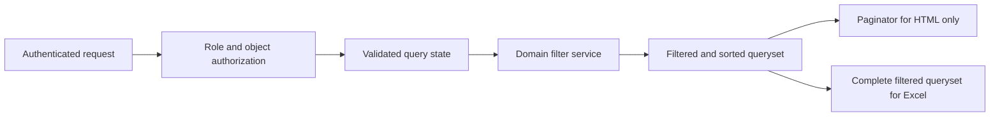
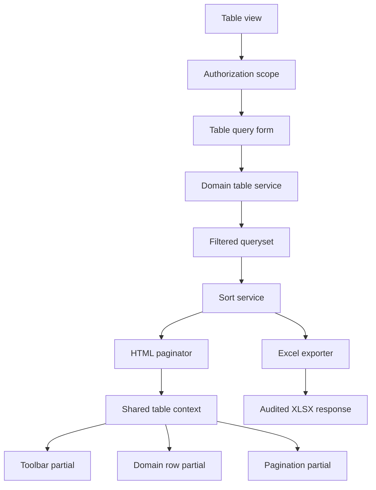

# QCMS Universal Table Framework Plan

## 1. Purpose

This document audits every custom table currently rendered by QCMS and defines a reusable Universal Table Framework for consistent search, filtering, filter reset, Excel export, pagination, and page-size behavior.

The audit covers Admin, User, HOD, and Management interfaces. It distinguishes business data grids from configuration matrices and dashboard previews so that QCMS gains consistency without adding meaningless controls to small, task-specific tables.

## 2. Executive Summary

QCMS currently has a shared visual table stylesheet and two reusable row-table partials, but it does not yet have a shared table behavior architecture. Search, filters, pagination, query-string handling, sorting, and rendering are implemented independently in individual views and templates.

The main findings are:

1. No QCMS business table currently supports Excel export.
2. No table supports a page-size selector.
3. Existing page sizes are inconsistent: 8, 10, and 20 rows.
4. Admin Checklists, Admin Responses, Activity Logs, My Checklists, and My Submissions are paginated in Python but render no pagination navigation. Records beyond the first page may therefore be inaccessible through the visible UI.
5. Projects and Departments have no search, filters, clear-filter action, export, or pagination.
6. User/HOD/Management checklist and response tables have no search, filters, clear-filter action, export, visible pagination, or page-size selector.
7. Filtered list queries and future export queries do not yet share a reusable domain filter service.
8. Table CSS is partially centralized, but page-level CSS still restyles generic `table`, `th`, `td`, `thead`, and `.table-container` selectors.
9. Configuration matrices such as Notification Control and role permissions should reuse table visuals and accessibility behavior, but should not automatically inherit business-grid export or pagination requirements.

The recommended solution is a server-rendered Django framework with:

- One validated query-state contract.
- One filter/query service per domain.
- Shared toolbar, active-filter, table-shell, pagination, page-size, empty-state, and export components.
- Permission-aware Excel exports generated from the complete filtered queryset before pagination.
- A standard default of 25 rows with allowlisted options 25, 50, 100, and 250.

## 3. Audit Scope and Table Classification

### 3.1 Business data grids

These tables represent persistent collections and should implement the full Universal Table Framework:

- Admin Users.
- Admin Projects.
- Admin Departments.
- Admin Checklists.
- User/HOD/Management My Checklists.
- Admin Responses.
- User/HOD/Management My Submissions.
- Admin Activity Logs.

### 3.2 Dashboard preview tables

- Admin Dashboard Recent Submissions.

This table is intentionally a fixed preview of the eight most recent responses. It should reuse table visuals but should not contain a second full filtering/export implementation. It should provide a clear link to the complete Responses data grid.

### 3.3 Configuration matrices

- Response role-permission matrix.
- Notification Control event-settings matrix.
- Checklist builder metadata summary matrix.

These are editable settings surfaces, not ordinary record collections. They should use the framework’s visual, responsive, focus, header, empty-state, and alignment primitives. Search/filter behavior may be added when the number of rows justifies it, but Excel export, standard pagination, and page-size controls are not mandatory.

### 3.4 Non-table collection surfaces

The personal notification drawer is implemented as a list of notification articles rather than an HTML table. It is outside the table framework, although its All, Unread, and Action Required filters should follow the same query-state naming principles where practical.

No custom Checklist Type management table currently exists. Checklist types appear as filter and builder options.

## 4. Current Table Audit

### 4.1 Admin Users

**Location**

- Template: `frontend/templates/admin_panel/admin_users.html`
- View: `backend/views/admin.py::admin_users`

**Current behavior**

- Search by username, first name, and last name.
- Filters by department, project, and active/inactive status.
- Clear action is labeled `Reset Filters`.
- Sorting exists for username, full name, role, department, project, and status.
- Visible Previous/Next pagination exists.
- Fixed page size: 10.
- No page-size selector.
- No Excel export.

**Issues**

- Pagination is implemented with page-specific markup rather than a shared component.
- The pagination query string is assembled manually in the view.
- Sort links and pagination state are maintained separately.
- Search does not include email, employee ID, role, assigned HOD, project, or department text.
- There is no result range such as `1-10 of 83`.
- There is no active-filter summary.
- Current branch markup around the Status and Action cells should be validated before the framework migration: the Status cell carries an action-column class and opens an action wrapper, while the following action cell lacks that class. A semantic table component would make this class of structural regression easier to prevent.

### 4.2 Admin Projects

**Location**

- Template: `frontend/templates/admin_panel/admin_projects.html`
- View: `backend/views/admin.py::admin_projects`

**Current behavior**

- Displays all projects ordered by ID.
- Supports modal create/edit/delete actions.
- No search.
- No filters.
- No clear-filter action.
- No sorting.
- No pagination.
- No page-size selector.
- No Excel export.

**Recommended filters**

- Status.
- Domain.
- Created-date range.
- Updated-date range.

**Recommended search fields**

- Code.
- Name.
- Domain.

### 4.3 Admin Departments

**Location**

- Template: `frontend/templates/admin_panel/admin_departments.html`
- View: `backend/views/admin.py::admin_departments`

**Current behavior**

- Displays all departments ordered by ID.
- Supports modal create/edit/delete actions.
- No search.
- No filters.
- No clear-filter action.
- No sorting.
- No pagination.
- No page-size selector.
- No Excel export.

**Recommended filters**

- Status.
- Created-date range.
- Updated-date range.

**Recommended search fields**

- Code.
- Name.

### 4.4 Admin Checklists

**Location**

- Template: `frontend/templates/admin_panel/admin_checklists.html`
- Shared table: `frontend/templates/admin_panel/partials/checklist_table.html`
- View: `backend/views/admin.py::admin_checklists`

**Current behavior**

- Search by checklist ID or checklist name.
- Filters by checklist type and active/inactive status.
- Clear action is labeled `Reset Filters`.
- Backend pagination exists.
- Fixed page size: 8.
- The view exposes AJAX page metadata, but the rendered page and reviewed JavaScript do not provide visible pagination controls.
- No page-size selector.
- No Excel export.
- No sorting controls.

**Issues**

- Users may not be able to reach checklist records after page one.
- The AJAX response and server-rendered partial provide parallel rendering paths.
- Projects are loaded into the view but are not available as a list filter.
- Departments are loaded into the view but are not available as a list filter.
- Search/filter state is not represented in a reusable query object.

**Recommended filters**

- Checklist type.
- Project.
- Department.
- Status.
- Updated-date range.

### 4.5 User/HOD/Management My Checklists

**Location**

- Template: `frontend/templates/user_panel/my_checklists.html`
- Shared table: `frontend/templates/admin_panel/partials/checklist_table.html`
- View: `backend/views/user_panel.py::my_checklists`

**Current behavior**

- Role-scoped queryset.
- Backend pagination exists.
- Fixed page size: 8.
- No visible pagination controls.
- No search.
- No filters.
- No clear-filter action.
- No page-size selector.
- No Excel export.

**Issues**

- Records beyond the first page may be inaccessible in the UI.
- The shared table supports role-specific actions, but the surrounding toolbar behavior is not shared.
- HOD, Management, and User may need different filter visibility while retaining one query contract.

**Recommended filters**

- Checklist type.
- Department where meaningful for the role.
- Project where meaningful for the role.
- Status.
- Updated-date range.

### 4.6 Admin Responses

**Location**

- Template: `frontend/templates/admin_panel/admin_responses.html`
- Shared table: `frontend/templates/admin_panel/partials/response_table.html`
- View: `backend/views/admin.py::admin_responses`

**Current behavior**

- Search by checklist ID, checklist name, or submitting username.
- Filters by project, department, status, submission date from, and submission date to.
- Clear action is labeled `Reset Filters`.
- Backend pagination exists.
- Fixed page size: 10.
- No visible pagination controls.
- No page-size selector.
- No Excel export.
- No column sorting.
- Dashboard statistics and charts correctly use the filtered queryset before pagination.

**Issues**

- Responses after page one may be inaccessible in the UI.
- Query behavior is embedded directly in the view and would need to be duplicated for export.
- Search does not include HOD, project name, department name, status, response ID, or updated-by name.
- Export must honor role-visible columns and must never expose attachment URLs or unauthorized response records.

**Recommended filters**

- Existing project, department, status, and date filters.
- Checklist type.
- Assigned HOD.
- Submitted user.
- Updated-by user.
- Has attachment.
- Has location data, if operationally useful and privacy-approved.

### 4.7 User/HOD/Management My Submissions

**Location**

- Template: `frontend/templates/user_panel/my_submissions.html`
- Shared table: `frontend/templates/admin_panel/partials/response_table.html`
- View: `backend/views/user_panel.py::my_submissions`

**Current behavior**

- Uses role-scoped response authorization.
- Uses role-configured visible columns and allowed actions.
- Backend pagination exists.
- Fixed page size: 10.
- No visible pagination controls.
- No search.
- No filters.
- No clear-filter action.
- No page-size selector.
- No Excel export.

**Issues**

- Records beyond page one may be inaccessible.
- User, HOD, and Management need different export columns and permitted query scope.
- HOD filtering must not weaken assigned-HOD approval rules or response visibility rules.
- Management export must remain oversight-only and preserve current authorization semantics.

**Recommended role-aware filters**

- User: checklist, status, submission date.
- HOD: user, project, department, checklist, status, submission date.
- Management: user, HOD, project, department, checklist, status, submission date.

### 4.8 Admin Activity Logs

**Location**

- Template: `frontend/templates/admin_panel/admin_logs.html`
- View: `backend/views/admin.py::admin_logs`

**Current behavior**

- Global search across description, username, department, project, action type, status, and IP.
- Filters by date range, department, user, project, action type, and status.
- Backend pagination exists.
- Fixed page size: 20.
- No visible pagination controls.
- No clear-filter action.
- No page-size selector.
- No Excel export.
- No sorting controls.

**Issues**

- Logs after page one may be inaccessible through the UI.
- The most compliance-sensitive table cannot currently export a complete filtered audit report.
- The filter bar can become very wide and has no active-filter summary.
- User and action-type dropdowns can become expensive and unwieldy as data grows.

**Recommended filters**

- Existing filters.
- Role.
- Module.
- IP address exact/contains mode if needed.
- Status.
- Date/time range with explicit timezone display.

### 4.9 Admin Dashboard Recent Submissions

**Location**

- Template: `frontend/templates/admin_panel/admin_dashboard.html`
- View: `backend/views/admin.py::admin_dashboard`

**Current behavior**

- Displays the eight most recent responses.
- No search, filters, clear action, export, pagination, or page-size selector.

**Assessment**

This is acceptable for a dashboard preview. Add a `View All Responses` link carrying any selected dashboard status filter. Do not duplicate the full table toolbar inside the dashboard.

### 4.10 Response Role-Permission Matrix

**Location**

- Template: `frontend/templates/admin_panel/admin_responses.html`

**Current behavior**

- Four fixed rows: User, HOD, Management, and Admin.
- Edit action opens a configuration dialog.
- No search, filters, clear action, export, pagination, or page-size selector.

**Assessment**

This is a small configuration matrix. Full data-grid features are not appropriate. It should use the shared table shell, responsive behavior, action alignment, and accessible edit controls only.

### 4.11 Notification Control Event Matrix

**Location**

- Template: `frontend/templates/admin_panel/admin_notification_settings.html`

**Current behavior**

- Lists each event with Enabled, Priority, and Popup controls.
- No search.
- No category filter.
- No clear-filter action.
- No export.
- No pagination.
- No page-size selector.
- Uses a private `.ns-events` CSS implementation.

**Assessment**

This is a configuration matrix. It should migrate to a `table--settings` framework variant. As the event catalog grows, add client- or server-side search and category filtering. Pagination and Excel export are not recommended because the table is one configuration form and must submit as a coherent unit.

### 4.12 Checklist Builder Metadata Matrix

**Location**

- Template: `frontend/templates/admin_panel/checklist_create.html`

**Current behavior**

- One-row summary for checklist ID, name, type, project, department, and edit action.
- No search, filters, clear action, export, pagination, or page-size selector.

**Assessment**

This is a builder summary, not a data grid. It should use the framework’s compact/settings table visuals only. No list controls are required.

## 5. Missing Features Matrix

Legend:

- **Yes**: currently implemented and visible.
- **Backend only**: pagination exists but visible controls are absent.
- **Missing**: required for a business data grid.
- **Optional**: beneficial for a growing configuration matrix.
- **N/A**: intentionally not applicable.

| Table | Search | Filters | Clear Filters | Excel Export | Pagination | Page Size | Current Rows | Classification |
|---|---|---|---|---|---|---|---:|---|
| Admin Users | Yes | Yes | Yes, named Reset | Missing | Yes | Missing | 10 | Business grid |
| Admin Projects | Missing | Missing | Missing | Missing | Missing | Missing | All | Business grid |
| Admin Departments | Missing | Missing | Missing | Missing | Missing | Missing | All | Business grid |
| Admin Checklists | Yes | Yes | Yes, named Reset | Missing | Backend only | Missing | 8 | Business grid |
| My Checklists | Missing | Missing | Missing | Missing | Backend only | Missing | 8 | Business grid |
| Admin Responses | Yes | Yes | Yes, named Reset | Missing | Backend only | Missing | 10 | Business grid |
| My Submissions | Missing | Missing | Missing | Missing | Backend only | Missing | 10 | Business grid |
| Activity Logs | Yes | Yes | Missing | Missing | Backend only | Missing | 20 | Business grid |
| Dashboard Recent Submissions | N/A | N/A | N/A | N/A | N/A | N/A | 8 | Preview |
| Role Permissions | N/A | N/A | N/A | N/A | N/A | N/A | 4 | Configuration |
| Notification Control Events | Optional | Optional | Optional | N/A | N/A | N/A | All events | Configuration |
| Checklist Builder Summary | N/A | N/A | N/A | N/A | N/A | N/A | 1 | Builder summary |

## 6. Inconsistent UI Findings

### 6.1 Toolbar inconsistency

- Admin Users, Checklists, Responses, and Logs use `.users-toolbar`, even outside the Users module.
- Search actions alternate between text and an encoded/emoji search symbol.
- Clear actions use `Reset Filters` in some modules and are absent elsewhere.
- Filter order and button placement vary.
- No table displays result range, filtered count, or active filter chips.
- No toolbar provides responsive grouping between primary filters and secondary actions.

### 6.2 Pagination inconsistency

- Only Admin Users renders pagination controls.
- Page sizes differ across views.
- Existing pagination uses only Previous/Next and page number text.
- Query-string preservation is manually built for Users and absent from other modules.
- No page-size selector exists.
- There is no standard behavior when a requested page becomes invalid after filtering.

### 6.3 Table styling inconsistency

- `frontend/static/shared/table_system.css` defines shared table visuals.
- `frontend/static/admin_users/admin_users.css` also styles generic `table`, `thead`, `th`, `td`, `.table-container`, and row hover.
- `frontend/static/admin_panel/checklist_response.css` separately styles `.role-permissions-table`.
- Notification Control defines `.ns-events` entirely inside its template.
- `frontend/templates/base.html` defines another generic table system.
- Minimum widths, alignment, font sizes, header colors, and hover behavior therefore depend on stylesheet load order.

### 6.4 Empty-state inconsistency

- Empty rows use different text such as `No users found`, `No data available`, and `No logs found`.
- Some use a module-specific CSS class; others do not.
- Empty-row `colspan` values are hardcoded and can become incorrect when response columns are permission-driven.
- There is no distinction between an empty database and no results matching filters.

### 6.5 Sorting inconsistency

- Admin Users supports server-side sorting.
- Other business grids do not expose sorting.
- Sort state is not part of a shared query contract.
- No shared accessible sort indicator or `aria-sort` behavior exists.

## 7. Duplicate Table Implementations

### 7.1 Existing useful reuse

- `partials/checklist_table.html` is reused by Admin and role-facing checklist pages.
- `partials/response_table.html` is reused by Admin, User, HOD, and Management response pages.
- `shared/table_system.css` provides a partial common visual foundation.

### 7.2 Duplication to remove

- Per-page filter toolbars.
- Manual query-string construction.
- Direct `Paginator` construction with hardcoded page sizes.
- Page-specific pagination markup.
- Generic table CSS inside Admin Users and the legacy base template.
- Separate role-permission and notification table visual systems.
- Module-specific empty-state rows.
- Future export queryset filtering if export is added directly to each view.
- Separate AJAX and server-rendered checklist row representations unless AJAX is required for a defined interaction.

### 7.3 Duplication prevention rule

No module should independently implement all of the following:

- Query parameter validation.
- Search/filter application.
- Page-size validation.
- Pagination query preservation.
- Excel response generation.
- Result-range display.
- Empty/no-results state.

Modules should supply domain-specific field definitions and authorized querysets to shared infrastructure.

## 8. Universal Table Framework Requirements

### 8.1 Required behavior for business grids

Every business data grid must provide:

1. Search.
2. Context-appropriate filters.
3. `Clear Filters` action.
4. Excel export.
5. Pagination.
6. Page-size selector.
7. Default page size of 25.
8. Allowed sizes of 25, 50, 100, and 250 only.
9. Current result range and total filtered count.
10. Empty and no-filter-results states.
11. Query-string persistence across search, filters, sorting, page size, and pagination.
12. Permission-aware columns and row actions.
13. Left-aligned action columns.
14. Responsive horizontal scrolling.
15. Keyboard-accessible controls and sortable headers.

### 8.2 Standard query parameters

Use one naming contract:

```text
q=<search text>
page=<positive integer>
page_size=25|50|100|250
sort=<allowlisted column key>
direction=asc|desc
<domain filter>=<validated value>
export=xlsx
```

For backward compatibility, existing `search` and `dir` parameters may be accepted during migration and normalized to `q` and `direction` in generated links.

### 8.3 Search behavior

- Trim leading/trailing whitespace.
- Enforce a practical maximum query length.
- Search only allowlisted fields.
- Use `icontains` initially for compatibility.
- Do not search unrestricted JSON, file contents, comments, or sensitive values by default.
- Display the submitted search value after rendering.
- Reset to page one when search changes.
- Use a visible text label or accessible name; do not rely on a search icon alone.

### 8.4 Filter behavior

- Define filters using Django forms or typed filter specifications.
- Reject or safely ignore invalid IDs, dates, enum values, and page sizes.
- Use inclusive date semantics documented per field.
- Show active-filter chips or a concise filtered-state summary.
- `Clear Filters` returns to the base list URL and resets search, filters, sort, and page while preserving the default page size policy.
- Changing filters resets `page=1`.

### 8.5 Pagination behavior

- Default to 25 rows.
- Allow only 25, 50, 100, and 250.
- Invalid page size falls back to 25.
- Invalid or out-of-range page numbers resolve gracefully to a valid page.
- Display First, Previous, current page context, Next, and Last where useful.
- Use a compact page-number window for large result sets.
- Preserve all validated query parameters.
- Display `Showing 26-50 of 437`.
- Do not render disabled navigation as clickable links.
- Add accessible labels to pagination controls.

### 8.6 Sorting behavior

Sorting is recommended as part of the framework even though it was not listed as a minimum requirement:

- Allowlist sortable columns per table.
- Use stable secondary ordering, usually primary key.
- Indicate direction visually and with `aria-sort`.
- Preserve search, filters, and page size.
- Reset to page one when sorting changes.

## 9. Excel Export Requirements

### 9.1 Export data source

The export pipeline must use the same authorized and filtered queryset as the visible table:



The export must branch before pagination. It must never export only `page_obj.object_list`.

### 9.2 Export scope

- Export the complete filtered dataset.
- Respect all active search, filter, and sort parameters.
- Exclude table action columns.
- Include only columns the role is authorized to view.
- Do not expose attachment storage paths or direct media URLs.
- Do not add hidden/private model fields merely because they exist.
- Use explicit export column definitions per table.

### 9.3 File format and dependency

The current `requirements.txt` does not contain `openpyxl` or `XlsxWriter`. Add one maintained XLSX library during implementation. `openpyxl` is a conventional choice for styled workbooks; `XlsxWriter` is also suitable for write-only exports.

Recommended workbook behavior:

- `.xlsx` output.
- Frozen header row.
- Auto-filter enabled.
- Bold header style.
- Reasonable column widths with upper bounds.
- ISO-like dates or documented local display format.
- UTC or configured timezone handled consistently.
- One worksheet per export unless a business requirement requires more.
- Filename includes module and export timestamp.

### 9.4 Spreadsheet security

Prevent formula injection. Text beginning with `=`, `+`, `-`, or `@` must be escaped or written explicitly as text where the value originated from user-controlled data.

Also:

- Strip illegal XML control characters.
- Limit cell length.
- Avoid embedding hyperlinks from untrusted fields.
- Do not export raw HTML.
- Audit who exported which module, filter state, row count, and timestamp.

### 9.5 Export scalability

For Phase 1, synchronous export is acceptable with an explicit maximum row limit based on measured production volume. If the filtered result exceeds the limit:

- Do not silently truncate.
- Display a clear message asking the user to narrow filters.
- Add asynchronous export jobs only in a future phase if real volumes require them.

Use iterator-based queryset consumption and a write-efficient workbook mode where supported.

## 10. Standard Table Architecture

### 10.1 Architectural layers



### 10.2 Table definition

Each data grid should have a declarative definition containing:

- Stable table key.
- Search fields.
- Filter form class.
- Allowed sort fields and default ordering.
- Default and allowed page sizes.
- Visible HTML columns.
- Export columns and value serializers.
- Permission callback or authorization scope function.
- Empty-state text.
- Export permission.

This can be a Python dataclass, a small class, or explicit module configuration. Avoid a large metaprogramming framework that makes domain permissions difficult to inspect.

### 10.3 Domain query services

Recommended services:

```text
backend/table_framework/query_state.py
backend/table_framework/pagination.py
backend/table_framework/export.py
backend/tables/users.py
backend/tables/projects.py
backend/tables/departments.py
backend/tables/checklists.py
backend/tables/responses.py
backend/tables/activity_logs.py
```

Each domain service should expose an authorized base queryset and a pure sequence of filter/sort operations. HTML and export views call the same service.

### 10.4 Authorization ordering

Always apply authorization before user-provided filtering:

1. Authenticate.
2. Determine role/profile.
3. Build the role-authorized base queryset.
4. Validate query parameters.
5. Apply search and filters.
6. Apply allowlisted sorting.
7. Paginate or export.

This prevents export endpoints or crafted filters from broadening data visibility.

### 10.5 Database query behavior

- Preserve `select_related` and `prefetch_related` optimizations in table definitions.
- Compute filtered counts once where possible.
- Avoid per-row permission queries; annotate or precompute allowed actions when practical.
- Keep chart/stat aggregation on the filtered unpaginated queryset when the page requires it.
- Add indexes only after measuring generated queries, especially for response status/date/project/department and log date/module/status filters.
- PostgreSQL should be the production target for larger datasets; SQLite is not a scalability benchmark.

## 11. Reusable Component Strategy

### 11.1 Shared template components

Recommended components:

```text
frontend/templates/shared/tables/table_page.html
frontend/templates/shared/tables/table_toolbar.html
frontend/templates/shared/tables/active_filters.html
frontend/templates/shared/tables/table_shell.html
frontend/templates/shared/tables/table_empty_state.html
frontend/templates/shared/tables/pagination.html
frontend/templates/shared/tables/page_size_selector.html
frontend/templates/shared/tables/export_button.html
frontend/templates/shared/tables/settings_table_shell.html
```

The domain keeps ownership of column and row markup where permissions or actions are complex:

```text
frontend/templates/admin_panel/partials/user_rows.html
frontend/templates/admin_panel/partials/project_rows.html
frontend/templates/admin_panel/partials/department_rows.html
frontend/templates/admin_panel/partials/checklist_table.html
frontend/templates/admin_panel/partials/response_table.html
frontend/templates/admin_panel/partials/activity_log_rows.html
```

### 11.2 Toolbar layout

Standard order:

1. Search field.
2. Primary filters.
3. More Filters disclosure for secondary filters.
4. Apply Filters.
5. Clear Filters.
6. Result count.
7. Page-size selector.
8. Export Excel.

On mobile, controls stack without changing their semantic order. Export remains visible but should not crowd the primary filtering workflow.

### 11.3 Shared CSS

Expand `frontend/static/shared/table_system.css` as the only table component stylesheet. Use namespaced classes such as:

```text
.qcms-table-page
.qcms-table-toolbar
.qcms-table-filter-grid
.qcms-table-shell
.qcms-table
.qcms-table__actions
.qcms-table__empty
.qcms-table-pagination
.qcms-table-page-size
.qcms-table--settings
.qcms-table--preview
```

Deprecate page-level generic selectors for `table`, `thead`, `th`, `td`, and `.table-container`. Configuration and preview variants should consume the same tokens instead of defining private systems.

### 11.4 JavaScript strategy

Core table behavior should remain server-rendered and work without JavaScript:

- GET forms for search and filters.
- Links for sorting and pagination.
- GET-based export endpoint.

JavaScript may progressively enhance:

- Auto-submit page-size changes.
- Debounced search only if explicitly desired.
- More Filters disclosure.
- Confirmation and loading state for large exports.
- Scroll/focus restoration after partial updates.

Do not introduce a client-side grid library unless QCMS later requires inline editing, virtualization, or very high-frequency real-time updates. It would duplicate Django authorization/filter logic and increase bundle complexity.

## 12. Module-Specific Framework Definitions

| Table Key | Search Scope | Filters | Default Sort | Export Columns |
|---|---|---|---|---|
| `users` | Username, name, email, employee ID | Role, department, project, HOD, status | Username ascending | Username, full name, email, employee ID, role, department, project, assigned HOD, status |
| `projects` | Code, name, domain | Domain, status, created/updated dates | Name ascending | ID, code, name, domain, status, created, updated |
| `departments` | Code, name | Status, created/updated dates | Name ascending | ID, code, name, status, created, updated |
| `checklists` | ID, name | Type, project, department, status, updated dates | Updated descending | Checklist ID, name, type, projects, departments, status, updated |
| `responses` | Response ID, checklist ID/name, user | Role-appropriate project, department, HOD, user, type, status, dates | Submitted descending | Permission-visible response metadata; exclude actions and private file paths |
| `activity_logs` | Description, actor, module, action, IP | Date/time, actor, role, department, project, module, action, status | Timestamp descending | Timestamp, user, role, department, project, module, action, status, IP, description |

## 13. Testing Strategy

### 13.1 Shared framework tests

- Default page size is 25.
- Allowed sizes 25, 50, 100, and 250 work.
- Invalid page size falls back to 25.
- Negative, zero, non-numeric, and excessive page values do not fail.
- Query parameters persist through pagination and sorting.
- Filter changes reset to page one.
- Clear Filters removes all query state.
- Empty and no-results states render correctly.

### 13.2 Export tests

- Export contains all filtered records across multiple pages.
- Export does not include unfiltered records.
- Export does not include action columns.
- Export honors role-visible columns.
- User cannot export another user’s responses.
- Non-assigned HOD cannot use export to bypass response scope.
- Management and Admin exports retain current authorized scope.
- Spreadsheet formula prefixes are neutralized.
- Date/time values use the documented timezone.
- Export action creates an ActivityLog entry.

### 13.3 Module integration tests

- Users search/filter/sort/page/export parity.
- Projects and Departments controls.
- Checklist project/department/type/status filtering.
- Response status/date/project/department and role scope.
- Activity Log date/module/action/user filters.
- Page two and later are visibly reachable in every paginated template.

### 13.4 UI and accessibility tests

- Action columns remain left-aligned.
- Table headers and controls remain visible at desktop, tablet, and mobile widths.
- Pagination is keyboard accessible.
- Sort state has `aria-sort`.
- Inputs have labels or accessible names.
- Focus order matches visual order.
- 200% zoom does not hide actions or pagination.

## 14. Implementation Phases

### Phase 0: Correctness baseline

**Priority: Critical**

- Add visible shared pagination to Admin Checklists, Admin Responses, Activity Logs, My Checklists, and My Submissions using existing page objects.
- Correct current Users table Status/Action cell structure during implementation review.
- Add regression tests proving page two is reachable for every paginated list.
- Document the standard query parameter contract.

No export work should precede restoring complete record navigation.

### Phase 1: Shared framework foundation

**Priority: High**

- Build query-state validation, page-size helper, shared pagination, table shell, empty state, and toolbar components.
- Set default page size to 25.
- Allow only 25, 50, 100, and 250.
- Migrate Admin Users first as the reference implementation.
- Preserve backward-compatible query parameters.

### Phase 2: Master-data grids

**Priority: High**

- Migrate Projects and Departments.
- Add search, filters, clear filters, sorting, pagination, and page-size controls.
- Retain existing create/edit/delete behavior.
- Add Excel exports after filter/query parity tests pass.

### Phase 3: Checklist grids

**Priority: High**

- Migrate Admin Checklists and My Checklists.
- Add role-aware filters.
- Consolidate server-rendered and AJAX behavior; retain AJAX only if a proven UX requirement exists.
- Add permission-aware Excel export.

### Phase 4: Response grids

**Priority: High**

- Build one response filter service on top of the existing authorized query scope.
- Migrate Admin Responses and My Submissions.
- Preserve role-configured visible columns and per-response workflow actions.
- Add complete filtered export with strict authorization tests.

### Phase 5: Activity Logs

**Priority: High**

- Migrate Activity Logs.
- Add clear filters, visible pagination, page size, module/role filters, sorting, and Excel export.
- Add export audit logging and sensitive-data review.
- Optimize large dropdowns and query indexes based on production data.

### Phase 6: Specialized tables and cleanup

**Priority: Medium**

- Migrate Dashboard Recent Submissions to the preview variant and add View All.
- Migrate role permissions, Notification Control, and checklist-builder tables to the settings/compact visual variants.
- Add Notification Control event search/category filter if the event catalog warrants it.
- Remove deprecated generic table CSS and page-specific pagination markup.

## 15. Risks and Mitigations

| Risk | Impact | Mitigation |
|---|---|---|
| Export and HTML use different filters | Reports disagree with the screen | Require one domain query service for both paths |
| Export bypasses role scope | Sensitive data exposure | Apply authorization before filters and export; add adversarial tests |
| Export uses current page | Incomplete reports | Branch to export before paginator construction |
| Very large synchronous export | Timeouts and memory pressure | Iterator/write-only mode, explicit row limit, future async path |
| Spreadsheet formula injection | Malicious formulas on open | Escape dangerous prefixes and write user data as text |
| Generic framework hides workflow rules | Authorization regressions | Keep domain permission logic explicit and outside templates |
| Query-string migration breaks bookmarks | User disruption | Accept old parameter aliases and generate canonical new links |
| Global CSS migration changes specialized matrices | Visual regressions | Introduce explicit data/settings/preview variants and migrate incrementally |
| Page size 250 creates N+1 load | Slow response pages | Preserve select/prefetch strategy and profile query counts |
| Count queries become expensive | Slow pagination | Measure production database; optimize indexes; consider estimated/cursor strategies only when needed |
| Audit log export contains sensitive content | Compliance/privacy issue | Define explicit columns and review description/old/new data policy |
| Dynamic permission columns break colspan | Broken empty states | Compute colspan from table definition rather than hardcoding |
| Duplicate AJAX and HTML renderers drift | Inconsistent rows/actions | Prefer one server-rendered source or share serializers and tests |

## 16. Recommended Rollout Order

1. **Visible pagination repair:** Admin Checklists, Admin Responses, Activity Logs, My Checklists, My Submissions.
2. **Admin Users reference migration:** already has the broadest behavior and can validate the shared architecture.
3. **Projects and Departments:** low workflow risk and ideal for proving new search/filter/export behavior.
4. **Admin and role-facing Checklists:** shared partial provides immediate multi-role benefit.
5. **Admin and role-facing Responses:** highest authorization sensitivity; migrate after the framework is proven.
6. **Activity Logs:** requires careful export security and volume testing.
7. **Dashboard preview:** switch to preview variant and link to Responses.
8. **Notification Control and settings matrices:** visual framework adoption, optional search/category filters.
9. **Legacy CSS and duplicate renderer removal:** only after all screens have migrated and visual regression tests pass.

## 17. Acceptance Criteria

The Universal Table Framework is complete when:

1. Every business data grid provides search, filters, Clear Filters, Excel export, pagination, and page size.
2. Every business data grid defaults to 25 rows.
3. Only 25, 50, 100, and 250 are accepted as page sizes.
4. Every server-paginated table exposes visible, accessible pagination.
5. Exports contain the complete filtered dataset, not the current page.
6. HTML and Excel results use the same authorized filter service.
7. Export columns respect role and object-level permissions.
8. Response exports cannot bypass User, HOD, Management, or Admin authorization rules.
9. Search, filters, sorting, page size, and pagination preserve a canonical query state.
10. Action columns remain left-aligned.
11. Configuration matrices use shared table visual primitives without unnecessary business-grid controls.
12. Page-level generic table CSS and private pagination systems are removed.
13. Empty states, result counts, sorting, and pagination meet keyboard and responsive requirements.
14. Export actions are audited and spreadsheet injection is prevented.

## 18. Final Recommendation

Implement a Django-native, server-rendered table framework rather than adopting a client-side data-grid library. QCMS already has strong server-side authorization and role-aware queryset logic; the framework should make that logic reusable for HTML and exports rather than reproduce it in JavaScript.

The first implementation task should be visible pagination restoration, because the current UI can conceal records that the backend has already placed on later pages. After that, use Admin Users as the reference implementation, then move from low-risk master data to high-sensitivity response and audit tables.

The governing rule should be simple: **one authorized queryset, one validated query state, two outputs - paginated HTML and complete filtered Excel.**
