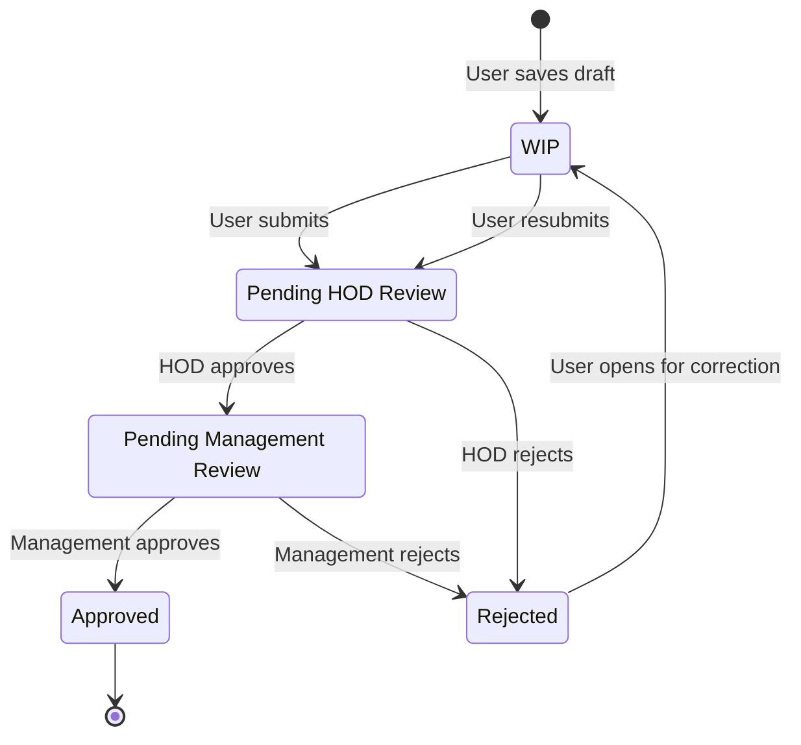
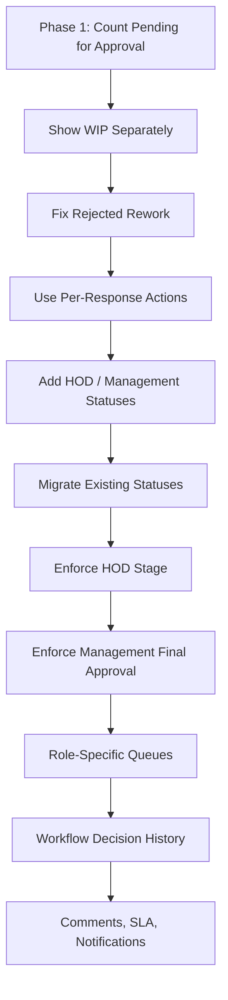

# Workflow Implementation Plan

## 1. Purpose

This plan evaluates the proposed workflow redesign and breaks implementation into three practical phases:

- Phase 1 (Immediate): Correct current workflow inconsistencies without changing the database model.
- Phase 2 (Medium Term): Introduce explicit HOD and Management review stages.
- Phase 3 (Future): Add audit-grade workflow history, analytics, and enterprise controls.

The plan is based on the current QCMS workflow implementation and the recommendations in `WORKFLOW_REDESIGN_PROPOSAL.md`.

## 2. Current Impact Assessment

### Existing Users

Current users can save a checklist response as `WIP` or submit it as `Pending for Approval`.

Impact of redesign:

- Minimal impact in Phase 1 because labels and behavior remain mostly unchanged.
- Medium impact in Phase 2 because submitted responses will move through HOD and Management stages instead of going directly from `Pending for Approval` to `Approved`.
- Users will benefit from clearer response state labels and a more consistent rejected-response rework path.
- Users may need UI guidance when a rejected response returns for correction.

Key compatibility concern:

- The service layer allows users to edit `Rejected` responses, but the current fill view only fetches editable `WIP` responses. Phase 1 should align the UI with the policy.

### HOD Workflow

Current HOD users can view scoped responses and approve or reject them if permissions allow.

Impact of redesign:

- Phase 1 improves visibility and action accuracy without changing responsibility.
- Phase 2 makes HOD review an explicit stage.
- HOD approval should move a response to `Pending Management Review`, not directly to `Approved`.
- HOD rejection should return the response to `Rejected` for user correction.

Key compatibility concern:

- The response has a `hod` field, but current authorization does not require the signed-in HOD to match `response.hod`. Phase 2 should decide whether approval is restricted to the assigned HOD or any scoped HOD.

### Management Workflow

Current Management users can approve or reject the same `Pending for Approval` responses as HOD users.

Impact of redesign:

- Phase 1 should improve dashboard and queue visibility.
- Phase 2 turns Management approval into the final approval stage after HOD approval.
- Management should primarily act on `Pending Management Review`.
- Management dashboards should expose bottlenecks from HOD review to final approval.

Key compatibility concern:

- If Management users currently approve responses directly, Phase 2 will add an extra gate before they can take final action.

### Dashboard Changes Required

Current dashboard counts underreport active work because they count `Pending` but not `Pending for Approval`.

Required improvements:

- Count `WIP` separately.
- Count `Pending for Approval` in active pending totals.
- Keep `Pending` visible as a legacy status until data is migrated.
- Add HOD and Management review queues when staged workflow is introduced.
- Use one shared aggregation helper so Admin, HOD, Management, and reports use the same definitions.

### Database Changes Required

Phase 1:

- No database schema changes required.
- Optional data cleanup query may normalize old `Pending` records, but this should be reviewed before execution.

Phase 2:

- Update `ChecklistResponse.status` choices to include explicit staged statuses.
- Add a data migration for existing statuses.
- Optional: add status/date indexes optimized for dashboard queues.

Phase 3:

- Add a workflow decision/history model.
- Optional: add SLA fields, comments, escalation fields, and notification preferences.

### Migration Complexity

| Phase | Complexity | Reason |
| --- | --- | --- |
| Phase 1 | Low | Mostly query, label, dashboard, and action visibility fixes. |
| Phase 2 | Medium | Requires status choices, transition changes, data migration, UI changes, and role behavior updates. |
| Phase 3 | High | Adds new workflow history model, reporting implications, and possible notification/SLA architecture. |

### Backward Compatibility Concerns

| Concern | Risk | Mitigation |
| --- | --- | --- |
| Existing `Pending` records | Could disappear from pending dashboards if only new statuses are counted. | Include `Pending` in legacy pending totals until migrated. |
| Existing `Pending for Approval` records | Need a destination when staged workflow is introduced. | Migrate to `Pending HOD Review` by default unless business rules say otherwise. |
| Existing HOD approvals | Current HOD scope may be broader than assigned HOD. | Keep broad scope in Phase 1; enforce assigned HOD only after business approval. |
| Management direct approval | Phase 2 adds an intermediate HOD approval requirement. | Announce process change and show Management queue only after HOD approval. |
| Admin toggle | Current toggle behavior maps rejected responses back to `Pending`. | Replace with explicit `reopen`, `reject`, and stage override actions. |
| Reports and filters | Saved procedures or user habits may rely on old names. | Keep aliases and filters during transition period. |

## 3. Recommended Target Workflow

## 4. Phase 1 (Immediate)

Goal: make the current workflow accurate, understandable, and safe without introducing new statuses or migrations.

### Task 1: Fix Pending Dashboard Counts

Description:

Update all dashboard and response summary counts to include `Pending for Approval` as active pending work. Keep `Pending` counted as legacy pending until migration.

Files impacted:

- `backend/views/admin.py`
- `frontend/templates/admin_panel/admin_dashboard.html`
- `frontend/templates/admin_panel/admin_responses.html`
- `frontend/static/admin_dashboard/admin_dashboard.js`
- `frontend/static/admin_panel/admin_responses.js`

Complexity: Low

Priority: Critical

Dependencies:

- None.

Expected business impact:

- Admin and leadership see accurate pending workload immediately.
- Newly submitted responses stop disappearing from pending metrics.

### Task 2: Show WIP Separately

Description:

Add separate `WIP` cards or filters so drafts are not confused with submitted work.

Files impacted:

- `backend/views/admin.py`
- `frontend/templates/admin_panel/admin_dashboard.html`
- `frontend/templates/admin_panel/admin_responses.html`

Complexity: Low

Priority: High

Dependencies:

- Task 1.

Expected business impact:

- Better distinction between user drafts and actual approval workload.

### Task 3: Align Rejected Editing Behavior

Description:

Allow owners to open rejected responses for correction if the service layer permits `Rejected` editing. The form should load existing answers for both `WIP` and `Rejected` responses.

Files impacted:

- `backend/views/user_panel.py`
- `frontend/templates/user_panel/my_submissions.html`
- `frontend/static/user_panel/my_submissions.js`

Complexity: Medium

Priority: High

Dependencies:

- Current `can_edit_response()` behavior.

Expected business impact:

- Users can correct rejected submissions without admin assistance.
- Reduces support friction and workflow dead ends.

### Task 4: Use Per-Response Workflow Actions In Tables

Description:

Render action buttons from `response.workflow_allowed_actions` instead of static role-level `allowed_actions`. The backend already blocks invalid actions, but the UI should not show buttons that will fail.

Files impacted:

- `frontend/templates/admin_panel/partials/response_table.html`
- `backend/views/admin.py`
- `backend/views/user_panel.py`

Complexity: Low

Priority: High

Dependencies:

- Existing `effective_allowed_actions_for_response()` service.

Expected business impact:

- Less user confusion.
- Fewer failed approve/reject attempts.

### Task 5: Clarify Legacy Pending Label

Description:

Keep `Pending` visible in filters, but label it as `Pending (Legacy)` until migration is complete.

Files impacted:

- `frontend/templates/admin_panel/admin_responses.html`
- Any future reporting/export templates.

Complexity: Low

Priority: Medium

Dependencies:

- Agreement that `Pending for Approval` is the active submitted status.

Expected business impact:

- Avoids confusion between legacy and active pending states.

## 5. Phase 2 (Medium Term)

Goal: implement the staged HOD -> Management approval process.

### Task 1: Add Explicit Workflow Statuses

Description:

Add two explicit statuses:

- `Pending HOD Review`
- `Pending Management Review`

Deprecate active use of:

- `Pending`
- `Pending for Approval`

Files impacted:

- `backend/workflow_service.py`
- `backend/models.py`
- New Django migration.
- Existing status filters and templates.

Complexity: Medium

Priority: Critical

Dependencies:

- Business approval of two-stage workflow.
- Phase 1 dashboard fixes.

Expected business impact:

- Workflow stages match real organizational responsibilities.
- Reporting becomes clearer and more auditable.

### Task 2: Create Data Migration For Existing Responses

Description:

Map existing records:

| Existing Status | Proposed Migration |
| --- | --- |
| WIP | WIP |
| Pending for Approval | Pending HOD Review |
| Pending | Pending HOD Review, unless manually classified |
| Approved | Approved |
| Rejected | Rejected |

Files impacted:

- New migration under `backend/migrations/`
- Optional management command for dry-run reporting before migration.

Complexity: Medium

Priority: Critical

Dependencies:

- Task 1.
- Data review of existing `Pending` records.

Expected business impact:

- Existing responses remain visible and actionable after redesign.

### Task 3: Enforce HOD Stage Approval

Description:

Update approval logic so HOD approval moves `Pending HOD Review` to `Pending Management Review`, while HOD rejection moves it to `Rejected`.

Decision required:

- Strict mode: only `response.hod` can approve.
- Scoped mode: any HOD within matching department/project scope can approve.

Files impacted:

- `backend/workflow_service.py`
- `backend/permission_service.py`
- `backend/views/user_panel.py`
- Tests in `backend/tests.py`

Complexity: Medium

Priority: High

Dependencies:

- Task 1 and Task 2.
- Business decision on assigned-HOD enforcement.

Expected business impact:

- HOD accountability becomes explicit.
- Management receives only HOD-reviewed responses.

### Task 4: Enforce Management Final Approval

Description:

Update approval logic so Management can approve only `Pending Management Review` responses to final `Approved`.

Files impacted:

- `backend/workflow_service.py`
- `backend/permission_service.py`
- `backend/views/user_panel.py`
- Tests in `backend/tests.py`

Complexity: Medium

Priority: High

Dependencies:

- HOD stage enforcement.

Expected business impact:

- Enables real two-level approval.
- Improves compliance posture.

### Task 5: Replace Admin Toggle With Explicit Override Actions

Description:

Remove ambiguous toggle behavior from active workflow screens and replace it with named actions:

- `reopen`
- `reject`
- `send_to_hod`
- `send_to_management`

Files impacted:

- `backend/workflow_service.py`
- `backend/views/admin.py`
- `frontend/static/admin_panel/admin_responses.js`
- `frontend/templates/admin_panel/partials/response_table.html`

Complexity: Medium

Priority: Medium

Dependencies:

- New transition model.

Expected business impact:

- Admin actions become auditable and understandable.
- Reduces accidental status changes.

### Task 6: Add HOD And Management Queues

Description:

Add queue-specific filters/cards:

- HOD: `Pending HOD Review`
- Management: `Pending Management Review`

Files impacted:

- `backend/views/user_panel.py`
- `backend/views/management.py`
- `frontend/templates/user_panel/dashboard.html`
- `frontend/templates/user_panel/my_submissions.html`
- New or updated dashboard JS/CSS.

Complexity: Medium

Priority: High

Dependencies:

- New statuses and role transitions.

Expected business impact:

- Reviewers can focus on their actual queue.
- Reduces approval delays.

## 6. Phase 3 (Future)

Goal: make the workflow enterprise-grade with history, comments, notifications, and analytics.

### Task 1: Add Workflow Decision History

Description:

Create a `WorkflowDecision` model that records every approval, rejection, reopen, and override event.

Suggested fields:

- response
- from_status
- to_status
- action
- actor
- actor_role
- comment
- ip_address
- created_at

Files impacted:

- `backend/models.py`
- New migration.
- `backend/workflow_service.py`
- `backend/views/admin.py`
- `backend/views/user_panel.py`
- Admin and user detail templates.

Complexity: High

Priority: High

Dependencies:

- Phase 2 workflow stages.

Expected business impact:

- Audit-ready approval history.
- Clear accountability for every decision.

### Task 2: Add Approval Comments

Description:

Require or optionally collect comments when rejecting, reopening, or overriding a response.

Files impacted:

- Response action views.
- Response action modals.
- Workflow decision model.

Complexity: Medium

Priority: Medium

Dependencies:

- Workflow decision history.

Expected business impact:

- Users understand rejection reasons.
- HOD and Management decisions become easier to audit.

### Task 3: Add SLA And Aging Metrics

Description:

Track how long responses remain in each review stage.

Files impacted:

- Dashboard aggregation service.
- Admin dashboard.
- HOD dashboard.
- Management dashboard.
- Optional workflow history model.

Complexity: Medium

Priority: Medium

Dependencies:

- Decision history or reliable status timestamp fields.

Expected business impact:

- Identifies bottlenecks.
- Supports operational KPIs.

### Task 4: Add Notifications And Escalations

Description:

Notify HODs and Management when responses enter their queue. Escalate overdue responses.

Files impacted:

- New notification service.
- Email or in-app notification templates.
- User preferences if required.

Complexity: High

Priority: Medium

Dependencies:

- Stable staged workflow.
- SLA rules.

Expected business impact:

- Faster approvals.
- Less manual follow-up.

## 7. Recommended Implementation Sequence

## 8. Testing Strategy

Phase 1 tests:

- `Pending for Approval` appears in pending dashboard totals.
- `WIP` appears separately.
- Rejected owner can edit and resubmit.
- Invalid action buttons are hidden per response.
- Backend still blocks unauthorized actions.

Phase 2 tests:

- User submit creates `Pending HOD Review`.
- HOD approve creates `Pending Management Review`.
- HOD reject creates `Rejected`.
- Management cannot approve `Pending HOD Review`.
- Management approve from `Pending Management Review` creates `Approved`.
- Legacy `Pending` records migrate correctly.

Phase 3 tests:

- Every workflow action creates a decision history row.
- Rejection comments persist and display.
- Aging metrics calculate correctly.
- Notification triggers run once per transition.

## 9. Release And Rollback Plan

Phase 1 release:

- Low-risk deployment.
- No schema migration.
- Rollback by reverting dashboard/action visibility changes.

Phase 2 release:

- Requires maintenance window or controlled deployment.
- Run migration dry-run first.
- Back up database before migration.
- Keep legacy status filters visible for at least one release.
- Rollback requires restoring database backup or reverse migration strategy.

Phase 3 release:

- Deploy history model first.
- Enable decision recording behind a feature flag if possible.
- Roll out comments, SLA, and notifications incrementally.

## 10. Final Recommendation

Start with Phase 1 immediately. It fixes measurable business inaccuracies without changing the database or disrupting users.

Move to Phase 2 only after stakeholders confirm that QCMS must enforce two-level approval. If the business wants a single approval step, keep `Pending for Approval`, retire legacy `Pending`, and skip the HOD -> Management staged migration.

Phase 3 should follow once the workflow is stable and the organization needs audit history, SLA tracking, and automated escalation.
