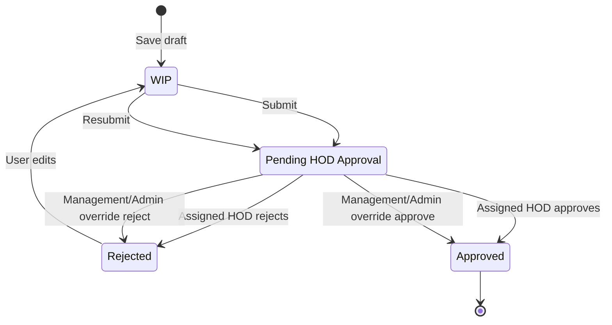
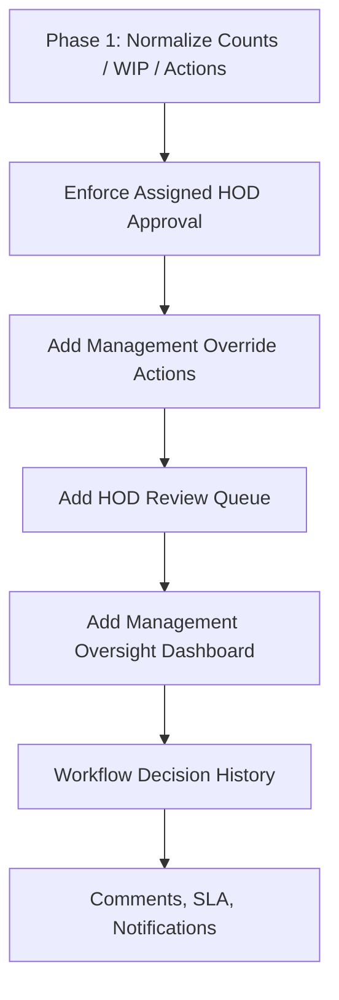
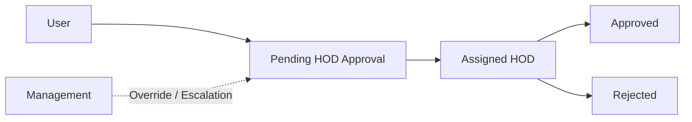

# Workflow Implementation Plan

## 1. Purpose

This plan updates the workflow roadmap according to the confirmed business rule:

- HOD approval is mandatory.
- Management approval is not part of the normal workflow.
- Management acts as escalation, oversight, and optional override authority.

The plan keeps Phase 1 as the immediate normalization work and revises Phase 2 and Phase 3 away from a HOD-to-Management approval chain.

## 2. Impact Assessment

### Existing Users

Users continue to own every response they create.

Impact:

- Phase 1 remains low impact: dashboard clarity, WIP visibility, rejected-response rework, and cleaner row actions.
- Phase 2 improves clarity by routing submitted responses to the assigned HOD.
- Users will see rejected responses return for correction and resubmission to HOD.

Compatibility concern:

- Existing `Pending for Approval` records should remain actionable and should be interpreted as awaiting HOD approval.

### HOD Workflow

HOD becomes the mandatory normal approver.

Impact:

- HOD pending queue becomes operationally important.
- Normal approval should require the response's assigned HOD.
- HOD approval moves the response directly to `Approved`.
- HOD rejection moves the response to `Rejected`.

Business decision still needed:

- Whether a backup/scoped HOD may approve when the assigned HOD is unavailable.

### Management Workflow

Management is not required for normal approval.

Impact:

- Management should not receive a required "approval queue".
- Management should receive an oversight/escalation view.
- Management actions should be labeled as override actions.
- Management override approval/rejection should be audited separately from normal HOD decisions.

### Dashboard Changes Required

Phase 1:

- Count `Pending` and `Pending for Approval` together as active pending.
- Show WIP separately.
- Label legacy `Pending`.

Phase 2:

- Add HOD review queue counts.
- Add Management oversight counts, not required-approval counts.
- Track overdue HOD reviews.

Phase 3:

- Add Management override counts.
- Add SLA, aging, rejection, and escalation analytics.

### Database Changes Required

Phase 1:

- No schema changes.

Phase 2:

- No status migration is strictly required if `Pending for Approval` is retained as the stored pending-HOD status.
- Optional future migration may rename `Pending for Approval` to `Pending HOD Approval`.

Phase 3:

- Add workflow decision/history model.
- Optional fields for comments, SLA timestamps, override reason, and escalation metadata.

### Migration Complexity

| Phase | Complexity | Reason |
| --- | --- | --- |
| Phase 1 | Low | No schema changes; UI/count/action normalization only. |
| Phase 2 | Low to Medium | Can enforce HOD approval without new statuses; complexity depends on assigned-HOD enforcement and override UI. |
| Phase 3 | Medium to High | Adds workflow history, comments, SLA, escalation, and reporting. |

### Backward Compatibility Concerns

| Concern | Risk | Mitigation |
| --- | --- | --- |
| Existing `Pending` records | Legacy pending records may be confused with current pending approvals. | Count with active pending and label as legacy until cleanup. |
| Existing `Pending for Approval` records | Must remain actionable after HOD enforcement. | Treat as awaiting assigned HOD approval. |
| Current Management approvals | Management users may expect direct approve/reject buttons. | Keep authority as override but relabel and audit it. |
| Assigned HOD missing | Some responses may have no HOD if user profile data is incomplete. | Add fallback queue for Admin/Management oversight and data cleanup. |
| Backup HOD coverage | Strict assigned-HOD enforcement can block approval when HOD is unavailable. | Define backup HOD or Admin/Management override process. |

## 3. Target Workflow

## 4. Phase 1 (Immediate)

Goal: keep the current workflow stable while making counts, labels, and actions accurate.

### Task 1: Fix Pending Dashboard Counts

Description:

Count both `Pending` and `Pending for Approval` as active pending work.

Files impacted:

- `backend/views/admin.py`
- `frontend/templates/admin_panel/admin_dashboard.html`
- `frontend/templates/admin_panel/admin_responses.html`
- `frontend/static/admin_dashboard/admin_dashboard.js`

Complexity: Low

Priority: Critical

Expected business impact:

- Pending workload becomes visible and accurate.

### Task 2: Show WIP Separately

Description:

Display WIP as draft work, separate from submitted approval workload.

Files impacted:

- `backend/views/admin.py`
- `frontend/templates/admin_panel/admin_dashboard.html`
- `frontend/templates/admin_panel/admin_responses.html`

Complexity: Low

Priority: High

Expected business impact:

- Drafts are not confused with submitted responses.

### Task 3: Align Rejected Editing Behavior

Description:

Allow the original response owner to edit rejected responses and resubmit to HOD.

Files impacted:

- `backend/views/user_panel.py`
- `frontend/templates/user_panel/my_submissions.html`
- `frontend/static/user_panel/my_submissions.js`

Complexity: Medium

Priority: High

Expected business impact:

- Users can correct rejected responses without admin assistance.

### Task 4: Use Per-Response Workflow Actions

Description:

Render actions from computed backend workflow permissions for each response.

Files impacted:

- `frontend/templates/admin_panel/partials/response_table.html`
- `backend/views/admin.py`
- `backend/views/user_panel.py`
- `backend/permission_service.py`

Complexity: Low

Priority: High

Expected business impact:

- Users see only actions that are valid for the response status and role.

### Task 5: Clarify Legacy Pending Label

Description:

Show `Pending` as `Pending (Legacy)`.

Files impacted:

- `frontend/templates/admin_panel/admin_responses.html`

Complexity: Low

Priority: Medium

Expected business impact:

- Reduces confusion between old and active pending statuses.

## 5. Phase 2 (Medium Term)

Goal: enforce HOD-mandatory approval and reposition Management as override/escalation.

### Task 1: Enforce Assigned HOD Approval

Description:

Normal approval should require:

- Response is pending approval.
- Actor role is HOD.
- Actor is the assigned HOD for the response, unless backup-HOD policy is approved.

Files impacted:

- `backend/permission_service.py`
- `backend/workflow_service.py`
- `backend/views/user_panel.py`
- `backend/tests.py`

Complexity: Medium

Priority: Critical

Dependencies:

- Confirm fallback behavior for missing or inactive HOD.

Expected business impact:

- Approval accountability matches the business rule.

### Task 2: Preserve Management Override Authority

Description:

Management may approve or reject pending responses as override authority, not as normal required approval.

Recommended action names:

- `override_approve`
- `override_reject`

Files impacted:

- `backend/workflow_service.py`
- `backend/permission_service.py`
- `backend/views/user_panel.py`
- `frontend/templates/admin_panel/partials/response_table.html`
- `frontend/static/user_panel/my_submissions.js`
- `backend/tests.py`

Complexity: Medium

Priority: High

Dependencies:

- Override labels and audit requirements.

Expected business impact:

- Management can resolve escalations without becoming a mandatory approval stage.

### Task 3: Add HOD Review Queue

Description:

Provide HOD users a clear view of responses awaiting their approval.

Files impacted:

- `backend/views/user_panel.py`
- `frontend/templates/user_panel/my_submissions.html`
- Optional dashboard template updates.

Complexity: Medium

Priority: High

Dependencies:

- Assigned-HOD enforcement.

Expected business impact:

- HODs can prioritize required approvals.

### Task 4: Add Management Oversight Dashboard

Description:

Management dashboard should focus on oversight, not required approvals.

Recommended cards:

- Pending HOD approvals
- Overdue HOD approvals
- Rejected responses
- Approved responses
- Responses needing escalation
- Management override actions, once history exists

Files impacted:

- `backend/views/user_panel.py`
- `backend/views/management.py`
- `frontend/templates/user_panel/dashboard.html`

Complexity: Medium

Priority: Medium

Dependencies:

- Status aggregation helper.

Expected business impact:

- Management can monitor health and intervene only when needed.

### Task 5: Optional Status Rename

Description:

Optionally rename `Pending for Approval` to `Pending HOD Approval` in a later migration.

Files impacted:

- `backend/workflow_service.py`
- `backend/models.py`
- Django migration
- Status filters and reports

Complexity: Medium

Priority: Low

Dependencies:

- Business decision that the clearer label justifies migration cost.

Expected business impact:

- Better workflow language with minimal behavioral change.

## 6. Phase 3 (Future)

Goal: add audit-grade oversight, escalation, and analytics.

### Task 1: Add Workflow Decision History

Description:

Create a model that records each workflow decision.

Suggested fields:

- response
- from_status
- to_status
- action
- actor
- actor_role
- is_override
- comment
- ip_address
- created_at

Files impacted:

- `backend/models.py`
- New migration
- `backend/workflow_service.py`
- `backend/views/admin.py`
- `backend/views/user_panel.py`

Complexity: High

Priority: High

Expected business impact:

- HOD approval and Management overrides become auditable.

### Task 2: Add Override And Rejection Comments

Description:

Capture comments for:

- HOD rejection
- Management override approval
- Management override rejection
- Admin override

Complexity: Medium

Priority: Medium

Expected business impact:

- Users understand rejection reasons.
- Overrides have business justification.

### Task 3: Add SLA And Escalation Metrics

Description:

Track pending HOD approvals by age and escalation level.

Complexity: Medium

Priority: Medium

Expected business impact:

- Management can identify delayed approvals.

### Task 4: Add Notifications

Description:

Notify:

- HOD when a response enters pending approval.
- User when a response is approved or rejected.
- Management when a response breaches SLA or is escalated.

Complexity: High

Priority: Medium

Expected business impact:

- Faster approvals and fewer manual follow-ups.

## 7. Recommended Implementation Sequence

## 8. Testing Strategy

Phase 1 tests:

- `Pending for Approval` appears in pending dashboard totals.
- `WIP` appears separately.
- Rejected owner can edit and resubmit.
- Invalid action buttons are hidden per response.
- Backend blocks unauthorized actions.

Phase 2 tests:

- User submit creates or keeps `Pending for Approval`.
- Assigned HOD can approve to `Approved`.
- Assigned HOD can reject to `Rejected`.
- Non-assigned HOD cannot normally approve unless backup policy allows it.
- Management override approve can approve pending responses.
- Management override reject can reject pending responses.
- Management override actions are labeled separately from HOD normal approval.

Phase 3 tests:

- Every HOD decision creates workflow history.
- Every Management/Admin override creates workflow history with `is_override=True`.
- Rejection and override comments persist.
- SLA aging calculations are correct.

## 9. Release And Rollback Plan

Phase 1:

- Low risk.
- No schema changes.
- Rollback by reverting UI/count/action changes.

Phase 2:

- Moderate risk because authorization behavior changes.
- Run a report before release to find responses with missing HOD assignment.
- Communicate that Management is override authority, not a required stage.
- Rollback by reverting permission/workflow policy changes.

Phase 3:

- Higher risk because schema changes are likely.
- Deploy workflow history model first.
- Back up database before migration.
- Enable notifications and SLA features incrementally.

## 10. Final Recommendation

Keep the normal workflow simple:

Phase 2 should enforce HOD-mandatory approval and make Management override explicit. It should not introduce a required Management approval stage.
