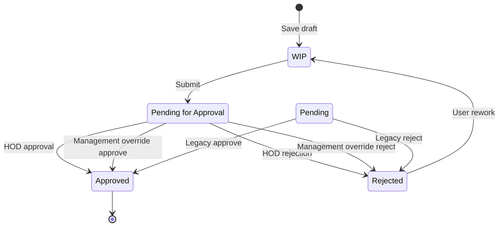
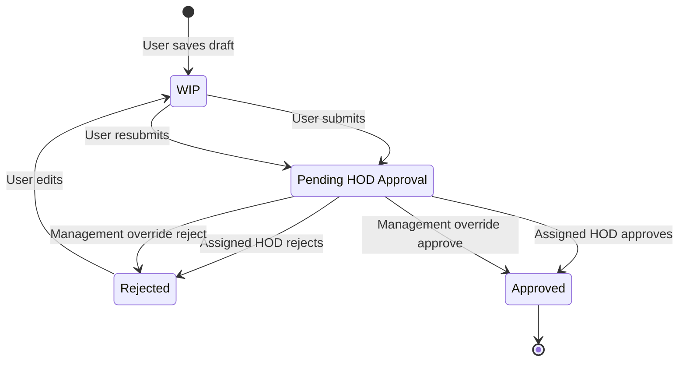
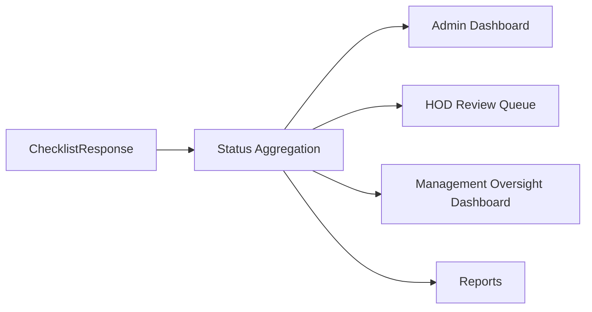
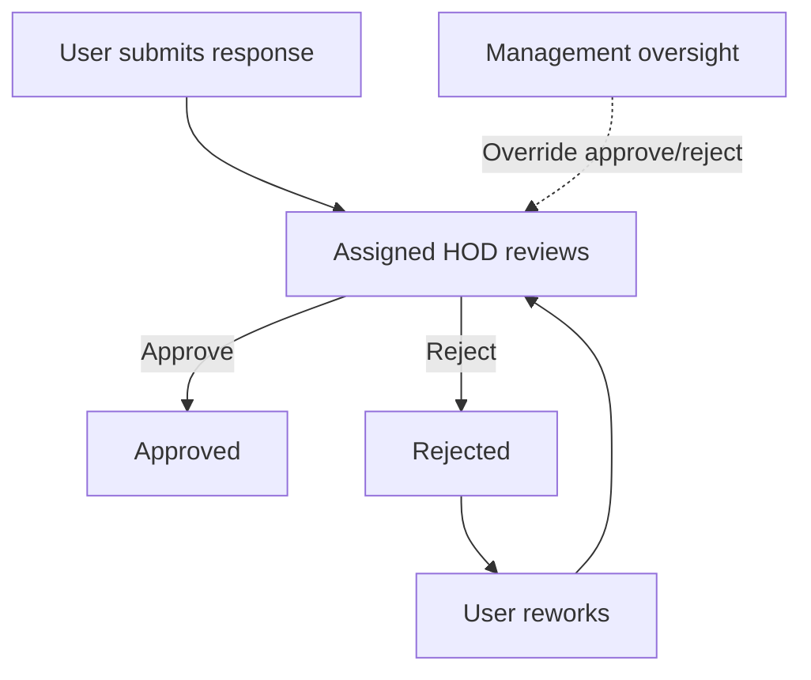

# Workflow Redesign Proposal

## 1. Purpose

This proposal documents the confirmed QCMS approval rule and revises the workflow recommendations accordingly.

Confirmed business rule:

- Every checklist response belongs to a user.
- The user's assigned HOD is the primary approver.
- HOD approval is mandatory.
- Management approval is not part of the normal workflow.
- Management may approve or reject any response only as an override authority.
- Management acts as escalation and oversight, not as a required approval stage.

## 2. Current Workflow Summary

QCMS currently defines five response statuses in `backend/workflow_service.py`:

| Status | Current Meaning |
| --- | --- |
| WIP | Draft response saved by a user. |
| Pending for Approval | Submitted response waiting for review. This is the current submit target. |
| Pending | Legacy pending status retained for backward compatibility. |
| Approved | Final accepted response. |
| Rejected | Response returned for correction. |

Current transition map:

| From | To | Trigger |
| --- | --- | --- |
| WIP | Pending for Approval | User submits a saved draft. |
| Pending for Approval | Approved | HOD/Admin approval today; Management can also approve by current permissions. |
| Pending for Approval | Rejected | HOD/Admin rejection today; Management can also reject by current permissions. |
| Pending | Approved | Legacy approval flow. |
| Pending | Rejected | Legacy rejection flow. |
| Rejected | WIP | Rework path. |
| Approved | None | Terminal. |

## 3. Recommended Workflow Model

The future workflow should keep a single required approval stage owned by the assigned HOD.

Recommended long-term statuses:

| Status | Purpose |
| --- | --- |
| WIP | User draft. Not submitted for approval. |
| Pending HOD Approval | Submitted by user and awaiting assigned HOD decision. |
| Approved | Final approved response. Normally approved by HOD. |
| Rejected | Returned to user for correction. |

`Pending` should remain only as a legacy alias during migration. `Pending for Approval` may either remain as the active pending label or be renamed to `Pending HOD Approval` in a future migration.

## 4. Role Responsibilities

| Role | Normal Responsibility | Override Responsibility |
| --- | --- | --- |
| User | Create, save, submit, and rework own checklist responses. | None. |
| HOD | Mandatory primary approval or rejection for assigned users. | None unless business explicitly grants cross-HOD backup. |
| Management | Oversight, escalation review, exceptional approval/rejection. | May approve/reject any response within authorized scope as an override. |
| Admin | Configure workflow, inspect all responses, recover exceptional states. | May override for administration and support. |

## 5. Approval Ownership

Every submitted response should resolve its primary HOD from the submitting user's profile.

Recommended authorization rule:

| Stage | Required Actor | Rule |
| --- | --- | --- |
| Draft | Owner user | `response.submitted_by == request.user` |
| HOD Approval | Assigned HOD | `response.hod == request.user` |
| Management Override | Management | Authorized Management user with override permission and response visibility. |
| Admin Override | Admin | Admin role with explicit override action. |
| Rework | Owner user | `response.submitted_by == request.user` and status is `Rejected` or `WIP`. |

Management override should be visible in audit records as an override, not as normal approval.

## 6. Current Gaps

| Area | Current Gap | Recommendation |
| --- | --- | --- |
| Pending naming | Both `Pending` and `Pending for Approval` exist. | Treat `Pending` as legacy; keep `Pending for Approval` or rename to `Pending HOD Approval`. |
| Dashboard counts | Legacy pending and active pending can be counted differently. | Count both as active pending until migration; show WIP separately. |
| HOD ownership | `response.hod` exists but current approval scope does not require assigned HOD. | Enforce assigned HOD for normal approval. |
| Management role | Management can approve/reject but the UI does not distinguish override from normal approval. | Label Management actions as override/escalation actions. |
| Auditability | Status changes do not preserve decision history. | Add workflow decision history with actor role and override flag. |

## 7. Dashboard Recommendations

Recommended dashboard counts:

| Count | Definition |
| --- | --- |
| WIP Drafts | `status = WIP` |
| Pending HOD Approval | `status = Pending for Approval` plus legacy `Pending` until migration |
| Approved | `status = Approved` |
| Rejected | `status = Rejected` |
| Management Overrides | Count of decisions made by Management as override, once decision history exists |
| Overdue HOD Reviews | Pending HOD approvals older than configured SLA |

## 8. Recommended Transition Matrix

| From | Action | Role | To | Notes |
| --- | --- | --- | --- | --- |
| WIP | submit | User owner | Pending HOD Approval | Normal submission. |
| Rejected | resubmit | User owner | Pending HOD Approval | Corrected response returns to HOD. |
| Pending HOD Approval | approve | Assigned HOD | Approved | Normal required approval. |
| Pending HOD Approval | reject | Assigned HOD | Rejected | Normal required rejection. |
| Pending HOD Approval | override_approve | Management/Admin | Approved | Escalation/oversight only. |
| Pending HOD Approval | override_reject | Management/Admin | Rejected | Escalation/oversight only. |
| Approved | reopen | Admin | WIP or Pending HOD Approval | Exceptional support path. |

## 9. Implementation Recommendations

### Phase 1: Normalize Current Behavior

Already recommended and implemented separately:

1. Count `Pending` and `Pending for Approval` consistently.
2. Show WIP separately.
3. Allow owners to rework rejected responses.
4. Render per-response actions from backend workflow permissions.
5. Label `Pending` as legacy.

### Phase 2: Enforce HOD-Mandatory Approval

1. Keep existing status values initially to avoid migration risk.
2. Make normal approval require `response.hod == request.user`.
3. Keep Management approve/reject as override actions, not normal actions.
4. Update UI labels so Management sees "Override Approve" and "Override Reject".
5. Add HOD queue filters for pending approvals.

### Phase 3: Improve Audit And Escalation

1. Add workflow decision history.
2. Record whether a decision is normal approval or Management/Admin override.
3. Add rejection/override comments.
4. Add SLA aging and escalation indicators.
5. Add Management oversight dashboard focused on exceptions, overdue items, and override history.

## 10. Backward Compatibility Plan

| Existing Status | Handling |
| --- | --- |
| WIP | Keep unchanged. |
| Pending for Approval | Treat as Pending HOD Approval under current storage. |
| Pending | Treat as legacy pending HOD approval until cleanup. |
| Approved | Keep unchanged. |
| Rejected | Keep unchanged and allow owner rework. |

No `Pending Management Review` status is recommended under the confirmed business rule.

## 11. Final Recommendation

QCMS should use a HOD-mandatory approval workflow with Management override authority.

The recommended normal path is:

Management should not be modeled as a required approval stage. It should be modeled as escalation, oversight, and exceptional override authority.
