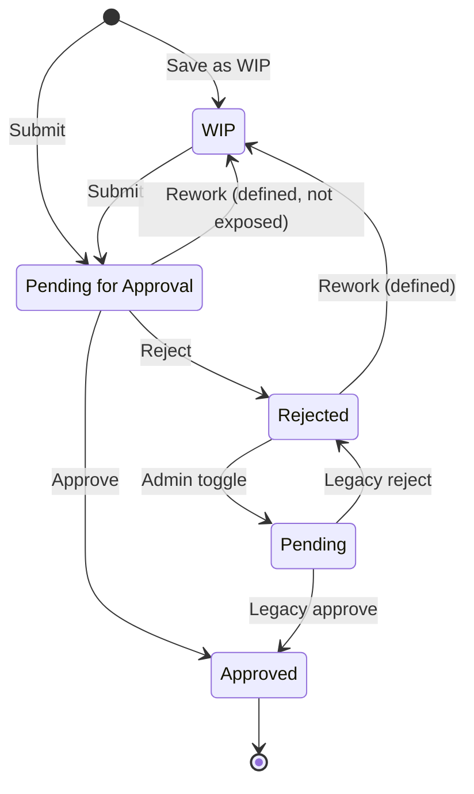
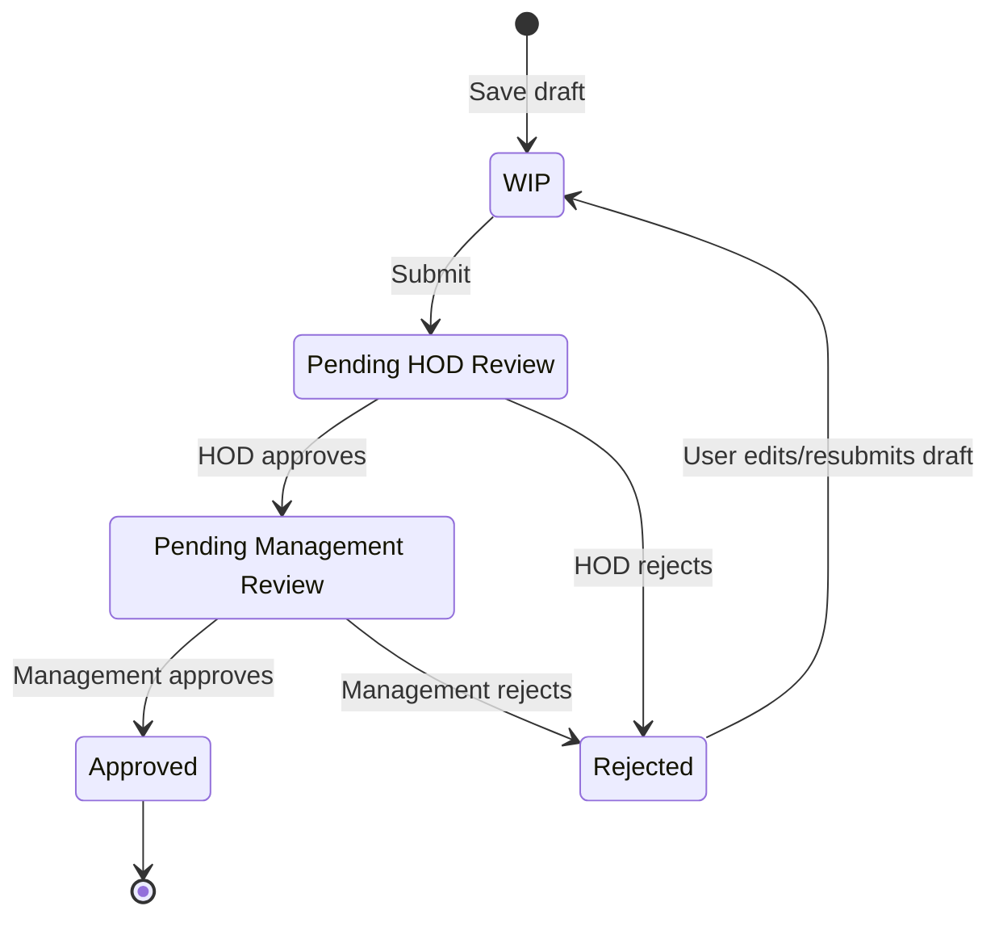
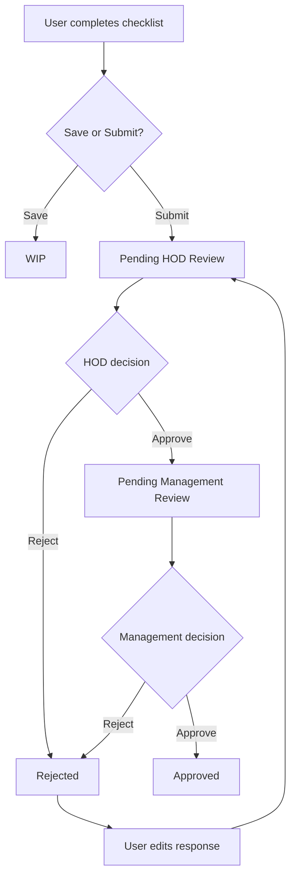
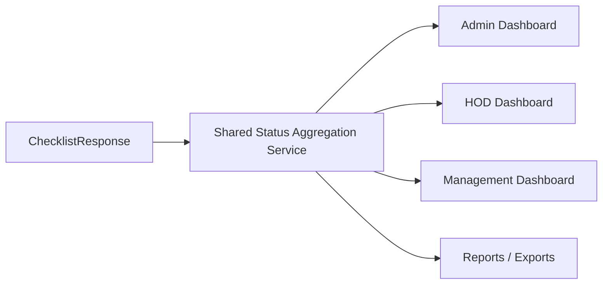
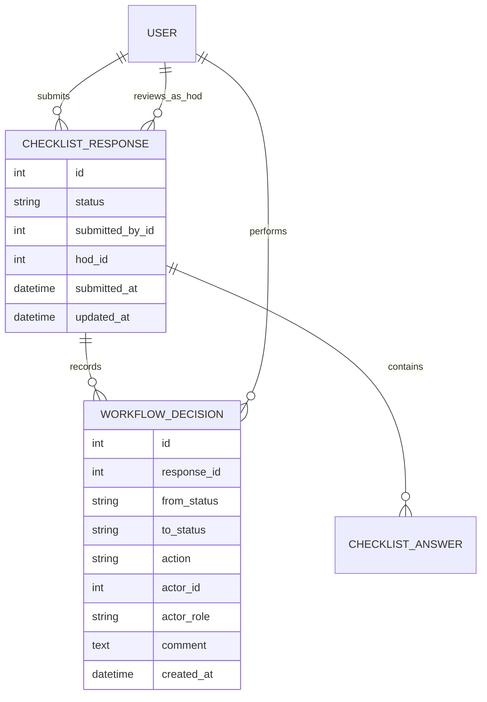

# Workflow Redesign Proposal

## 1. Purpose

This proposal reviews the current QCMS checklist response workflow and recommends a clearer approval design for:

- WIP
- Pending
- Pending for Approval
- Approved
- Rejected

The goal is to remove ambiguity between legacy and new statuses, make HOD and Management responsibilities explicit, improve dashboard accuracy, and prepare the workflow for audit-ready production use.

## 2. Current Workflow Summary

QCMS currently defines five response statuses in `backend/workflow_service.py`:

| Status | Current Meaning |
| --- | --- |
| WIP | Draft response saved by a user. Required-question validation is relaxed, but upload validation still applies. |
| Pending for Approval | Newly submitted response awaiting approval. This is the current submit target from the checklist fill screen. |
| Pending | Legacy pending status retained for backward compatibility. Older responses and some toggle flows still use this. |
| Approved | Final accepted response. No further transition is currently allowed. |
| Rejected | Response rejected by an approver. Owner can edit rejected responses. |

Current transition map:

| From | To | Trigger |
| --- | --- | --- |
| WIP | Pending for Approval | User submits a saved draft. |
| Pending for Approval | Approved | Admin, HOD, or Management approves. |
| Pending for Approval | Rejected | Admin, HOD, or Management rejects. |
| Pending for Approval | WIP | Defined in transition map, but not exposed by the current UI. |
| Pending | Approved | Legacy approve flow. |
| Pending | Rejected | Legacy reject flow. |
| Rejected | Pending | Admin toggle action. |
| Rejected | WIP | Defined in transition map, but normal user edit creates WIP only through form resubmission path. |
| Approved | None | Terminal. |

## 3. Current Approval Process

### User Flow

1. User opens an assigned checklist.
2. User clicks `Save as WIP`.
3. System creates or updates a `ChecklistResponse` with status `WIP`.
4. User clicks `Submit for Approval`.
5. System validates required fields and uploads, then saves status `Pending for Approval`.
6. User can edit only responses in `WIP` according to the current edit query. The service layer also permits editing `Rejected`, but the fill view currently fetches only `WIP` responses for editing.

### HOD Flow

HOD users see responses through `responses_for_profile()` when:

- The response department matches the HOD department.
- If the HOD has a project, the response project must also match.
- If that project has a domain, the response project domain must also match.

HODs can approve or reject if role permissions include the action and the workflow transition allows it.

Current limitation: the `hod` field is assigned at submission, but approval authorization does not require `response.hod == request.user`. Any HOD matching the department/project scope may approve.

### Management Flow

Management users see responses through `responses_for_profile()` when:

- Their department is set and matches the response department, or
- Their project is set and matches both response project and domain.

Management users can approve or reject if role permissions include the action and the workflow transition allows it.

Current limitation: there is no distinct Management approval stage. HOD and Management both approve the same `Pending for Approval` status directly to `Approved`.

### Admin Flow

Admins can view all responses, approve, reject, delete, edit, and toggle according to the centralized permission policy.

Admin toggle currently maps:

- Rejected -> Pending
- Any other status -> Rejected, if the transition is allowed

This preserves older behavior but conflicts with the newer `Pending for Approval` status model.

## 4. Dashboard Count Review

### Current Admin Dashboard

Admin dashboard counts:

- `Approved`
- `Pending`
- `Rejected`

It does not count:

- `WIP`
- `Pending for Approval`

This means newly submitted responses may increase total submissions but not appear in the pending card if they use `Pending for Approval`.

### Current Admin Responses Page

The response filter includes all five statuses, but summary cards count only:

- `Pending`
- `Approved`
- `Rejected`

The page does not separately show:

- WIP
- Pending for Approval

### Current Management Dashboard

The Management dashboard currently renders a placeholder and does not show workflow counts.

### Recommendation

Use a shared status aggregation helper so every dashboard counts the same workflow states.

Recommended dashboard counts:

| Count | Definition |
| --- | --- |
| Draft / WIP | `status = WIP` |
| Awaiting HOD | `status = Pending for Approval` if using one-step approval, or `Pending HOD Review` if adopting the staged redesign. |
| Awaiting Management | New explicit status if adopting staged approval. |
| Pending Total | All non-terminal, non-WIP review statuses. |
| Approved | `status = Approved` |
| Rejected | `status = Rejected` |
| Total Submitted | Exclude WIP if business meaning is "submitted"; include WIP only in "Total Responses". |

## 5. Key Issues In Current Design

| Area | Issue | Impact |
| --- | --- | --- |
| Status naming | Both `Pending` and `Pending for Approval` exist. | Users and reports may disagree about what "pending" means. |
| Dashboard counts | New submissions use `Pending for Approval`, but cards count `Pending`. | Pending workload is underreported. |
| HOD workflow | HOD field is assigned but not enforced as the only approver. | Review ownership is unclear. |
| Management workflow | Management approval is not a separate stage. | Cannot prove two-level approval. |
| Rejection flow | Rejected can transition to `Pending` through admin toggle, while user rework expects WIP-like editing. | Rework path is inconsistent. |
| UI action visibility | Approve/reject buttons render based on role action config, not per-row workflow actions in the partial. Backend still blocks invalid actions. | Users may see actions that fail after click. |
| Auditability | Status changes record only status and `updated_by`; no approval stage, comment, or decision history model. | Limited audit trail for regulated workflows. |

## 6. Recommended Workflow Model

Replace ambiguous pending states with explicit review stages.

Recommended statuses:

| Status | Purpose |
| --- | --- |
| WIP | User draft. Not submitted for review. |
| Pending HOD Review | Submitted by user and awaiting assigned HOD review. |
| Pending Management Review | HOD approved and Management must review. |
| Approved | Final approved state. |
| Rejected | Returned to user for correction. |

Keep legacy `Pending` only as a migration alias, not as a long-term active status.

## 7. Proposed Status Transition Matrix

| Current Status | User | HOD | Management | Admin |
| --- | --- | --- | --- | --- |
| WIP | Save, submit | View if scoped | View if scoped | View, edit, delete |
| Pending HOD Review | View | Approve to Management, reject to User | View | Approve/reject/override |
| Pending Management Review | View | View | Approve final, reject to User | Approve/reject/override |
| Approved | View | View | View | View, reopen through explicit override |
| Rejected | Edit, resubmit | View | View | View, reopen/delete |

Recommended machine transitions:

| From | Action | Role | To |
| --- | --- | --- | --- |
| WIP | submit | User | Pending HOD Review |
| Rejected | resubmit | User | Pending HOD Review |
| Pending HOD Review | approve | Assigned HOD | Pending Management Review |
| Pending HOD Review | reject | Assigned HOD | Rejected |
| Pending Management Review | approve | Management | Approved |
| Pending Management Review | reject | Management | Rejected |
| Any non-terminal | override_reject | Admin | Rejected |
| Approved | reopen | Admin | Pending Management Review or WIP, based on business rule |

## 8. Proposed Approval Architecture

Recommended decision ownership:

| Stage | Owner | Authorization Rule |
| --- | --- | --- |
| Draft | Submitting user | `response.submitted_by == request.user` |
| HOD Review | Assigned HOD | `response.hod == request.user`, with Admin override |
| Management Review | Scoped Management user | Department/project/domain scope, with Admin override |
| Final Approval | Management | Only from Management stage |
| Rework | Submitting user | Only rejected owner can edit/resubmit |

## 9. Dashboard Redesign Recommendations

### Admin Dashboard

Show complete workflow health:

- Total Responses
- Draft WIP
- Submitted for HOD
- Submitted for Management
- Approved
- Rejected
- Average approval time
- Rejection rate
- Aging: pending more than 2, 5, and 10 days

### HOD Dashboard

Add a HOD-focused dashboard or enhance `my_submissions`:

- My Pending Reviews
- Approved by Me
- Rejected by Me
- Overdue Reviews
- Department workload

### Management Dashboard

Replace the placeholder with:

- Pending Management Review
- Approved this month
- Rejected this month
- Department/project distribution
- HOD bottleneck summary

## 10. Implementation Recommendations

### Phase 1: Normalize Current Behavior

1. Treat `Pending for Approval` as the active pending review status in all counts.
2. Update dashboard cards to count WIP and Pending for Approval.
3. Rename UI labels from `Pending` to `Legacy Pending` where old data still exists.
4. Ensure action buttons use `response.workflow_allowed_actions`, not only static role permissions.
5. Allow owners to edit `Rejected` responses through the fill view if the service layer already permits it.

### Phase 2: Introduce Explicit Stages

1. Add `Pending HOD Review`.
2. Add `Pending Management Review`.
3. Map existing `Pending for Approval` records to the appropriate starting stage.
4. Require HOD approval before Management final approval.
5. Replace admin toggle with explicit actions: `reject`, `reopen`, `send_to_hod`, `send_to_management`.

### Phase 3: Add Audit-Grade Approval Records

Create a separate decision history model.

Recommended fields:

- response
- from_status
- to_status
- action
- actor
- actor_role
- comment
- created_at
- ip_address

This avoids losing historical decisions when `ChecklistResponse.status` changes.

## 11. Backward Compatibility Plan

| Existing Status | Recommended Handling |
| --- | --- |
| WIP | Keep unchanged. |
| Pending for Approval | Migrate to `Pending HOD Review` if HOD review is required. |
| Pending | Treat as legacy. Migrate to `Pending HOD Review` or `Pending Management Review` based on business rules. |
| Approved | Keep unchanged. |
| Rejected | Keep unchanged, but route resubmission through WIP -> Pending HOD Review. |

If the organization wants a one-step approval process, keep `Pending for Approval` and remove the legacy `Pending` status from active UI filters and dashboards.

## 12. Final Recommendation

QCMS should adopt the staged HOD -> Management approval model because the current data model already stores an assigned HOD and the product has separate HOD and Management roles. The redesign should make that business process explicit instead of allowing both roles to approve the same pending state directly to final approval.

Minimum near-term fix:

- Count `Pending for Approval` in all pending dashboard cards.
- Show WIP separately.
- Hide invalid row actions using per-response workflow actions.
- Enable rejected owner rework consistently.

Best long-term fix:

- Replace `Pending` and `Pending for Approval` with `Pending HOD Review` and `Pending Management Review`.
- Add workflow decision history.
- Add role-specific dashboards for HOD and Management review queues.
