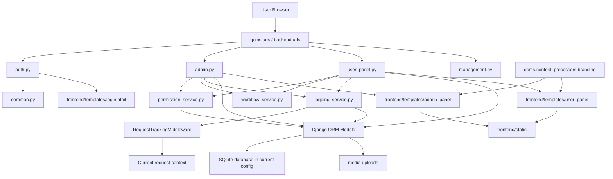
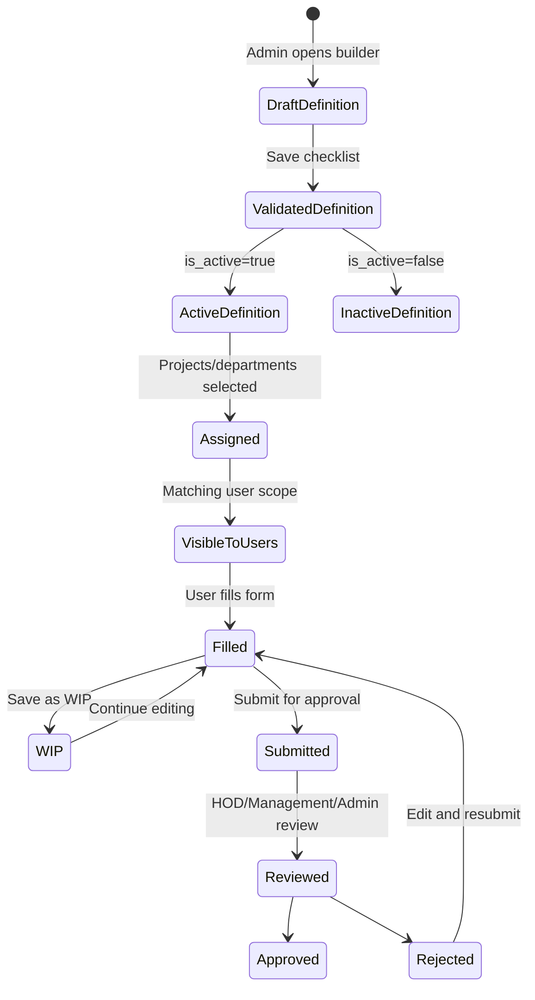
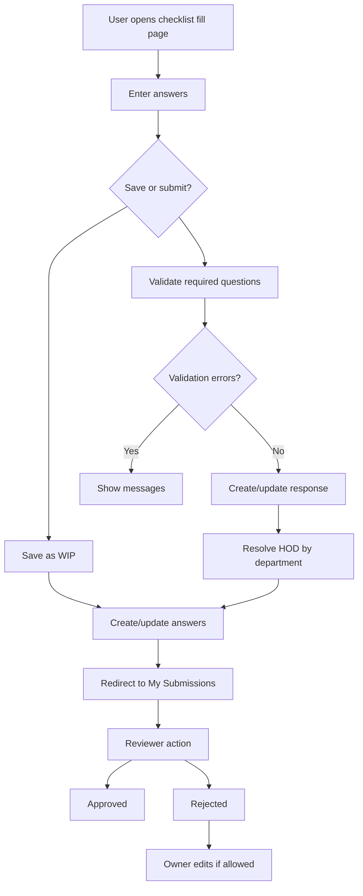
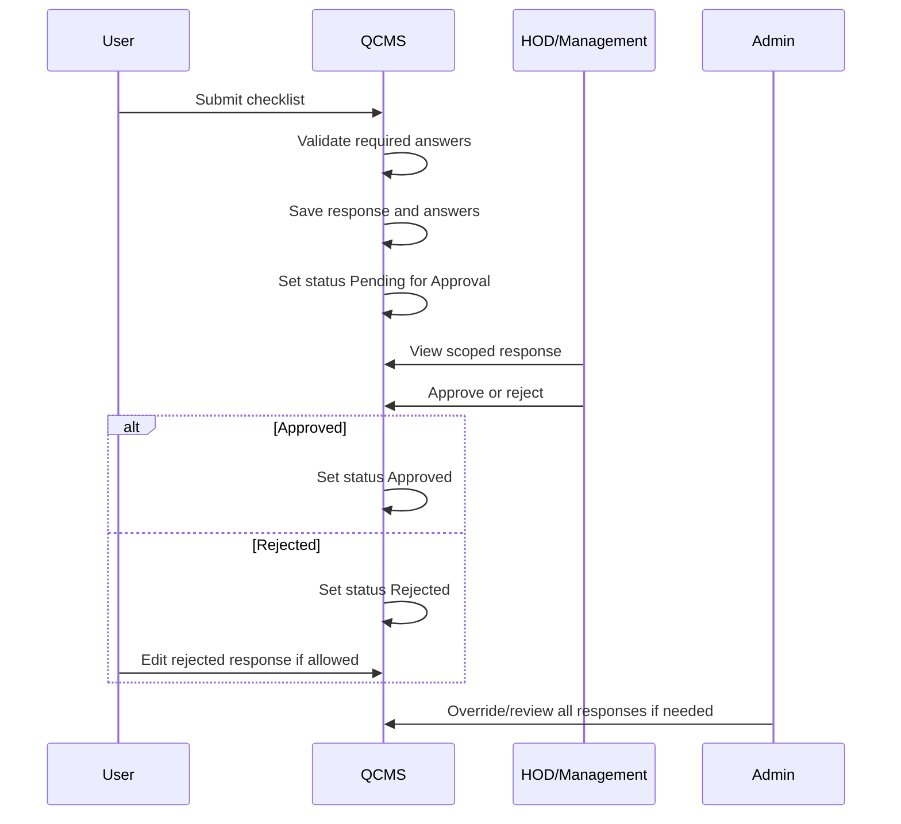
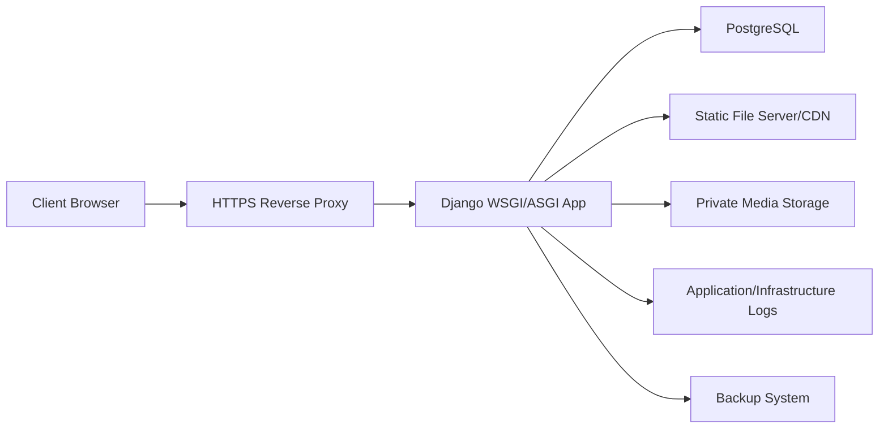
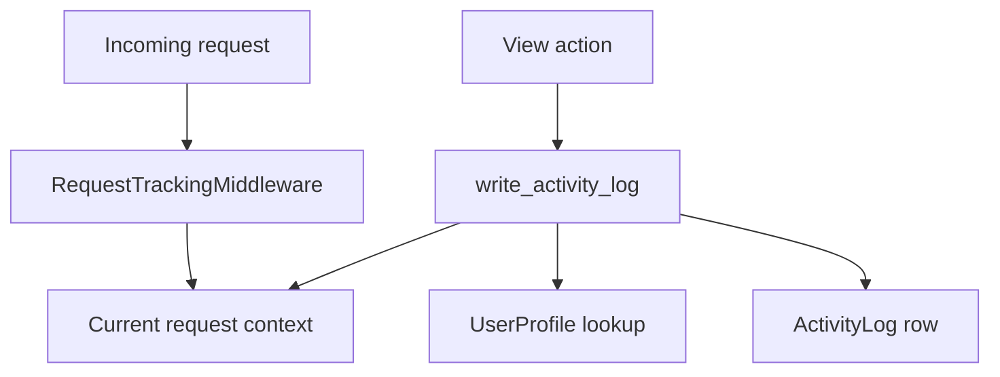
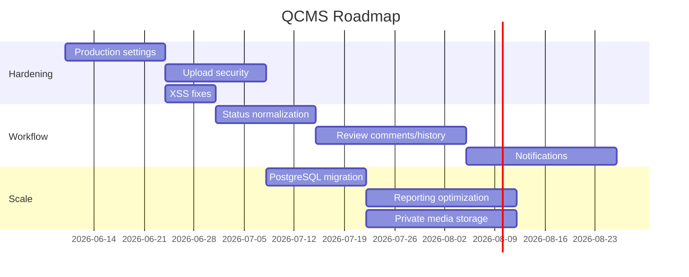

# QCMS Master System Document

## 1. Executive Summary

QCMS, the Quality Control Management System, is a Django-based web application for managing quality checklists across projects and departments. It supports checklist creation, assignment, completion, review, approval, rejection, role-based response visibility, audit logging, PDF export, profile management, and basic system branding.

The application is currently a server-rendered Django monolith. The backend uses Django models, function-based views, and service modules for permissions, workflow, and logging. The frontend uses Django templates, shared CSS, and page-specific vanilla JavaScript.

This document is the single source of truth for the current QCMS system behavior, architecture, roles, workflows, risks, and roadmap.

## 2. Business Purpose

QCMS exists to standardize quality-control data collection and approval across business operations.

Business goals:

- Digitize checklist-based quality inspections.
- Assign checklist templates by project and department.
- Allow users to submit checklist responses with text, options, dates, and files.
- Route submitted responses to HOD, Management, or Admin review.
- Track approval/rejection status.
- Maintain an audit trail for accountability.
- Provide dashboards and reports for operational visibility.
- Centralize master data for users, departments, projects, and checklist types.

## 3. System Overview

QCMS has four main user audiences:

- Admins configure and operate the system.
- Users complete assigned checklists.
- HODs review department-scoped responses.
- Management users review scoped responses and view a dashboard.

The system stores checklist templates separately from submitted responses. A checklist template is represented by `ChecklistDefinition` and `ChecklistQuestion`. A completed or in-progress checklist is represented by `ChecklistResponse` and `ChecklistAnswer`.

## 4. Complete Architecture Diagram



## 5. Database ER Diagram

```mermaid
erDiagram
    USER ||--|| USERPROFILE : has
    USER ||--o{ CHECKLISTRESPONSE : submits
    USER ||--o{ CHECKLISTRESPONSE : reviews_as_hod
    USER ||--o{ CHECKLISTRESPONSE : updates
    USER ||--o{ ACTIVITYLOG : creates

    DEPARTMENT ||--o{ USERPROFILE : contains
    PROJECT ||--o{ USERPROFILE : contains

    CHECKLISTTYPE ||--o{ CHECKLISTDEFINITION : categorizes
    CHECKLISTDEFINITION ||--o{ CHECKLISTQUESTION : contains
    CHECKLISTDEFINITION ||--o{ CHECKLISTRESPONSE : receives
    CHECKLISTRESPONSE ||--o{ CHECKLISTANSWER : contains
    CHECKLISTQUESTION ||--o{ CHECKLISTANSWER : answered_by

    PROJECT ||--o{ CHECKLISTRESPONSE : scopes
    DEPARTMENT ||--o{ CHECKLISTRESPONSE : scopes
    PROJECT ||--o{ ACTIVITYLOG : recorded_on
    DEPARTMENT ||--o{ ACTIVITYLOG : recorded_on

    CHECKLISTDEFINITION }o--o{ PROJECT : assigned_to
    CHECKLISTDEFINITION }o--o{ DEPARTMENT : assigned_to

    ROLEPERMISSION ||--|| ROLEPERMISSION : configures_role
    APPSETTINGS ||--|| APPSETTINGS : singleton

    USER {
        int id
        string username
        string password
        string email
        string first_name
        string last_name
        bool is_active
    }

    USERPROFILE {
        int id
        int user_id
        string role
        int department_id
        int project_id
        bool is_active
        string employee_id
        string phone_number
        string profile_image
    }

    PROJECT {
        int id
        string code
        string name
        string domain
        bool is_active
    }

    DEPARTMENT {
        int id
        string code
        string name
        bool is_active
    }

    CHECKLISTTYPE {
        int id
        string name
        bool is_active
    }

    CHECKLISTDEFINITION {
        int id
        string checklist_id
        string name
        int checklist_type_id
        bool is_active
    }

    CHECKLISTQUESTION {
        int id
        int checklist_id
        text question_text
        string type
        json options
        int order
        string section
        bool required
    }

    CHECKLISTRESPONSE {
        int id
        int checklist_id
        int submitted_by_id
        int project_id
        int department_id
        int hod_id
        string status
        datetime submitted_at
        datetime updated_at
        int updated_by_id
    }

    CHECKLISTANSWER {
        int id
        int response_id
        int question_id
        text answer_text
        string file
    }

    ROLEPERMISSION {
        int id
        string role
        json visible_columns
        json selected_projects
        json allowed_actions
    }

    ACTIVITYLOG {
        int id
        int user_id
        string role
        int department_id
        int project_id
        string action_type
        string module_name
        text description
        string ip_address
        string status
        datetime timestamp
    }

    APPSETTINGS {
        int id
        string web_app_name
        string logo
        string favicon
        json theme_settings
        json security_settings
    }
```



## 6. User Roles

| Role | Purpose | Primary Area |
| --- | --- | --- |
| Admin | Full system administration and oversight. | Admin panel |
| User | Completes assigned checklists and manages own submissions. | User panel |
| HOD | Reviews department/project-scoped responses. | User panel response view |
| Management | Reviews scoped responses and views dashboard. | Management dashboard/user panel |
| Django Superuser | Uses Django's built-in admin. | `/admin/` |

## 7. Permission Matrix

| Capability | Admin | User | HOD | Management |
| --- | --- | --- | --- | --- |
| Login/logout | Yes | Yes | Yes | Yes |
| View assigned checklists | Yes | Yes | Yes | Yes |
| Fill checklist | Yes | Yes | Yes | Yes |
| Save WIP | Yes | Yes | Yes | Yes |
| Submit checklist | Yes | Yes | Yes | Yes |
| View own submissions | Yes | Yes | Yes | Yes |
| View scoped submissions | All | Own only | Department/project scoped | Department/project scoped |
| Edit response | All | Own WIP/rejected | No by default | No by default |
| Approve response | Yes | No | Yes if permitted and valid status | Yes if permitted and valid status |
| Reject response | Yes | No | Yes if permitted and valid status | Yes if permitted and valid status |
| Delete response | Yes | No | No | No |
| Toggle response status | Yes | No | No | No |
| Manage users | Yes | No | No | No |
| Manage departments | Yes | No | No | No |
| Manage projects | Yes | No | No | No |
| Manage checklist definitions | Yes | No | No | No |
| Manage role permissions | Yes | No | No | No |
| View activity logs | Yes | No | No | No |
| Manage branding/settings | Yes | No | No | No |

Role action ceilings in code:

| Role | Maximum Response Actions |
| --- | --- |
| Admin | `view`, `edit`, `approve`, `reject`, `delete`, `toggle` |
| User | `view`, `edit` |
| HOD | `view`, `approve`, `reject` |
| Management | `view`, `approve`, `reject` |

## 8. Checklist Lifecycle



Checklist definition components:

- Checklist ID.
- Checklist name.
- Checklist type.
- Project assignments.
- Department assignments.
- Section titles.
- Questions.
- Question type.
- Options.
- Required flags.

## 9. Response Lifecycle



Response data is stored in:

- `ChecklistResponse`: header/status/scope/reviewer metadata.
- `ChecklistAnswer`: one row per answered question.

## 10. Approval Workflow

The intended approval workflow:

1. User completes checklist.
2. User submits for approval.
3. Response status becomes `Pending for Approval`.
4. HOD or Management sees response if it matches their scope and permissions.
5. Admin sees all responses.
6. Reviewer approves or rejects.
7. Approved response becomes final.
8. Rejected response can be edited by owner or Admin depending on workflow rules.



## 11. Status Transition Matrix

Current statuses:

- `WIP`
- `Pending for Approval`
- `Pending`
- `Approved`
- `Rejected`

| Current Status | WIP | Pending for Approval | Pending | Approved | Rejected |
| --- | --- | --- | --- | --- | --- |
| WIP | No | Yes | No | No | No |
| Pending for Approval | Yes | No | No | Yes | Yes |
| Pending | No | No | No | Yes | Yes |
| Approved | No | No | No | No | No |
| Rejected | Yes | No | Yes | No | No |

Action mapping:

| Action | Result |
| --- | --- |
| `approve` | Target status `Approved` if transition is allowed. |
| `reject` | Target status `Rejected` if transition is allowed. |
| `toggle` | If current status is `Rejected`, target `Pending`; otherwise target `Rejected`. |

Known status concern:

- New submissions use `Pending for Approval`, while some dashboards and older logic still count/use `Pending`.

## 12. URL Structure

### Root

| URL | Name | Purpose |
| --- | --- | --- |
| `/` | `home` | Role-based redirect. |
| `/admin/` | Django admin | Built-in Django admin. |
| `/login/` | `login` | User login. |
| `/logout/` | `logout` | User logout. |

### User/HOD/Management

| URL | Name | Purpose |
| --- | --- | --- |
| `/my-checklists/` | `my_checklists` | List visible checklists. |
| `/my-checklists/<id>/view/` | `user_checklist_preview` | Preview checklist. |
| `/my-checklists/<id>/pdf/` | `user_checklist_pdf` | Download checklist PDF. |
| `/my-checklists/<id>/fill/` | `user_checklist_fill` | Fill/edit checklist response. |
| `/my-submissions/` | `my_submissions` | View submissions. |
| `/my-submissions/action/` | `user_submission_action` | AJAX response action endpoint. |
| `/dashboard/` | `dashboard` | Management dashboard. |
| `/management-dashboard/` | `management_dashboard` | Legacy redirect to dashboard. |
| `/user/profile/` | `user_profile` | User/HOD/Management profile. |

### Admin

| URL | Name | Purpose |
| --- | --- | --- |
| `/admin-panel/` | `admin_dashboard` | Admin dashboard. |
| `/admin-panel/users/` | `admin_users` | User management. |
| `/admin-panel/departments/` | `admin_departments` | Department management. |
| `/admin-panel/projects/` | `admin_projects` | Project management. |
| `/admin-panel/checklists/` | `admin_checklists` | Checklist management. |
| `/admin-panel/checklists/create/` | `admin_checklist_create` | Create checklist. |
| `/admin-panel/checklists/<id>/edit/` | `admin_checklist_edit` | Edit checklist. |
| `/admin-panel/checklists/<id>/view/` | `admin_checklist_view` | Preview checklist. |
| `/admin-panel/checklists/<id>/pdf/` | `admin_checklist_pdf` | Download checklist PDF. |
| `/admin-panel/responses/` | `admin_responses` | Response management. |
| `/admin-panel/control-panel/` | `admin_control_panel` | Branding/settings. |
| `/admin-panel/logs/` | `admin_logs` | Audit logs. |
| `/admin-panel/profile/` | `admin_profile` | Admin profile. |

### Action Endpoints

| URL | Purpose |
| --- | --- |
| `/admin-create/` | Create user/department/project. |
| `/admin-master-create/` | Legacy create alias. |
| `/admin-user-action/` | User view/edit/delete/toggle. |
| `/admin-department-action/` | Department edit/delete. |
| `/admin-project-action/` | Project edit/delete. |
| `/admin-checklist-action/` | Checklist create/edit/delete/toggle. |
| `/admin-response-action/` | Response view/approve/reject/delete/toggle and permission save. |

## 13. Folder Structure

```text
qcms_webapp/
  manage.py
  requirements.txt
  db.sqlite3
  qcms/
    settings.py
    urls.py
    context_processors.py
    asgi.py
    wsgi.py
  backend/
    models.py
    urls.py
    admin.py
    apps.py
    tests.py
    workflow_service.py
    permission_service.py
    logging_service.py
    middleware.py
    views/
      __init__.py
      auth.py
      common.py
      admin.py
      user_panel.py
      management.py
    migrations/
  frontend/
    templates/
      login.html
      base.html
      admin_panel/
      user_panel/
      shared/
      includes/
    static/
      shared/
      admin_dashboard/
      admin_panel/
      admin_users/
      user_panel/
      images/
  media/
    profile_images/
    checklist_uploads/
    branding/
  docs/
  MASTER_SYSTEM_DOCUMENT.md
```

## 14. Module Wise Explanation

| Module | Responsibility |
| --- | --- |
| `manage.py` | Django command runner. |
| `qcms/settings.py` | Project settings, apps, middleware, database, static/media, auth redirects. |
| `qcms/urls.py` | Root URL routing and development media serving. |
| `qcms/context_processors.py` | Injects global branding/theme into templates. |
| `backend/models.py` | Database models and relationships. |
| `backend/urls.py` | Application route map. |
| `backend/views/auth.py` | Home, login, logout. |
| `backend/views/common.py` | Profile lookup, safe next URL, role redirect. |
| `backend/views/admin.py` | Admin dashboard, master data, checklist builder, responses, logs, settings. |
| `backend/views/user_panel.py` | User/HOD/Management checklist, submission, profile, PDF workflows. |
| `backend/views/management.py` | Management dashboard redirect. |
| `backend/workflow_service.py` | Response statuses, transitions, workflow checks. |
| `backend/permission_service.py` | Role permission config, response scoping, action checks. |
| `backend/logging_service.py` | Audit log creation with request metadata. |
| `backend/middleware.py` | Current-request tracking for logging. |
| `backend/admin.py` | Django admin model registration. |
| `backend/tests.py` | Access-control and checklist-builder tests. |
| `frontend/templates` | HTML page rendering. |
| `frontend/static` | CSS, JavaScript, images. |
| `media` | Uploaded files and branding assets. |

## 15. Admin Operations Guide

Admin operations:

1. Log in at `/login/`.
2. Use `/admin-panel/` for dashboard overview.
3. Manage users at `/admin-panel/users/`.
4. Manage departments at `/admin-panel/departments/`.
5. Manage projects at `/admin-panel/projects/`.
6. Create and edit checklists at `/admin-panel/checklists/`.
7. Review responses at `/admin-panel/responses/`.
8. Configure role response permissions from the Responses page.
9. Review audit logs at `/admin-panel/logs/`.
10. Configure app branding at `/admin-panel/control-panel/`.
11. Maintain profile/password at `/admin-panel/profile/`.

Admin best practices:

- Prefer deactivating records over deleting when history matters.
- Avoid deleting checklists with existing responses.
- Review logs for failed logins and unusual activity.
- Keep role permissions aligned with business process.

## 16. User Operations Guide

User operations:

1. Log in at `/login/`.
2. Open `/my-checklists/`.
3. Select a checklist.
4. Preview or fill the checklist.
5. Answer required and optional questions.
6. Save as WIP if incomplete.
7. Submit for approval when complete.
8. Open `/my-submissions/` to view status.
9. Edit WIP or rejected responses when available.
10. Update profile/password at `/user/profile/`.

## 17. HOD Operations Guide

HOD operations:

1. Log in at `/login/`.
2. Open `/my-checklists/` to view department checklists.
3. Open `/my-submissions/` to view scoped responses.
4. Review response details.
5. Approve or reject if the action is permitted and workflow status allows it.
6. Use profile page for password/profile image updates.

HOD scope:

- Department-based.
- Further project/domain constrained if the HOD profile has a project.

## 18. Management Operations Guide

Management operations:

1. Log in at `/login/`.
2. Open `/dashboard/`.
3. Review available dashboard data.
4. Open checklist and response pages from navigation.
5. Review scoped responses.
6. Approve or reject if permitted and workflow status allows it.
7. Maintain profile/password from the profile page.

Management scope:

- Department-based if department exists.
- Project/domain-based if project exists.
- No response visibility if no scope data exists.

## 19. Deployment Architecture

Recommended production deployment:



Production recommendations:

- Use PostgreSQL instead of SQLite.
- Serve static files through the web server or CDN.
- Serve sensitive media through authenticated download views.
- Use environment variables for secrets.
- Run `python manage.py check --deploy`.
- Configure backups and monitoring.

## 20. Security Architecture

Current security mechanisms:

- Django authentication.
- CSRF middleware.
- Session middleware.
- Password validators.
- Safe local `next` redirect validation.
- Role checks in views.
- Backend permission checks for response actions.
- Admin password confirmation for global control panel changes.
- Activity logging.

Security gaps to address before production:

- Move `SECRET_KEY` to environment.
- Set `DEBUG=False`.
- Configure `ALLOWED_HOSTS`.
- Enable HTTPS-only cookies.
- Enable HTTPS redirect and HSTS.
- Add login rate limiting.
- Validate all uploads by type, size, extension, and content.
- Serve sensitive uploads privately.
- Fix JS `innerHTML` XSS risks in response detail modals.
- Add CSP.
- Remove or self-host external CDN dependencies.

## 21. Audit Logging Architecture



Logged fields:

- User.
- Role.
- Department.
- Project.
- Action type.
- Module name.
- Description.
- IP address.
- User agent.
- Status.
- Old data.
- New data.
- Timestamp.

Common logged events:

- Login success/failure.
- Logout.
- Profile image update.
- Password changes.
- Checklist viewed/printed/PDF downloaded.
- Checklist created/updated/deleted/toggled.
- Checklist submitted/WIP saved.
- Response approved/rejected/deleted/toggled.
- Permission changes.
- User, department, and project changes.

## 22. Known Issues

- Development settings are present in source.
- `Pending` and `Pending for Approval` coexist and may confuse reporting.
- Response detail modals use unsafe `innerHTML`.
- Checklist answer uploads are permissive.
- Media is served directly in development.
- `RolePermission.selected_projects` is stored but not fully enforced.
- Some generated `__pycache__` files appear tracked.
- Some templates/static files contain mojibake text artifacts.
- Legacy checklist models remain in `models.py`.
- Admin views are concentrated in one large module.

## 23. Technical Debt

- Split `backend/views/admin.py` by domain.
- Replace manual repeated auth/role checks with decorators or mixins.
- Add comprehensive permission/workflow tests.
- Add upload validators.
- Add private media access.
- Normalize status model.
- Remove legacy models after data review.
- Add database constraints and composite indexes.
- Cache global app settings.
- Replace blocking browser alerts/confirms with UI modals.
- Reduce duplicate profile templates.

## 24. Future Roadmap



Priority roadmap:

1. Production settings hardening.
2. Upload validation and private media.
3. XSS-safe response rendering.
4. Status workflow consolidation.
5. Database constraints and indexes.
6. Admin module refactor.
7. Workflow and permission test coverage.
8. Reporting and dashboard performance improvements.
9. Notifications and review comments.
10. Enterprise identity/SSO and fine-grained permissions.

## 25. Troubleshooting Guide

### Login redirects to the wrong page

Check:

- User has a `UserProfile`.
- `UserProfile.role` is correct.
- `redirect_for_profile` maps that role as expected.
- Django superusers are redirected to `/admin/`.

### User cannot see a checklist

Check:

- Checklist is active.
- Checklist has matching department assignment.
- Checklist has matching project or project domain assignment.
- User profile has correct department/project.
- Management visibility rules differ from User/HOD rules.

### Required question validation fails

Check:

- Required fields have values.
- File upload questions have a file attached.
- Option-based questions have valid options.
- The user is submitting, not saving WIP.

### Response action is blocked

Check:

- Role has the action in `RolePermission.allowed_actions`.
- Role action ceiling permits that action.
- Response is inside the user's scoped queryset.
- Workflow transition is allowed for current status.
- The response exists and has not been deleted.

### PDF export fails

Check:

- WeasyPrint is installed.
- Required system libraries for WeasyPrint are installed.
- Template renders without error.
- Static assets are reachable by the PDF renderer.

### Profile image upload fails

Check:

- Browser produced valid base64 cropped image data.
- Payload contains `;base64,`.
- Pillow can open the image.
- Media directory is writable.

### Branding changes do not appear

Check:

- Admin confirmed password correctly.
- `AppSettings` row exists.
- Template uses `GLOBAL_BRANDING` and `GLOBAL_THEME`.
- Browser cache is not serving old favicon/logo.

### Dashboard counts look wrong

Check:

- Whether responses use `Pending` or `Pending for Approval`.
- Whether filters are applied.
- Whether response statuses match dashboard query logic.

### Static files missing in production

Check:

- `collectstatic` was run.
- Web server points to `STATIC_ROOT`.
- `STATIC_URL` is correct.
- CDN or reverse proxy cache is current.

### Media files missing

Check:

- `MEDIA_ROOT` is correct.
- Files exist on disk/storage.
- Web server or authenticated media endpoint serves them.
- File path stored in database is valid.

### Tests fail around PDF rendering

Check:

- WeasyPrint dependency is installed.
- System-level PDF/rendering libraries are available.
- Test database migrations are current.
