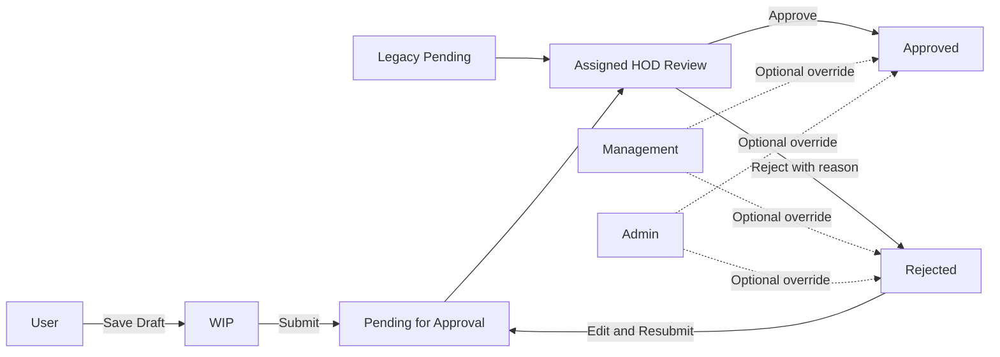
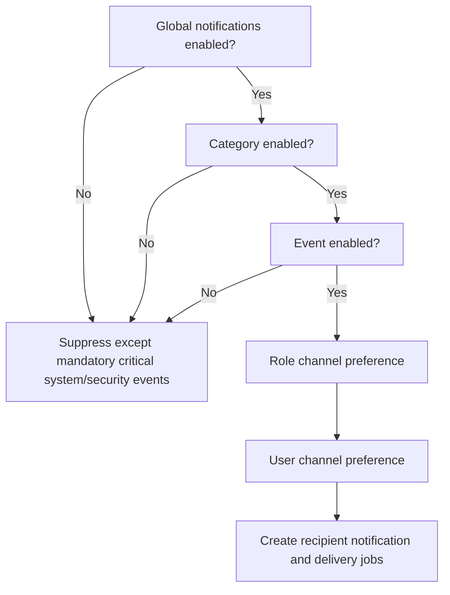
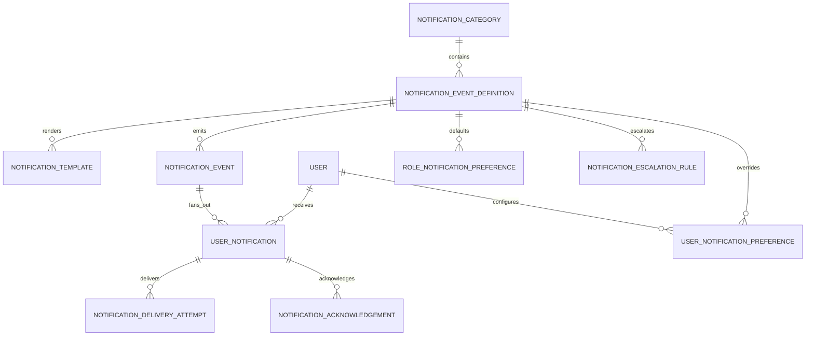
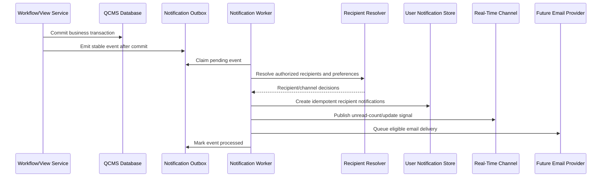
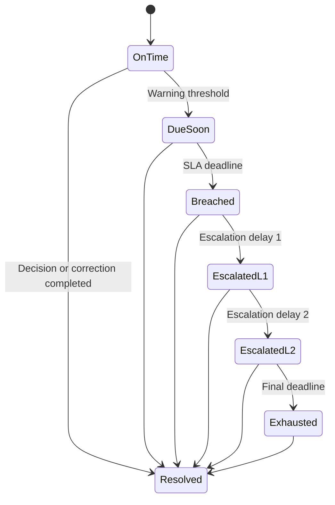
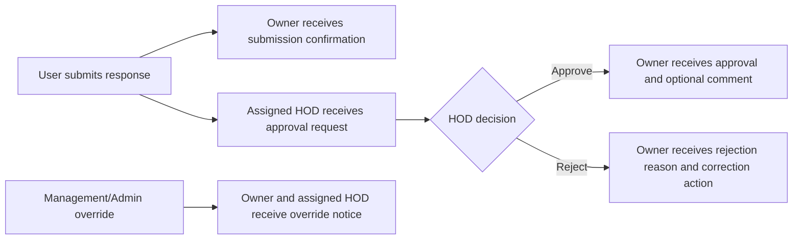

# QCMS Notification Center Master Plan

## 1. Executive Summary

QCMS should introduce a centralized, configurable Notification Center that converts workflow, security, audit, and system events into targeted messages for Users, assigned HODs, Management, and Admins.

The current application already provides a working Phase 1 notification foundation:

- `ChecklistResponse` records WIP, Pending, Pending for Approval, Approved, and Rejected states.
- Every response belongs to a user and stores its responsible HOD.
- The assigned HOD is the mandatory normal approver.
- Management and Admin may approve or reject as override authorities.
- `ResponseDecision` provides immutable approval/rejection history and comments.
- `ActivityLog` records operational and security activity.
- `NotificationSetting` stores global enablement, bell, popup, sound, retention, colors, and per-event settings.
- `Notification` provides a durable per-recipient inbox with read state, action-required state, related-object navigation, and one-time popup tracking.
- Notification APIs provide recipient-scoped list, poll, mark-read, mark-all-read, and delete operations.
- The shared header provides a bell, unread badge, drawer, Action Required filter, polling every 45 seconds, and High/Critical popups.
- The Admin Notification Control page manages the implemented Phase 1 event set.
- Optional submit-time geolocation provides additional audit evidence.

The remaining enterprise gap is not the absence of notifications; it is the absence of categories, templates, role/user preference inheritance, acknowledgement, delivery history, asynchronous fan-out, email delivery, SLA scheduling, escalation state, full history/search, and operational telemetry. The target design should evolve the current implementation into a dedicated notification domain without breaking the existing event producers or inbox.

### Recommended Defaults

- Global notifications: **Enabled**.
- In-app notifications: **Enabled**.
- Popups: **Enabled for High and Critical events only**.
- Sound: **Disabled by default**.
- Email: **Disabled until an email provider and verified addresses are configured**.
- Escalation: **Disabled until SLA rules and scheduled workers are deployed**.
- Retention: **365 days for notification history**, configurable by Admin.
- Low-priority informational events: retained in the drawer but normally silent.
- Geolocation data: never embedded directly in notification text or email.

## 2. Current Workflow Context

### Role Responsibilities

| Role | Normal responsibility | Notification scope |
|---|---|---|
| User | Complete, save, submit, correct, and resubmit assigned checklists | Own checklist availability, submissions, decisions, comments, and personal security events |
| HOD | Review responses belonging to users assigned to that HOD | Assigned approval queue, resubmissions, SLA reminders, and override outcomes affecting assigned responses |
| Management | Oversight, escalation, and optional override authority | Aggregated exceptions, SLA breaches, escalations, high-risk activity, and override confirmations |
| Admin | Configuration, master data, users, permissions, audit, and override authority | System configuration, security, audit, failures, data integrity, and administrative operations |

### Current Implementation Baseline

| Capability | Current state | Master-plan direction |
|---|---|---|
| Persistence | Implemented: one `Notification` row per recipient | Split immutable business event from recipient delivery/read state |
| Global controls | Implemented: notifications, bell, popup, sound, retention | Add email, escalation, category controls, quiet hours, and mandatory-event policy |
| Per-event controls | Implemented for 20 event keys: enabled, priority, popup | Add category, channel, role, user, template, and escalation controls |
| Bell and drawer | Implemented with All, Unread, and Action Required views | Add Critical tab, categories, pagination, date groups, acknowledgement, and history link |
| Real-time behavior | 45-second browser polling | Retain polling first; add SSE when operationally justified |
| Popups | High/Critical only; 8 seconds High and 12 seconds Critical | Make duration configurable; Critical should support sticky acknowledgement |
| Retention | Lazy purge during polling using global retention days | Move to scheduled retention jobs with archive/legal-hold support |
| Email | Not implemented | Future provider-backed delivery with attempts, retry, bounce, and suppression tracking |
| SLA/escalation | Not implemented | Future business-calendar scheduler and explicit escalation instances |
| Templates | Titles are defined in code; messages are composed by callers | Versioned, channel-specific, safely rendered Admin templates |
| Preferences | No role/user preference models | Inherited role defaults plus optional user overrides |
| Audit | Settings changes and key workflow decisions are logged; coverage is incomplete | Audit configuration, templates, tests, retention, exports, and delivery failures |

### Implemented Event-Key Mapping

The following keys exist now and should be preserved through migration or mapped through aliases. Canonical dotted keys are recommended for the enterprise catalog.

| Current event key | Canonical event key | Current producer / purpose |
|---|---|---|
| `checklist_submitted` | `checklist.submission_succeeded` | Owner confirmation after initial submission |
| `checklist_resubmitted` | `checklist.resubmitted` | Owner confirmation after rejected-response resubmission |
| `new_approval_request` | `approval.requested` | Assigned HOD receives a new review request |
| `rejected_response_resubmitted` | `approval.resubmission_requested` | Assigned HOD receives a corrected response |
| `checklist_approved` | `approval.completed` | Owner receives approval result |
| `checklist_rejected` | `rejection.completed` | Owner receives rejection result |
| `rejection_comment_available` | `rejection.reason_available` | Owner is told that correction guidance exists |
| `user_assigned_to_hod` | `hod.user_assigned` | HOD receives a user assignment |
| `user_removed_from_hod` | `hod.user_unassigned` | Previous HOD receives removal notice |
| `missing_assigned_hod_alert` | `management.approver_missing` | Management oversight for an unassigned user/response |
| `missing_hod_assignment_detected` | `admin.approver_missing` | Admin data-governance alert |
| `override_approval_performed` | `approval.override_actor_confirmation` | Management actor confirmation |
| `override_rejection_performed` | `rejection.override_actor_confirmation` | Management actor confirmation |
| `user_created` | `admin.user_created` | Admin notification after user creation |
| `user_deactivated` | `admin.user_deactivated` | Admin alert after deactivation |
| `notification_settings_changed` | `admin.notification_config_changed` | Admin notification after Notification Control save |
| `suspicious_upload_rejected` | `security.upload_rejected` | User and Admin warning for rejected checklist upload |
| `permission_denied_threshold` | `security.permission_denied_repeated` | Admin alert after five denied actions in 15 minutes |
| `geolocation_capture_failed` | `audit.location_unavailable` | Owner information when submission succeeds without location |
| `protected_audit_action_blocked` | `audit.integrity_exception` | Admin alert when protected decision history blocks deletion |

Migration rule: retain the current keys until all existing rows, settings JSON, tests, and producers have been migrated. A registry alias must prevent duplicate notifications while old and new producers coexist.

## 3. Design Principles

1. **Event-driven:** business code emits stable event keys; delivery rules decide who receives what.
2. **Authorization-aware:** a notification never grants access to an object. Opening it must re-check current permissions.
3. **Transactional:** notifications are created only after the related database transaction commits successfully.
4. **Idempotent:** retries must not create duplicate recipient notifications.
5. **Configurable:** global, category, event, role, and user settings follow a documented precedence order.
6. **Auditable:** generation, suppression, delivery, read, dismissal, failure, and escalation are traceable.
7. **Privacy-preserving:** sensitive answers, rejection text, coordinates, and IP addresses are not exposed in previews.
8. **Actionable:** high-priority items link directly to the authorized response, queue, audit record, or setting.
9. **Quiet by default:** routine events go to the inbox without disruptive popups or sound.
10. **Future-ready:** email, SLA escalation, SSE/WebSockets, and external integrations can be added without changing event producers.

## 4. Priority and Presentation Standard

| Priority | Default color | Hex | Intended use | Default popup behavior |
|---|---|---:|---|---|
| Critical | Red | `#DC2626` | Security incidents, data integrity failures, service outages, exhausted escalations | Sticky until acknowledged |
| High | Orange | `#EA580C` | Rejections, urgent approvals, SLA breaches, permission changes, failed critical operations | 8 seconds |
| Medium | Blue | `#2563EB` | Normal submissions, approvals, assignments, configuration changes | 5 seconds when popup is enabled |
| Low | Gray | `#6B7280` | Informational updates, successful routine operations, summaries | No popup by default |

Admin may configure colors, but the UI must enforce WCAG-compatible contrast and must not permit two priorities to become visually indistinguishable without a warning.

## 5. Complete Notification Event Catalog

The following catalog covers current QCMS events and recommended future events. Every row supplies the requested name, trigger, recipients, default priority, default enabled state, popup requirement, in-app requirement, future email requirement, and escalation candidacy. `Email` means future email eligibility, not that email should be implemented immediately. Events in the Implemented Event-Key Mapping are available now; all other rows are target-state events unless explicitly described as current behavior.

### 5.1 Checklist Notifications

| Key / Notification Name | Trigger Event | Recipient(s) | Priority | Default | Popup | In-App | Email | Escalation |
|---|---|---|---|---|---|---|---|---|
| `checklist.available` / New Checklist Available | Active checklist becomes applicable to a user's department/project/domain | Matching Users; relevant HODs | Medium | Enabled | No | Yes | Yes | No |
| `checklist.updated` / Checklist Updated | Questions, sections, applicability, or metadata change | Matching Users; relevant HODs | Medium | Enabled | No | Yes | Yes | No |
| `checklist.deactivated` / Checklist Withdrawn | Admin deactivates an applicable checklist | Matching Users; relevant HODs | Medium | Enabled | No | Yes | Yes | No |
| `checklist.assignment_changed` / Checklist Scope Changed | Project or department applicability changes | Newly affected and removed Users; relevant HODs | Medium | Enabled | No | Yes | Yes | No |
| `checklist.wip_saved` / Draft Saved | User successfully saves WIP | Acting User | Low | Disabled | No | Yes | No | No |
| `checklist.wip_stale` / Draft Awaiting Completion | WIP remains unchanged beyond configured age | Checklist owner | Medium | Disabled | No | Yes | Yes | Yes |
| `checklist.submission_succeeded` / Checklist Submitted | Response enters Pending for Approval or legacy Pending | Checklist owner | Medium | Enabled | No | Yes | Yes | No |
| `checklist.resubmitted` / Checklist Resubmitted | Rejected response is corrected and resubmitted | Owner; assigned HOD | High | Enabled | Yes | Yes | Yes | Yes |
| `checklist.submission_failed` / Submission Failed | Server-side validation or persistence prevents submission | Acting User; Admin after repeated failures | High | Enabled | Yes | Yes | No | Yes |
| `checklist.required_answer_missing` / Required Answers Missing | Final submit fails required-answer validation | Acting User | Medium | Enabled | Yes | Yes | No | No |
| `checklist.attachment_rejected` / Attachment Rejected | Upload fails size, signature, PDF, image, or document validation | Acting User | High | Enabled | Yes | Yes | No | No |
| `checklist.response_deleted` / Response Deleted | Admin deletes an eligible response | Owner; assigned HOD; Admin actor | High | Enabled | Yes | Yes | Yes | No |

### 5.2 Approval Notifications

| Key / Notification Name | Trigger Event | Recipient(s) | Priority | Default | Popup | In-App | Email | Escalation |
|---|---|---|---|---|---|---|---|---|
| `approval.requested` / Approval Required | Response enters Pending for Approval | Assigned HOD | High | Enabled | Yes | Yes | Yes | Yes |
| `approval.requested_legacy` / Legacy Response Requires Review | Legacy Pending response enters or remains in review queue | Assigned HOD or Admin if no HOD | High | Enabled | Yes | Yes | Yes | Yes |
| `approval.completed` / Response Approved | Assigned HOD approves response | Owner | Medium | Enabled | Yes | Yes | Yes | No |
| `approval.comment_added` / Approval Comment Added | Approval contains an optional comment | Owner | Medium | Enabled | No | Yes | Yes | No |
| `approval.override_completed` / Response Override Approved | Management or Admin override-approves response | Owner; assigned HOD; override actor | High | Enabled | Yes | Yes | Yes | No |
| `approval.queue_summary` / Approval Queue Summary | Scheduled daily/weekly digest | HOD | Low | Disabled | No | Yes | Yes | No |
| `approval.assignment_missing` / No Assigned HOD | Submitted response cannot resolve an active HOD | Owner; Admin; relevant Management | Critical | Enabled | Yes | Yes | Yes | Yes |
| `approval.assignment_changed` / Approver Assignment Changed | User's assigned HOD changes while responses are pending | Old HOD; new HOD; owner; Admin | High | Enabled | Yes | Yes | Yes | No |
| `approval.decision_conflict` / Decision Could Not Be Applied | Concurrent action or invalid transition blocks approval | Acting reviewer; Admin after repetition | High | Enabled | Yes | Yes | No | Yes |

### 5.3 Rejection Notifications

| Key / Notification Name | Trigger Event | Recipient(s) | Priority | Default | Popup | In-App | Email | Escalation |
|---|---|---|---|---|---|---|---|---|
| `rejection.completed` / Response Rejected | Assigned HOD rejects with mandatory reason | Owner | High | Enabled | Yes | Yes | Yes | No |
| `rejection.reason_available` / Rejection Reason Available | Rejection decision is committed | Owner | High | Enabled | Yes | Yes | Yes | No |
| `rejection.override_completed` / Response Override Rejected | Management or Admin override-rejects | Owner; assigned HOD; override actor | High | Enabled | Yes | Yes | Yes | No |
| `rejection.ready_for_correction` / Correction Required | Response enters Rejected and becomes owner-editable | Owner | High | Enabled | Yes | Yes | Yes | Yes |
| `rejection.not_resubmitted` / Rejected Response Still Open | Rejected response remains unchanged beyond configured interval | Owner; assigned HOD | Medium | Disabled | No | Yes | Yes | Yes |
| `rejection.repeat_pattern` / Repeated Rejections Detected | Same user/checklist exceeds rejection threshold | HOD; Management | High | Disabled | No | Yes | Yes | Yes |
| `rejection.reason_validation_failed` / Rejection Reason Required | Reviewer attempts rejection without a reason | Acting reviewer | Medium | Enabled | Yes | Yes | No | No |

### 5.4 HOD Notifications

| Key / Notification Name | Trigger Event | Recipient(s) | Priority | Default | Popup | In-App | Email | Escalation |
|---|---|---|---|---|---|---|---|---|
| `hod.user_assigned` / User Assigned to You | Admin assigns a user to an HOD | Assigned HOD | Medium | Enabled | No | Yes | Yes | No |
| `hod.user_unassigned` / User Removed from Your Approval Scope | Assigned HOD relationship is removed or replaced | Previous HOD | Medium | Enabled | No | Yes | Yes | No |
| `hod.pending_count_threshold` / Approval Queue Threshold Reached | Pending assigned responses exceed configured threshold | HOD | High | Disabled | Yes | Yes | Yes | Yes |
| `hod.response_reassigned` / Pending Response Reassigned | Pending response responsibility moves to another HOD | Old HOD; new HOD | High | Enabled | Yes | Yes | Yes | No |
| `hod.override_notice` / Management or Admin Override Applied | Override affects a response assigned to the HOD | Assigned HOD | High | Enabled | Yes | Yes | Yes | No |
| `hod.account_inactive_with_queue` / HOD Unavailable with Pending Queue | HOD/user profile becomes inactive while assigned responses remain pending | Admin; Management | Critical | Enabled | Yes | Yes | Yes | Yes |
| `hod.daily_digest` / HOD Daily Review Digest | Scheduled digest includes new, aging, and rejected items | HOD | Low | Disabled | No | Yes | Yes | No |

### 5.5 Management Notifications

| Key / Notification Name | Trigger Event | Recipient(s) | Priority | Default | Popup | In-App | Email | Escalation |
|---|---|---|---|---|---|---|---|---|
| `management.sla_overview` / SLA Exception Summary | Scheduled summary of approaching and breached SLAs | Management | High | Disabled | No | Yes | Yes | No |
| `management.escalation_received` / Response Escalated | Escalation rule targets Management | Management recipients selected by rule | High | Disabled | Yes | Yes | Yes | Yes |
| `management.override_confirmation` / Override Recorded | Management performs approve/reject override | Acting manager | Medium | Enabled | No | Yes | Yes | No |
| `management.override_rate_high` / High Override Rate Detected | Override frequency exceeds configured threshold | Management; Admin | High | Disabled | No | Yes | Yes | Yes |
| `management.rejection_trend` / Rejection Trend Alert | Project/department rejection rate crosses threshold | Management | Medium | Disabled | No | Yes | Yes | Yes |
| `management.compliance_exception` / Compliance Exception Detected | Missing HOD, invalid assignment, overdue critical response, or policy exception | Management; Admin | Critical | Disabled | Yes | Yes | Yes | Yes |
| `management.periodic_digest` / Management Oversight Digest | Daily/weekly operational summary | Management | Low | Disabled | No | Yes | Yes | No |

### 5.6 Admin Notifications

| Key / Notification Name | Trigger Event | Recipient(s) | Priority | Default | Popup | In-App | Email | Escalation |
|---|---|---|---|---|---|---|---|---|
| `admin.user_created` / User Created | Admin creates a user/profile | Admin actor; new user | Low | Enabled | No | Yes | Yes | No |
| `admin.user_updated` / User Profile or Role Updated | Role, department, project, HOD, or profile changes | Affected user; Admin actor | Medium | Enabled | No | Yes | Yes | No |
| `admin.user_activated` / Account Activated | Account becomes active | Affected user; Admin actor | Medium | Enabled | No | Yes | Yes | No |
| `admin.user_deactivated` / Account Deactivated | Account becomes inactive | Affected user where deliverable; Admin; assigned HOD if relevant | High | Enabled | Yes | Yes | Yes | No |
| `admin.permission_changed` / Role Permissions Changed | Visible columns or allowed actions change | Affected role users; Admin actor | High | Enabled | Yes | Yes | Yes | No |
| `admin.department_changed` / Department Configuration Changed | Department is created, updated, activated, or deleted | Admins; affected HODs when material | Medium | Enabled | No | Yes | No | No |
| `admin.project_changed` / Project Configuration Changed | Project is created, updated, activated, or deleted | Admins; affected HODs/Management when material | Medium | Enabled | No | Yes | No | No |
| `admin.checklist_created` / Checklist Created | Checklist definition is created | Admin actor; scoped users when activated | Low | Enabled | No | Yes | No | No |
| `admin.checklist_updated` / Checklist Definition Updated | Checklist structure or scope changes | Admin actor; scoped users/HODs | Medium | Enabled | No | Yes | Yes | No |
| `admin.settings_changed` / Control Panel Settings Changed | Admin saves global settings | All Admins | High | Enabled | Yes | Yes | Yes | No |
| `admin.geolocation_enabled` / Geolocation Tracking Enabled | Global geolocation changes from off to on | All Admins; affected users through policy notice | High | Enabled | Yes | Yes | Yes | No |
| `admin.geolocation_disabled` / Geolocation Tracking Disabled | Global geolocation changes from on to off | All Admins | Medium | Enabled | No | Yes | Yes | No |
| `admin.notification_config_changed` / Notification Configuration Changed | Category, event, template, priority, retention, or channel setting changes | All Admins | High | Enabled | Yes | Yes | Yes | No |
| `admin.notification_template_changed` / Notification Template Changed | Admin creates, activates, rolls back, or edits a channel template | All Admins; compliance role | High | Enabled | No | Yes | Yes | No |
| `admin.notification_role_preference_changed` / Role Notification Defaults Changed | Admin changes inherited notification behavior for a role | Affected role users; all Admins | High | Enabled | No | Yes | Yes | No |
| `admin.notification_retention_changed` / Notification Retention Policy Changed | Retention, archive, or legal-hold policy changes | All Admins; compliance role | Critical | Enabled | Yes | Yes | Yes | Yes |
| `admin.test_notification` / Test Notification | Admin uses Test Notification action | Selected test recipient(s) | Low | Enabled | Yes | Yes | No | No |
| `admin.protected_delete_blocked` / Protected Deletion Blocked | Response or record cannot be deleted because history must remain | Acting Admin | High | Enabled | Yes | Yes | No | No |
| `admin.branding_upload_rejected` / Branding Upload Rejected | Logo, favicon, or sidebar-logo upload fails validation | Acting Admin; security role after repeated failures | High | Enabled | Yes | Yes | No | Yes |
| `admin.configuration_reset` / Control Panel Configuration Reset | Admin resets branding, appearance, security, or notification settings | All Admins | Critical | Enabled | Yes | Yes | Yes | Yes |

### 5.7 Security Notifications

| Key / Notification Name | Trigger Event | Recipient(s) | Priority | Default | Popup | In-App | Email | Escalation |
|---|---|---|---|---|---|---|---|---|
| `security.login_failed` / Failed Login Attempt | Authentication fails | Affected user after threshold; Admin/security role | Medium | Disabled | No | Yes | Yes | Yes |
| `security.login_failure_threshold` / Repeated Login Failures | User/IP exceeds configured threshold | Admin/security role; affected user | Critical | Enabled | Yes | Yes | Yes | Yes |
| `security.password_changed` / Password Changed | Password update succeeds | Affected user | High | Enabled | Yes | Yes | Yes | No |
| `security.password_change_failed` / Password Change Failed | Incorrect current password or validation failure | Acting user; Admin after threshold | Medium | Enabled | Yes | Yes | Yes | Yes |
| `security.role_elevated` / Privileged Role Assigned | User gains HOD, Management, or Admin role | Affected user; all Admins | Critical | Enabled | Yes | Yes | Yes | Yes |
| `security.permission_denied_repeated` / Repeated Unauthorized Actions | Multiple backend authorization failures occur | Admin/security role | Critical | Disabled | Yes | Yes | Yes | Yes |
| `security.upload_rejected` / Suspicious Upload Rejected | Checklist attachment fails security validation | Acting user; Admin/security role | High | Enabled | Yes | Yes | Yes | Yes |
| `security.upload_attack_suspected` / Suspicious Upload Rejected | Repeated spoofed, invalid, or malicious-looking uploads | Admin/security role | Critical | Enabled | Yes | Yes | Yes | Yes |
| `security.profile_image_rejected` / Profile Image Rejected | Profile image payload fails type, content, size, or decode validation | Acting user; Admin after repeated failures | Medium | Enabled | Yes | Yes | No | Yes |
| `security.session_expired` / Session Expired | Session timeout terminates authenticated session | Affected user | Low | Enabled | No | Yes | No | No |
| `security.unusual_ip` / Unusual Submission Network | Future rule identifies materially unusual IP context | User; Admin/security role | High | Disabled | Yes | Yes | Yes | Yes |
| `security.geolocation_mismatch` / Location Consistency Exception | Future GPS/IP/site rule identifies a large discrepancy | Owner; assigned HOD; security reviewer | High | Disabled | No | Yes | Yes | Yes |
| `security.data_export` / Sensitive Data Exported | Future report/export contains responses, audit, or location data | Exporting user; Admin/security role | Critical | Enabled | Yes | Yes | Yes | Yes |

### 5.8 Audit Notifications

| Key / Notification Name | Trigger Event | Recipient(s) | Priority | Default | Popup | In-App | Email | Escalation |
|---|---|---|---|---|---|---|---|---|
| `audit.decision_recorded` / Decision History Recorded | Immutable ResponseDecision is created | Admin audit role; actor confirmation where useful | Low | Disabled | No | Yes | No | No |
| `audit.override_recorded` / Override Added to Audit History | Decision with `is_override=True` is created | Admin audit role; Management | High | Enabled | No | Yes | Yes | Yes |
| `audit.log_failure` / Audit Logging Failure | Activity log cannot be persisted | Admin/security role | Critical | Enabled | Yes | Yes | Yes | Yes |
| `audit.integrity_exception` / Audit Integrity Exception | Attempted modification/deletion of protected decision history | Admin/security role | Critical | Enabled | Yes | Yes | Yes | Yes |
| `audit.retention_due` / Audit Retention Review Due | Audit records reach policy review boundary | Admin/compliance role | Medium | Disabled | No | Yes | Yes | Yes |
| `audit.location_recorded` / Submission Location Evidence Recorded | Submit stores valid coordinates and/or server IP | Owner; authorized reviewer only | Low | Disabled | No | Yes | No | No |
| `audit.location_unavailable` / Location Not Captured | Tracking enabled but permission denied, unavailable, timed out, or invalid | Owner; Admin only if policy requires | Low | Disabled | No | Yes | No | No |
| `audit.admin_action_summary` / Administrative Activity Summary | Scheduled digest of privileged changes | Admin/compliance role | Medium | Disabled | No | Yes | Yes | No |
| `audit.notification_deleted` / Notification Deleted | Recipient deletes an inbox item | Recipient history; Admin/compliance only when policy requires | Low | Disabled | No | Yes | No | No |
| `audit.notifications_bulk_read` / Notifications Marked Read in Bulk | Recipient uses Mark All Read | Recipient; operational audit | Low | Disabled | No | Yes | No | No |
| `audit.notification_history_exported` / Notification History Exported | Authorized user exports notification or delivery history | Exporting user; Admin/compliance role | High | Enabled | Yes | Yes | Yes | Yes |
| `audit.notification_test_sent` / Test Notification Sent | Admin sends an in-app or future email test | Acting Admin; selected test recipient | Medium | Enabled | No | Yes | No | No |
| `audit.notification_retention_purged` / Notification Retention Purge Completed | Scheduled or manual retention removes/archives eligible records | Admin/compliance role | High | Enabled | No | Yes | Yes | Yes |
| `audit.notification_delivery_suppressed` / Notification Delivery Suppressed | Mandatory/global/category/event/role/user policy suppresses a channel | Admin operations view; no routine recipient alert | Low | Disabled | No | Yes | No | No |

### 5.9 SLA Notifications (Future)

| Key / Notification Name | Trigger Event | Recipient(s) | Priority | Default | Popup | In-App | Email | Escalation |
|---|---|---|---|---|---|---|---|---|
| `sla.approval_due_soon` / Approval Due Soon | Remaining approval time reaches warning threshold | Assigned HOD | Medium | Disabled | No | Yes | Yes | Yes |
| `sla.approval_due_today` / Approval Due Today | Approval deadline falls within current business day | Assigned HOD | High | Disabled | Yes | Yes | Yes | Yes |
| `sla.approval_breached` / Approval SLA Breached | Pending response exceeds approval SLA | Assigned HOD; Management | Critical | Disabled | Yes | Yes | Yes | Yes |
| `sla.correction_due_soon` / Correction Due Soon | Rejected response approaches correction deadline | Owner | Medium | Disabled | No | Yes | Yes | Yes |
| `sla.correction_breached` / Correction SLA Breached | Rejected response remains unresolved beyond SLA | Owner; assigned HOD | High | Disabled | Yes | Yes | Yes | Yes |
| `sla.assignment_unresolved` / Approver Assignment SLA Breached | Submitted response remains without an active HOD | Admin; Management | Critical | Disabled | Yes | Yes | Yes | Yes |
| `sla.escalation_unacknowledged` / Escalation Not Acknowledged | Escalated notification remains unacknowledged | Current and next escalation recipients | Critical | Disabled | Yes | Yes | Yes | Yes |
| `sla.recovery_completed` / SLA Exception Resolved | Previously breached item is completed or reassigned | Prior escalation recipients | Medium | Disabled | No | Yes | Yes | No |
| `sla.weekly_report` / Weekly SLA Performance Report | Scheduled weekly summary | Management; Admin | Low | Disabled | No | Yes | Yes | No |

### 5.10 Escalation Notifications (Future)

| Key / Notification Name | Trigger Event | Recipient(s) | Priority | Default | Popup | In-App | Email | Escalation |
|---|---|---|---|---|---|---|---|---|
| `escalation.level_1` / First-Level Escalation | First escalation delay expires | Assigned HOD; configured backup HOD | High | Disabled | Yes | Yes | Yes | Yes |
| `escalation.level_2` / Management Escalation | Level-one item remains unresolved | Management; assigned HOD | Critical | Disabled | Yes | Yes | Yes | Yes |
| `escalation.level_3` / Administrative Escalation | Management escalation remains unresolved | Admin; Management | Critical | Disabled | Yes | Yes | Yes | Yes |
| `escalation.acknowledged` / Escalation Acknowledged | Recipient acknowledges ownership | Previous escalation recipients; owner where appropriate | Medium | Disabled | No | Yes | Yes | No |
| `escalation.resolved` / Escalation Resolved | Related response reaches an accepted terminal/resolved state | All escalation participants | Medium | Disabled | No | Yes | Yes | No |
| `escalation.reassigned` / Escalation Reassigned | Admin or Management changes escalation owner | Old and new escalation owners | High | Disabled | Yes | Yes | Yes | Yes |
| `escalation.exhausted` / Escalation Path Exhausted | Final escalation level expires unresolved | Admin; Management; compliance role | Critical | Disabled | Yes | Yes | Yes | No |

### 5.11 System Notifications

| Key / Notification Name | Trigger Event | Recipient(s) | Priority | Default | Popup | In-App | Email | Escalation |
|---|---|---|---|---|---|---|---|---|
| `system.maintenance_scheduled` / Scheduled Maintenance | Admin publishes maintenance window | All active users | Medium | Enabled | Yes | Yes | Yes | No |
| `system.maintenance_started` / Maintenance Started | Maintenance begins | All active users | High | Enabled | Yes | Yes | Yes | No |
| `system.maintenance_completed` / Maintenance Completed | Maintenance ends successfully | All active users | Low | Enabled | No | Yes | Yes | No |
| `system.service_degraded` / Service Degraded | Health monitoring detects degraded service | Admin; Management; affected users where useful | High | Disabled | Yes | Yes | Yes | Yes |
| `system.service_unavailable` / Service Unavailable | Critical application dependency fails | Admin/operations role | Critical | Disabled | Yes | Yes | Yes | Yes |
| `system.background_job_failed` / Background Job Failed | Notification, SLA, retention, or email worker fails | Admin/operations role | Critical | Disabled | Yes | Yes | Yes | Yes |
| `system.email_delivery_failed` / Email Delivery Failed | Future email provider exhausts retries | Admin; original recipient through in-app status | High | Disabled | No | Yes | No | Yes |
| `system.notification_generation_failed` / Notification Generation Failed | Event processing cannot resolve or persist recipient notifications | Admin/operations role | Critical | Enabled | Yes | Yes | Yes | Yes |
| `system.notification_queue_delayed` / Notification Queue Delayed | Oldest unprocessed notification event exceeds latency threshold | Admin/operations role | High | Disabled | Yes | Yes | Yes | Yes |
| `system.notification_dead_lettered` / Notification Event Dead-Lettered | Processing retries are exhausted | Admin/operations role | Critical | Disabled | Yes | Yes | Yes | Yes |
| `system.storage_threshold` / Storage Capacity Warning | Database/media/log storage reaches threshold | Admin/operations role | High | Disabled | Yes | Yes | Yes | Yes |
| `system.backup_failed` / Backup Failed | Scheduled backup fails verification | Admin/operations role | Critical | Disabled | Yes | Yes | Yes | Yes |
| `system.release_deployed` / QCMS Updated | New application release is deployed | Admin; optionally all users for visible changes | Low | Disabled | No | Yes | Yes | No |
| `system.retention_completed` / Notification Retention Completed | Retention job archives/deletes eligible history | Admin | Low | Disabled | No | Yes | No | No |

## 6. Recipient Resolution Rules

Recipient selection must be implemented as named resolver policies, not repeated inline queries.

| Resolver | Rule |
|---|---|
| `response_owner` | `ChecklistResponse.submitted_by`, if active |
| `assigned_hod` | `ChecklistResponse.hod`; fall back to valid `UserProfile.assigned_hod` only before submission; never broadcast approval requests to every HOD |
| `scoped_hods` | Active HODs in the affected department/project, used only for informational checklist events |
| `management_active` | Active Management users, optionally narrowed by project/domain in a future scope model |
| `admins_active` | Active Admin users |
| `actor` | User who caused the event, normally used for confirmation rather than alerts |
| `affected_role` | Active users whose current role matches the changed permission/configuration scope |
| `escalation_rule` | Recipients configured for the current escalation level |

Users who become inactive should stop receiving new routine notifications. Existing notification history must retain the recipient snapshot for audit purposes.

## 7. Configuration Precedence

The effective policy should be resolved in this order, with the first explicit block winning:

Recommended precedence:

1. Mandatory security/system policy.
2. Global notification setting.
3. Category setting.
4. Event definition setting.
5. Role preference.
6. User preference.
7. Per-recipient temporary mute or quiet hours.

Users may reduce optional channels but must not disable mandatory Critical security, account, or compliance notices. Admin UI must clearly label mandatory events.

## 8. Control Panel Notification Center

Add a dedicated **Notifications** section to the Admin Control Panel with the following tabs.

### 8.1 General

- Global Enable/Disable Notifications toggle.
- In-App Notifications toggle.
- Popup Notifications toggle.
- Sound toggle and sound selection.
- Email master toggle, displayed as future-ready until provider configuration is valid.
- Escalation master toggle, disabled until scheduled processing is available.
- Default retention period in days.
- Quiet hours and organization timezone.
- Maximum unread badge count display (`99+` recommended).

### 8.2 Categories

- List all eleven required categories.
- Enable/disable each category.
- Configure category icon and display order.
- Show number of enabled events and recipients affected.
- Prevent disabling mandatory security/system categories without elevated confirmation.

### 8.3 Event Rules

Each event row should include:

- Event key and friendly name.
- Category.
- Current/future implementation status.
- Enabled toggle.
- Priority selector.
- Popup, in-app, email, sound, and escalation toggles.
- Recipient resolver summary.
- Template link.
- Last triggered timestamp and 30-day volume.
- Test action.

Use filters for category, priority, enabled state, channel, recipient role, and implementation status.

### 8.4 Priority and Colors

- Four color swatches with accessible color pickers.
- Contrast validation against light and dark backgrounds.
- Preview for toast, bell item, drawer row, email heading, and dashboard widget.
- Reset to recommended palette.

### 8.5 Popup and Sound

- Duration by priority.
- Recommended defaults: Low `0` seconds/no popup, Medium `5` seconds when explicitly enabled, High `8` seconds, Critical sticky until acknowledged with a configurable `12`-second fallback only for non-actionable Critical notices.
- Critical notification behavior: sticky or timed.
- Maximum simultaneous popups, recommended `3`.
- Deduplication window, recommended `60` seconds.
- Sound by priority, with sound disabled globally by default.
- Respect browser reduced-motion and user accessibility settings.

### 8.6 Retention

- History retention days, recommended default `365`.
- Read-notification retention, optionally shorter than unread retention.
- Critical/security retention override.
- Archive-before-delete option.
- Dry-run count and confirmation before retention execution.
- Legal hold flag for protected records.

### 8.7 Notification Templates

- Separate in-app title, in-app body, popup body, and future email subject/body.
- Supported variables displayed beside the editor.
- Preview using sanitized sample data.
- Template version history and rollback.
- Locale/language field for future internationalization.
- Test rendering must never use arbitrary executable template expressions.

### 8.8 Role Preferences

- Matrix: Role x Category/Event x Channel.
- Default preferences for User, HOD, Management, and Admin.
- Mandatory-event lock indicator.
- Bulk enable/disable by role and category.

### 8.9 User Preferences

- Search user and inspect effective settings.
- Show inherited role defaults and explicit overrides.
- Allow reset to role defaults.
- Users should manage optional popup, sound, email, digest, and quiet-hour preferences from Profile.
- Users must not change event priority, recipients, retention, or mandatory status.

### 8.10 Notification History

- Search by event key, recipient, actor, response, checklist, category, priority, date, and delivery state.
- Filter unread/read, popup shown, email pending/sent/failed, escalated, acknowledged, and expired.
- View sanitized payload and delivery attempts.
- Export permission restricted to Admin/compliance roles.
- No inline editing or deletion of individual audit-relevant history records.

### 8.11 Test Notification

- Select event definition, test recipient, channels, and sample priority.
- Clearly mark generated records as tests.
- Never trigger workflow actions, SLA timers, or escalation chains.
- Rate-limit test sends.
- Require password reconfirmation for testing future external email delivery.

## 9. Notification Bell Design

- Place a bell icon in the shared authenticated header for every role.
- Use a numeric unread badge; display `99+` above 99.
- Do not animate continuously. A brief accessible pulse is acceptable only for newly received High/Critical items.
- Bell tooltip: `Notifications`.
- Bell button must expose `aria-label`, unread count, keyboard focus, and `aria-expanded`.
- Clicking opens the drawer without navigating away.
- Critical unread state may add a red indicator, but color must not be the only signal.

## 10. Notification Drawer Design

Recommended desktop width: `400-440px`; mobile: full-width overlay.

Drawer structure:

1. Header with unread count, settings link, and `Mark all as read`.
2. Tabs: `All`, `Unread`, `Action Required`, `Critical`.
3. Optional category filter menu.
4. Date groups: `Today`, `Yesterday`, `Earlier`.
5. Notification rows with priority marker, icon, title, concise body, relative time, unread state, and optional action.
6. Footer link to full Notification History.

Row interactions:

- Click marks read and opens the authorized target.
- More menu: mark unread, dismiss, mute optional event, inspect details.
- Action-required items retain their state until the underlying workflow resolves; reading alone does not mean resolved.
- Missing/deleted/inaccessible targets open a neutral message instead of leaking object existence.

## 11. Dashboard Notification Widgets

### User Dashboard

- Corrections required.
- Recently approved responses.
- Drafts approaching reminder threshold.
- Personal unread notifications.

### HOD Dashboard

- New approval requests.
- Approvals due soon and overdue.
- Resubmitted responses.
- Responses overridden by Management/Admin.

### Management Dashboard

- SLA breaches and escalation levels.
- Unassigned approver exceptions.
- Override and rejection trends.
- Critical security/compliance alerts.

### Admin Dashboard

- Critical system/security notifications.
- Failed notification deliveries and jobs.
- Unresolved HOD assignments.
- Recent permission/configuration changes.
- Notification volume and unread/acknowledgement metrics.

Widgets should show compact counts and latest actionable items, not duplicate the full drawer.

## 12. Recommended Database Design

### 12.1 Core Models

#### `NotificationCategory`

- `key` unique slug.
- `name`.
- `description`.
- `icon`.
- `is_enabled`.
- `display_order`.
- `is_mandatory`.

#### `NotificationEventDefinition`

- `event_key` unique and immutable.
- `category` foreign key.
- `name`, `description`.
- `default_priority`.
- `is_enabled`.
- `is_implemented`.
- `is_mandatory`.
- `popup_enabled`, `in_app_enabled`, `email_enabled`, `sound_enabled`, `escalation_candidate`.
- `recipient_resolver`.
- `deduplication_window_seconds`.
- `created_at`, `updated_at`, `updated_by`.

#### `NotificationTemplate`

- `event_definition`.
- `channel`: in-app, popup, email.
- `locale`.
- `subject`, `title`, `body`.
- `version`, `is_active`.
- `allowed_variables` JSON.
- `created_by`, `created_at`.

#### `NotificationEvent`

One immutable business event before recipient fan-out:

- `event_id` UUID.
- `event_key` snapshot.
- `actor` nullable.
- `actor_role` snapshot.
- `response` nullable foreign key.
- `checklist` nullable foreign key.
- `object_type` and `object_id` for other entities.
- `payload` JSON containing only approved template variables.
- `deduplication_key` unique when supplied.
- `occurred_at`.
- `created_at`.
- `is_test`.

#### `UserNotification`

One row per recipient:

- `notification_event`.
- `recipient` nullable foreign key plus immutable recipient identity snapshot.
- `priority` snapshot.
- `title`, `body` rendered and sanitized.
- `target_name`, `target_url` or route parameters.
- `is_read`, `read_at`.
- `is_dismissed`, `dismissed_at`.
- `requires_acknowledgement`, `acknowledged_at`.
- `popup_shown_at`.
- `expires_at`.
- `created_at`.

#### `NotificationDeliveryAttempt`

- `user_notification`.
- `channel`.
- `status`: queued, sent, delivered, failed, suppressed.
- `provider_message_id`.
- `attempt_number`.
- `last_error_code`, sanitized `last_error_message`.
- `next_retry_at`, `created_at`, `completed_at`.

#### `RoleNotificationPreference`

- `role`.
- `event_definition` or category.
- Optional channel overrides.
- Digest mode.
- Unique constraint on role and preference target.

#### `UserNotificationPreference`

- `user`.
- `event_definition` or category.
- Optional channel overrides.
- Quiet hours, digest preference, sound preference.
- Unique constraint on user and preference target.

#### `NotificationEscalationRule` (Future)

- `event_definition` or SLA policy.
- `level`.
- `delay_minutes`.
- `recipient_resolver` and optional role.
- `priority_override`.
- `requires_acknowledgement`.
- `is_enabled`.

### 12.2 Recommended Indexes

- `UserNotification(recipient, is_read, created_at DESC)`.
- `UserNotification(recipient, is_dismissed, created_at DESC)`.
- `UserNotification(priority, created_at)`.
- `NotificationEvent(event_key, occurred_at DESC)`.
- `NotificationEvent(response, occurred_at DESC)`.
- Unique `NotificationEvent(deduplication_key)` where non-null.
- `NotificationDeliveryAttempt(status, next_retry_at)`.
- `NotificationDeliveryAttempt(user_notification, channel, attempt_number)`.
- `NotificationEscalationRule(is_enabled, event_definition, level)`.
- `UserNotification(expires_at)` for retention processing.

At high volume, archive or partition `NotificationEvent`, `UserNotification`, and delivery-attempt data by month or quarter.

## 13. Event Processing Architecture

### Reliability Requirements

- Use `transaction.on_commit()` for initial integration.
- Move to a transactional outbox when asynchronous workers are introduced.
- Generate a deterministic deduplication key such as `event_key:response_id:decision_id:recipient_id`.
- Retry transient failures with exponential backoff and a retry cap.
- Send exhausted failures to a dead-letter/admin queue.
- Never roll back an approval or submission because a notification channel failed.

## 14. Real-Time Update Strategy

### Phase 1: Polling

- Poll unread count every 30-60 seconds while the page is visible.
- Fetch drawer data only when opened or when count changes.
- Pause polling in hidden tabs and apply jitter to avoid synchronized requests.
- Suitable for the current Django deployment with minimal infrastructure.

### Phase 2: Server-Sent Events

- Recommended next step for one-way notification delivery.
- Simpler operational model than full WebSockets.
- Authenticate the stream and publish only recipient IDs/event IDs, then fetch authorized content through normal APIs.
- Keep polling as fallback.

### Phase 3: WebSockets

- Use Django Channels with Redis only if QCMS later requires interactive presence, live collaboration, or bidirectional updates.
- WebSockets are not necessary solely for a notification bell.

## 15. API and Authorization Design

Recommended endpoints:

- `GET /notifications/` paginated recipient inbox.
- `GET /notifications/unread-count/` minimal count response.
- `POST /notifications/<id>/read/`.
- `POST /notifications/<id>/unread/`.
- `POST /notifications/<id>/dismiss/`.
- `POST /notifications/<id>/acknowledge/`.
- `POST /notifications/read-all/`.
- `GET/POST /notification-preferences/` for the authenticated user.
- Admin-only category, event, template, role-preference, history, test, and retention endpoints.

Every recipient endpoint must filter by `recipient=request.user`. A stored target URL is only navigation metadata; the destination view must independently apply existing QCMS response, attachment, HOD, Management, and Admin authorization.

## 16. Templates and Safe Content

Recommended variables include:

- `recipient_name`.
- `checklist_id`, `checklist_name`.
- `response_id`, `response_status`.
- `owner_display_name`.
- `actor_display_name`, `actor_role`.
- `project_name`, `department_name`.
- `submitted_at`, `decision_at`, `due_at`.
- `decision_action`.

Do not place these in notification previews by default:

- Full checklist answers.
- File names that may contain sensitive content.
- Rejection/approval comments beyond a short sanitized excerpt.
- Latitude, longitude, exact map URLs, or IP addresses.
- Password, token, session, or raw exception information.

Render templates server-side using a restricted variable map, escape all output, and prohibit arbitrary Django template tags or filters entered by Admin.

## 17. SLA and Escalation Roadmap

QCMS currently has no due-date or business-calendar model. SLA notifications must remain disabled until the following exist:

1. SLA policy by checklist type/project/department.
2. Start event, normally first entry into Pending for Approval.
3. Pause/resume rules, if any.
4. Business timezone, workdays, holidays, and operating hours.
5. Warning and breach thresholds.
6. Escalation levels and recipient resolvers.
7. Acknowledgement and resolution definitions.
8. Scheduled worker with idempotent execution.

Management remains oversight and escalation authority, not a mandatory normal approval stage.

## 18. Geolocation Notification Policy

- Do not generate a popup merely because coordinates were captured successfully.
- A low-priority audit notification may record that location evidence exists, but should be disabled by default.
- Permission denial or unavailable GPS must not be treated as failure because submission is intentionally allowed to continue.
- Never include coordinates or IP in bell text, drawer previews, email, or push messages.
- Authorized users may follow a notification to response details, where existing role checks govern location visibility.
- Future GPS/IP mismatch alerts must be treated as review signals, never proof of fraud or absence.

## 19. Notification History and Audit Trail

Notification history and `ActivityLog` serve different purposes:

- `ActivityLog`: what operation occurred, by whom, from what request context.
- `NotificationEvent`: what business event was emitted.
- `UserNotification`: what each recipient was shown.
- `NotificationDeliveryAttempt`: what each channel attempted and whether it succeeded.

Important notification configuration changes, template changes, test sends, exports, retention runs, and manual history operations must themselves write `ActivityLog` entries.

History should be append-oriented. Read/dismiss/acknowledge timestamps may change, but rendered content, event identity, recipient snapshot, and delivery attempts should not be silently rewritten.

## 20. Scalability Considerations

- Avoid synchronous fan-out to large recipient groups inside web requests.
- Use bulk inserts for recipient rows after authorization-aware resolution.
- Cache event definitions and category settings with short invalidation-aware TTLs.
- Cache unread counts briefly, but treat the database as source of truth.
- Prevent broadcast storms when checklist applicability changes for thousands of users; queue recipient batches.
- Store compact approved payloads, not copied response data.
- Use digest consolidation for frequent low-priority events.
- Apply per-event deduplication and rate limits.
- Archive old delivery attempts sooner than user-visible notification history.
- Monitor queue age, generation latency, delivery latency, failure rate, unread backlog, and escalation backlog.
- Add database read replicas or partitioning only after measured volume justifies them.

## 21. Security and Privacy Controls

- Require authentication for every notification endpoint.
- Enforce recipient ownership for reads and mutations.
- Require Admin role and password reconfirmation for global settings, templates, test email, exports, and retention changes.
- Apply CSRF protection to all mutations.
- Escape titles and bodies; never insert notification content using `innerHTML`.
- Use fixed internal route names or validated same-origin URLs for actions.
- Do not trust client-supplied priority, recipient, actor, event key, or object ownership.
- Rate-limit polling, test sends, read-all, exports, and preference changes.
- Redact exception details and provider credentials.
- Encrypt transport and protect email provider secrets through environment configuration.
- Record configuration and privileged notification-history access in the audit log.

## 22. Testing Strategy

### Unit Tests

- Event definition and preference precedence.
- Recipient resolution for User, assigned HOD, Management, and Admin.
- Mandatory-event enforcement.
- Template escaping and allowed variables.
- Deduplication and idempotency.
- Priority/color validation.
- Retention eligibility.
- SLA business-time calculations when introduced.

### Workflow Integration Tests

- WIP does not notify HOD.
- Submit notifies owner and assigned HOD exactly once.
- Resubmit notifies assigned HOD.
- HOD approval/rejection notifies only the owner and authorized oversight recipients.
- Non-assigned HOD cannot trigger a decision or related decision notification.
- Management/Admin override creates override-specific notifications.
- Rejection reason and optional approval comment remain protected in previews.
- Permission-denied geolocation still permits submission notifications.
- Transaction rollback produces no notification.

### Authorization Tests

- User can list and mutate only personal notifications.
- HOD cannot use notification targets to open unauthorized responses.
- Inactive or role-changed users cannot retain access through old links.
- Admin-only configuration and history endpoints reject other roles.
- Attachment and response authorization remain independent of notification presence.

### Delivery Tests

- Polling unread count and pagination.
- Popup duration and priority behavior.
- Email retries, suppression, and failure recording when enabled.
- Escalation idempotency.
- Retention and legal hold.
- Accessibility and keyboard operation of bell/drawer.

## 23. Recommended Delivery Phases

### Phase 1: In-App Foundation

- Core category, event definition, event, recipient notification, and preference models.
- Global/category/event settings.
- Current workflow events: submit, resubmit, approve, reject, override, missing HOD, attachment rejection.
- Bell, drawer, history page, polling, mark read/unread/dismiss.
- Role/user preferences and test notification.

### Phase 2: Operational Hardening

- Transactional outbox and background worker.
- Delivery attempt history.
- Templates and versioning.
- Digests, quiet hours, retention jobs, metrics, and Admin dashboards.
- SSE real-time updates.

### Phase 3: Email

- Provider abstraction, verified sender, email preferences, unsubscribe policy for optional mail, retries, bounce handling, and delivery monitoring.
- Keep security/account messages compliant with mandatory-delivery policy.

### Phase 4: SLA and Escalation

- SLA policy and business calendar.
- Due-soon, breach, acknowledgement, escalation, recovery, and reporting events.
- Management oversight widgets.

### Phase 5: Enterprise Integrations

- Optional Teams/Slack/webhook channels.
- SIEM export for security events.
- Mobile push only if a supported mobile/PWA strategy exists.
- Advanced anomaly and trend rules with human review.

## 24. Success Metrics

- Median time from submission to HOD acknowledgement.
- Median approval turnaround time.
- Percentage of notifications generated within 5 seconds of event commit.
- Duplicate notification rate.
- Delivery failure and retry-exhaustion rate.
- Unread High/Critical age.
- SLA breach and recovery rate.
- Notification opt-out/mute rate by event.
- Popup dismissal rate.
- Management override rate and associated response outcomes.

Metrics should measure workflow effectiveness, not employee productivity or presence.

## 25. Final Recommendation

Build the Notification Center as a dedicated, auditable event-and-recipient subsystem. Begin with in-app notifications for the highest-value current workflow events and use polling to minimize deployment complexity. Keep email and SLA escalation disabled until their infrastructure and policies are complete.

The most important initial notification path is:

This preserves the confirmed QCMS business rule: assigned-HOD approval is the normal mandatory path, while Management and Admin remain optional override and escalation authorities.

## 26. Decisions Required Before Implementation

1. Confirm whether Critical mandatory notifications may bypass the global disable switch. Recommended: yes for account security, audit integrity, and service outage events, with a visible policy lock.
2. Confirm backup-HOD policy and the recipient resolver used when the assigned HOD is inactive or unavailable.
3. Choose the canonical submitted status and migration path for legacy `Pending` versus `Pending for Approval`.
4. Define whether users may delete notifications or only dismiss them. Recommended: dismiss from the personal inbox while preserving immutable event/delivery history.
5. Define the organization timezone, business calendar, and SLA owner before enabling SLA or escalation events.
6. Define which rejection-comment excerpts, if any, may appear in email. Recommended: subject-safe summary only, with the full reason behind authenticated access.
7. Define retention classes for routine, workflow, security, and compliance notifications rather than relying permanently on one global period.
8. Decide whether Management recipient scope follows department, project/domain, configured escalation rules, or a dedicated oversight assignment model.

## 27. Analysis Evidence Base

This plan was derived from the current implementation and project documentation, including:

- `backend/workflow_service.py`: response statuses, transition rules, owner editing/submission, assigned-HOD decisions, and Management/Admin overrides.
- `backend/models.py`: `UserProfile`, `ChecklistResponse`, immutable `ResponseDecision`, immutable `ActivityLog`, `NotificationSetting`, and `Notification`.
- `backend/views/user_panel.py`: WIP, submit, resubmit, geolocation capture behavior, approval, rejection, override, and current notification producers.
- `backend/views/admin.py`: checklist/master-data administration, permissions, user/HOD assignment, Admin override, protected deletion, and configuration actions.
- `backend/views/notifications.py` and `backend/notification_service.py`: current event registry, preferences, recipient filtering, polling, popup selection, retention, and denied-action threshold alerting.
- `frontend/templates/shared/notification_center.html` and `frontend/static/shared/notification_center.js`: current bell, drawer, unread count, tabs, popup duration, sound, and polling behavior.
- `frontend/templates/admin_panel/admin_notification_settings.html`: current Control Panel capability and limitations.
- `docs/05_Checklist_Workflow.md`, `docs/04_User_Roles_and_Permissions.md`, `WORKFLOW_IMPLEMENTATION_PLAN.md`: role responsibilities and target HOD-mandatory workflow.
- `GEOLOCATION_TRACKING_IMPLEMENTATION_REPORT.md` and `GEOLOCATION_RISK_ASSESSMENT.md`: one-shot submit-time location, non-blocking failure behavior, privacy, and risk constraints.
- `QCMS_ACTIVITY_LOG_COVERAGE_AUDIT.md`: audit gaps, security-event separation, and recommended structured event keys.
- `backend/tests.py`: verified expectations for workflow decisions, geolocation, notification persistence/scoping, popups, assignment, overrides, settings, and permission-denial thresholds.
