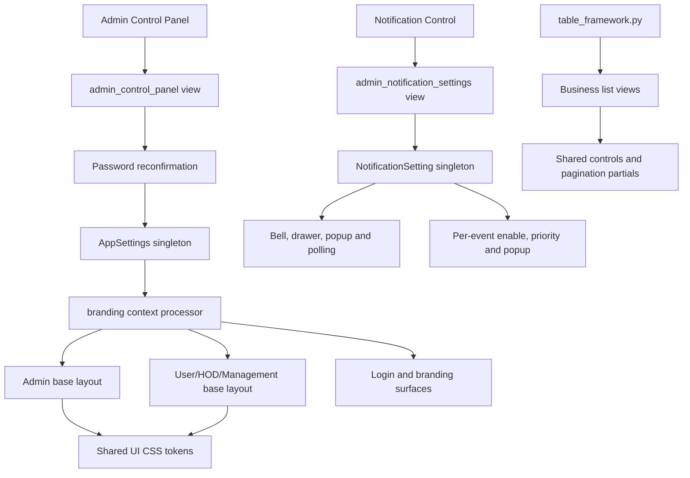
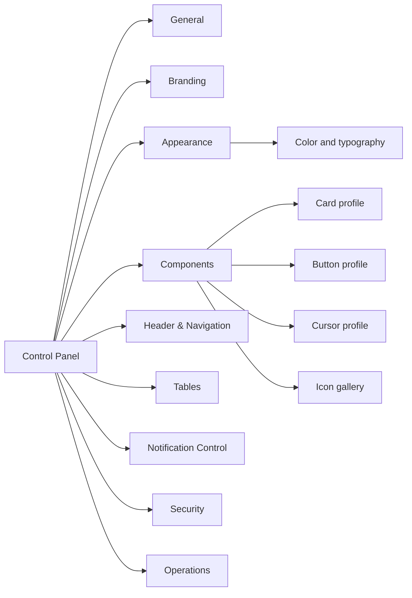

# QCMS Control Panel 2.0 Master Plan

## 1. Purpose and Evidence Base

This document audits the current QCMS Control Panel architecture and defines a non-duplicative Control Panel 2.0 design. It is based on the current repository state, including:

- `backend/models.py`
- `backend/views/admin.py`
- `backend/views/notifications.py`
- `backend/notification_service.py`
- `backend/table_framework.py`
- `qcms/context_processors.py`
- Admin and role-based base templates
- Shared UI, table, sidebar, notification, avatar, and profile assets
- Current Admin settings templates
- Current migrations and automated tests
- Existing UI, notification, table, avatar, and final implementation reports

The audit distinguishes between four states:

1. **Persisted**: a value exists in the database.
2. **Exposed**: Admin can change it in the Control Panel.
3. **Consumed**: application pages actually use it.
4. **Standardized**: one shared implementation governs all applicable modules.

This distinction matters because several keys exist in `AppSettings.theme_settings` but are neither exposed nor consumed.

## 2. Executive Assessment

QCMS already has a functional Control Panel foundation. It is not a blank-slate implementation.

The current system provides:

- A singleton `AppSettings` record for branding, theme, security, and reserved preference JSON.
- A separate singleton `NotificationSetting` record for operational notification behavior.
- Password reconfirmation before global Control Panel changes.
- Globally consumed application name, logo, favicon, brand color, and font family.
- Admin-controlled submit-time geolocation tracking.
- A complete Phase 1 Notification Control surface.
- Shared table pagination, page-size, clear-filter, and Excel-export components.
- Shared cursor, button-state, action-alignment, header-avatar, and profile systems.
- Structured audit logging for settings changes.

The principal gaps are configurability and governance, not absence of UI foundations:

- Card, button, and cursor profiles are not selectable.
- Header layout is fixed.
- Table defaults are code constants rather than Admin settings.
- Icons use a fixed CSS mask registry plus remaining emoji/glyphs; no Admin gallery exists.
- Some stored theme keys are dormant.
- Control Panel and Notification Control are separate peer navigation items rather than one settings information architecture.
- Page-local CSS still competes with shared component rules.

The recommended approach is to evolve the existing `AppSettings` aggregate and shared CSS token system. Do not create independent CardSetting, ButtonSetting, CursorSetting, HeaderSetting, TableSetting, or Icon database models.

## 3. Current Architecture



### 3.1 Access and change protection

- Both Control Panel routes require an authenticated QCMS `Admin` profile.
- General Control Panel saves and resets require the current Admin password.
- Notification Control is Admin-only but does not currently use the same password-reconfirmation flow.
- General settings updates write `settings.updated` activity events.
- Geolocation changes additionally write `geolocation_settings.updated`.
- Notification changes write `notification_settings.updated` and notify active Admin users.
- Branding uploads use the hardened branding validator and reject SVG/spoofed files.

### 3.2 Current navigation

Admin navigation currently exposes these as peer items:

- Control Panel
- Notification Control
- Logs

This works, but it separates one settings domain from the global settings center. Control Panel 2.0 should present Notification Control as a section of the Control Panel while preserving its current URL for backward compatibility.

## 4. Already Implemented Features

### 4.1 Global identity and branding

| Feature | Persisted | Admin exposed | Globally consumed | Notes |
|---|---:|---:|---:|---|
| Web application name | Yes | Yes | Yes | Used in titles, sidebar branding, and display context. |
| Application logo | Yes | Yes | Yes | Used by sidebar and login; `sidebar_logo` is mirrored from this value. |
| Favicon | Yes | Yes | Yes | Used by Admin, role-based, and login layouts. |
| Branding upload validation | N/A | Yes | Yes | Validates real image content and rejects SVG. |
| Reset to defaults | Yes | Yes | Yes | Resets app name, theme, branding, and geolocation. |
| Admin password confirmation | N/A | Yes | Yes | Required for general Control Panel saves/resets. |

### 4.2 Theme and appearance

| Feature | Persisted | Admin exposed | Globally consumed | Notes |
|---|---:|---:|---:|---|
| Global brand color | Yes | Yes | Yes | Drives header, sidebar, primary buttons, and table headers through CSS variables. |
| Font family | Yes | Yes | Yes | Applied to Admin and role-based base layouts. |
| Shared layout width token | Code | No | Yes | `--layout-max-width: 1280px`; fixed, not configurable. |
| Shared card radius/shadow tokens | Code | No | Partial | Shared cards consume them, but module/page CSS can override them. |
| Shared button states | Code | No | Partial | Hover, active, focus-visible, disabled, and reduced-motion behavior exist. |
| Shared cursor policy | Code | No | Yes | Pointer, text, and not-allowed semantics are centralized. |

### 4.3 Header and avatar system

- Shared Admin and role-based header identity.
- Circular image avatar with `object-fit: cover`.
- Circular initials fallback.
- Broken-image fallback handling.
- Profile link appropriate to Admin or non-Admin users.
- Welcome text, notification bell, and mobile behavior.
- Shared Modern Enterprise profile page and accessible crop workflow.
- Normalized 512 x 512 server-side avatar storage.

### 4.4 Universal Table Framework

The current codebase has moved beyond the earlier Phase 0 assessment. The following business list pages use the shared backend table framework and shared controls/pagination behavior:

- Users
- Projects
- Departments
- Checklists
- Responses
- Activity Logs
- Notification Control event settings
- My Checklists
- My Submissions

Implemented table behavior includes:

- Search appropriate to each dataset.
- Module-specific filters.
- Clear Filters.
- Page-size selection: 25, 50, 100, 250.
- Default page size: 25.
- Excel export of the complete filtered dataset before pagination.
- Spreadsheet formula-injection protection.
- Shared result count and current-page indicator.
- First, Previous, Next, and Last navigation.
- Query-string preservation.
- Left-aligned action columns.

Dashboard snapshots, checklist-builder configuration grids, and modal/detail tables are not business collection grids and should not automatically receive pagination or export.

### 4.5 Notification Control

Implemented settings:

- Global notification enable/disable.
- Notification bell enable/disable.
- Popup enable/disable.
- Sound enable/disable.
- Retention period from 1 to 3650 days.
- Low, Medium, High, and Critical colors.
- Per-event enable/disable.
- Per-event priority.
- Per-event popup enable/disable.
- Search, priority filter, enabled-state filter, page size, export, and pagination for event settings.

Implemented user experience:

- Bell visible to authenticated users when enabled.
- Unread count with `99+` cap.
- All, Unread, and Action Required drawer tabs.
- Mark read, mark all read, and recipient-scoped delete.
- Related-page navigation.
- Forty-five-second visibility-aware polling.
- High/Critical popup delivery.
- Priority colors and optional generated sound.
- Eight-second High and twelve-second Critical popup durations, currently hard-coded.

### 4.6 Existing icon system

The shared sidebar has a fixed semantic CSS mask registry for:

- Dashboard
- Checklist
- Response
- User/Profile
- Department
- Project
- Control/Settings
- Logs
- Logout
- Sidebar chevron

This is reusable and centrally located, but it is not an icon gallery. Notification bell, search, dashboard headings, close buttons, and profile-photo actions still include emoji or text glyphs.

## 5. Existing AppSettings Capabilities

### 5.1 Model fields

`AppSettings` currently contains:

- `web_app_name`
- `logo`
- `favicon`
- `sidebar_logo`
- `general_settings`
- `theme_settings`
- `system_preferences`
- `security_settings`
- `notification_settings`
- `updated_at`

### 5.2 Current effective ownership

| Storage area | Current values | Effective status |
|---|---|---|
| Direct fields | Name, logo, favicon, sidebar logo | Active. |
| `theme_settings` | Mode, colors, button style, font, layout width | Color and font active; other keys dormant. |
| `security_settings` | Session/password defaults, geolocation flag | Only geolocation is exposed and consumed by current application logic. |
| `general_settings` | Tagline/support defaults | Not exposed; save currently replaces it with `{}`. |
| `system_preferences` | Timezone/date defaults | Not exposed or consumed as global formatting policy. |
| `notification_settings` | Legacy email/in-app defaults | Not authoritative; operational notifications use `NotificationSetting`. |

### 5.3 Dormant or misleading settings

- `theme_settings.mode` is stored but no dark-mode implementation consumes it.
- `theme_settings.button_style` is stored/defaulted but no profile selector or CSS root attribute consumes it.
- `theme_settings.layout_width` is stored/defaulted but the page max width remains a fixed CSS token.
- Historical `primary_color`, `sidebar_color`, and `header_color` values are collapsed by the context processor into one global color.
- `sidebar_logo` is not independently controlled; saves mirror `logo` into it.
- `AppSettings.notification_settings` duplicates the domain now owned by `NotificationSetting` and should not receive new behavior.

## 6. Partially Implemented Features

| Feature | Current implementation | Missing for completion |
|---|---|---|
| Card system | Shared radius/shadow tokens and several working card types | Semantic card component contract and selectable profiles. |
| Button system | Shared states and semantic color classes | Profile selection, page-local cleanup, icon/loading standards. |
| Cursor system | Correct centralized semantic cursors | Optional profile selection; profiles must remain semantic and restrained. |
| Theme system | Brand color and font are global | Validated appearance schema, live preview, dormant-key cleanup. |
| Header system | Shared avatar, welcome text, bell | Layout choices, density, welcome-content options. |
| Icon system | Central sidebar mask registry | One library, semantic slot registry, picker, preview, and glyph removal. |
| Table system | Shared backend utilities and core controls | Admin-configurable defaults, density, and export policy. |
| Notification Control | Operational Phase 1 settings | Popup duration, history, test action, categories, templates, role/user preferences. |
| General settings | App name is active | Tagline/support values are not exposed or consumed. |
| System preferences | JSON exists | Timezone/date format are not exposed or consistently applied. |

## 7. Missing Features Matrix

| Requested capability | Current state | Reusable foundation | Recommended owner | Priority |
|---|---|---|---|---|
| Corporate Minimal card profile | Missing | Shared card tokens | `AppSettings.theme_settings` | Medium |
| Modern Enterprise card profile | Fixed styles partially resemble it | Shared card tokens/dashboard cards | `AppSettings.theme_settings` | High |
| Premium Executive card profile | Missing | Shared card tokens | `AppSettings.theme_settings` | Low |
| Corporate button profile | Missing as selectable profile | Shared `.btn/.btnx` states | `AppSettings.theme_settings` | Medium |
| Modern button profile | Current baseline is close | Shared `.btn/.btnx` states | `AppSettings.theme_settings` | High |
| Premium button profile | Missing | Shared button tokens | `AppSettings.theme_settings` | Low |
| Classic Enterprise cursor profile | Baseline semantics effectively implemented | Shared cursor policy | `AppSettings.theme_settings` | Low |
| Modern SaaS cursor profile | Missing | Shared cursor policy | `AppSettings.theme_settings` | Low |
| Premium Interactive cursor profile | Missing | Shared cursor policy | `AppSettings.theme_settings` | Low |
| Global Icon Gallery | Missing | Sidebar semantic icon names | Code registry plus stored slot mapping | High |
| Header avatar control | Rendering implemented | Shared avatar partial | `AppSettings.theme_settings` | Medium |
| Header welcome control | Fixed | Shared header partial | `AppSettings.theme_settings` | Medium |
| Header layout options | Missing | Shared base templates | `AppSettings.theme_settings` | Medium |
| Default table page size | Fixed at 25 | Shared table framework | `AppSettings.system_preferences` | High |
| Table density | Missing | Shared table CSS | `AppSettings.system_preferences` | Medium |
| Export enable/policy | Always available on supported lists | Shared exporter | `AppSettings.system_preferences` | Medium |
| Popup duration | Hard-coded 8/12 seconds | Notification client | `NotificationSetting` | High |
| Notification history page | Missing | `Notification` model | Notification domain | High |
| Test notification | Missing | Notification service | Notification domain | Medium |
| Notification categories | Missing | Event registry | Notification domain | Medium |
| Notification templates | Missing | Event title/message calls | Notification domain | Medium |
| Role/user preferences | Missing | Recipient model and role profiles | Notification domain | Medium |

Email, SLA, escalation, WebSockets/SSE, and external integrations are intentionally excluded from this plan.

## 8. Original Profile Requirements Assessment

### 8.1 Module card profiles

None of the three requested profiles is currently selectable.

- **Corporate Minimal**: not implemented.
- **Modern Enterprise**: portions exist in dashboard hover/elevation and the modern profile page, but there is no global card-profile contract.
- **Premium Executive**: not implemented.

Recommended implementation:

- Store `card_profile = corporate | modern | premium`.
- Emit `data-card-profile` on the root `.app-layout`.
- Change CSS custom properties only; do not branch template markup.
- Apply motion only to interactive module/metric cards, never passive form sections.

### 8.2 Global button profiles

No profile is selectable. The current shared baseline most closely resembles Modern.

- Preserve semantic variants: primary, secondary, success, danger, outline, ghost.
- Profiles may change radius, shadow, and motion, but must not change action meaning or contrast.
- Migrate `.ns-save`, base-template `.btn`, table `.btn`, and other page-local definitions into the shared contract before enabling profile selection.

### 8.3 Cursor profiles

The semantic cursor system is already correctly centralized. Profile selection should be intentionally subtle:

- **Classic Enterprise**: pointer with no additional interaction effects.
- **Modern SaaS**: pointer plus component hover response.
- **Premium Interactive**: pointer plus slightly stronger component response.

CSS cursor values themselves should remain standard browser cursors. No custom image cursors, oversized cursors, or misleading pointer behavior should be introduced.

### 8.4 Global Icon Gallery

The existing semantic icon names should become the migration bridge.

Recommended slots:

- Dashboard
- Users
- Projects
- Departments
- Checklists
- Responses
- Notification Control
- Activity Logs
- Settings/Control Panel
- Profile
- Logout
- Bell
- Search
- Close
- Edit
- Delete
- Approve
- Reject
- Export

Recommended implementation:

- Package one local icon library, preferably Lucide.
- Maintain a code-level allowlist such as `ICON_REGISTRY`.
- Store only icon keys by semantic slot in `AppSettings.theme_settings.icon_slots`.
- Render icons through one template tag or shared partial.
- Do not store arbitrary SVG, HTML, file paths, or remote URLs in the database.
- Provide searchable picker, category filter, preview at actual size, reset per slot, and reset all.

## 9. Duplicate-System Risks

### High risk

1. **Notification configuration duplication**
   - `AppSettings.notification_settings` exists, but `NotificationSetting` is authoritative.
   - Adding new notification controls to `AppSettings` would create conflicting sources of truth.

2. **Component CSS override layers**
   - Buttons and cards are styled in shared UI CSS, table CSS, base templates, module CSS, and inline templates.
   - Profile selection before cleanup would produce unpredictable cascade behavior.

3. **Icon duplication**
   - Embedded SVG masks, emoji, text glyphs, and bitmap assets coexist.
   - Adding an icon picker without first defining semantic slots would create another icon system.

### Medium risk

4. **Settings JSON without validation**
   - Raw JSON dictionaries are flexible but can retain obsolete keys and invalid values.
   - Saves currently replace whole dictionaries in some paths, risking unrelated setting loss.

5. **Independent Control Panel navigation**
   - General settings and Notification Control feel like separate products despite both being Admin configuration.

6. **Multiple singleton rows**
   - `get_solo()` uses `pk=1`, but the database does not structurally prevent additional rows.

7. **Control Panel-specific visual system**
   - `.cp-*` and `.ns-*` cards/buttons duplicate shared cards and controls.

### Low risk

8. **Legacy generic base template**
   - `frontend/templates/base.html` retains a separate navbar/card/button system. Its current usage should be confirmed before removal or migration.

## 10. Recommended Data Model

### 10.1 Preserve existing ownership

Use:

- `AppSettings` for global identity, appearance, navigation/header, table defaults, and security toggles.
- `NotificationSetting` for all notification behavior.
- Code registries for available component profiles and icon choices.

Do not introduce one model per visual component.

### 10.2 Recommended AppSettings schema

Continue using the existing JSON fields, but enforce an allowlisted versioned schema through a service/form layer.

```json
{
  "theme_settings": {
    "schema_version": 2,
    "global_theme_color": "#0b1b68",
    "font_family": "Inter",
    "card_profile": "modern",
    "button_profile": "modern",
    "cursor_profile": "classic",
    "header": {
      "layout": "standard",
      "show_avatar": true,
      "show_welcome_text": true,
      "density": "comfortable"
    },
    "icon_slots": {
      "dashboard": "layout-dashboard",
      "users": "users",
      "projects": "folder-kanban",
      "departments": "building-2",
      "checklists": "list-checks",
      "responses": "message-square-text",
      "notifications": "bell",
      "logs": "scroll-text",
      "settings": "settings",
      "profile": "circle-user-round",
      "logout": "log-out"
    }
  },
  "system_preferences": {
    "schema_version": 2,
    "table_default_page_size": 25,
    "table_density": "comfortable",
    "table_export_enabled": true
  }
}
```

### 10.3 Validation and update rules

- Use a Django form or settings service with explicit choices and range validation.
- Merge section updates instead of replacing entire JSON dictionaries.
- Reject unknown profile and icon keys.
- Normalize colors to six-digit hex values.
- Add `updated_by` to `AppSettings` or record actor snapshots through the existing ActivityLog.
- Log old/new deltas without recording secrets or raw upload content.
- Cache singleton settings with invalidation after save.
- Eventually add a singleton database constraint or administrative guard against extra rows.

### 10.4 Notification model recommendation

Extend `NotificationSetting`, not `AppSettings.notification_settings`, with:

- `high_popup_duration_seconds`
- `critical_popup_duration_seconds`
- Optional `poll_interval_seconds` within a safe range
- Future category/preference configuration only when implemented

Keep event definitions code-owned in the near term. This preserves stable event keys and prevents Admin from inventing unsupported events.

## 11. Recommended Control Panel 2.0 Layout

Use one settings shell with a persistent section navigation and a contextual save bar. Avoid presenting every setting in one long page.



### Page behavior

- Desktop: 220-250 px section navigation plus one content column.
- Tablet/mobile: section selector or horizontal tabs; no sticky side rail consuming viewport width.
- Each section owns its form fields and validation errors.
- One Preview mode applies unsaved appearance values to a contained preview area.
- Save only changed sections.
- Reset current section separately from Reset All.
- Require password reconfirmation for security, branding, notification, and global appearance changes.
- Show last-updated timestamp and actor where available.

## 12. Recommended Navigation Structure

### Admin sidebar

- Dashboard
- Checklists
- Responses
- Users
- Departments
- Projects
- Control Panel
- Activity Logs
- Profile

Remove Notification Control as a permanent peer item after Control Panel 2.0 is available. Preserve `/admin-panel/control-panel/notifications/` and route it into the Notification Control section.

### Control Panel internal navigation

1. General
2. Branding
3. Appearance
4. Components
5. Header & Navigation
6. Tables
7. Notification Control
8. Security
9. Operations

## 13. Recommended Sections and Tabs

### 13.1 General

- Web application name.
- Optional organization name, support email, and tagline only after their display locations are implemented.
- Timezone and date format only after all rendering paths consume them consistently.

### 13.2 Branding

- Application logo.
- Favicon.
- Optional independent sidebar logo; otherwise remove the appearance of separate ownership.
- Current asset preview and restore-default action.

### 13.3 Appearance

- Global theme color.
- Font family.
- Future light/dark mode only after a complete dark token set exists.
- Live preview for header, text, form, and table-head contrast.

### 13.4 Components

- Card profile: Corporate Minimal, Modern Enterprise, Premium Executive.
- Button profile: Corporate, Modern, Premium.
- Cursor profile: Classic Enterprise, Modern SaaS, Premium Interactive.
- Icon Gallery and semantic slot assignment.

### 13.5 Header & Navigation

- Show avatar.
- Show welcome text.
- Standard or compact header density.
- Standard or compact sidebar density.
- Header preview at desktop and mobile widths.

Do not allow arbitrary header HTML, custom CSS, or free-form layout templates.

### 13.6 Tables

- Default page size: 25, 50, 100, or 250.
- Density: compact, comfortable, spacious.
- Enable Excel export globally.
- Optional maximum export row limit with explicit feedback.
- Formula-injection protection remains mandatory and cannot be disabled.

### 13.7 Notification Control

Retain all current settings and add, in this order:

1. High/Critical popup durations.
2. Test notification action.
3. Searchable Admin notification history.
4. Category grouping of the existing stable event catalog.
5. Role-level preferences.
6. User-level preferences.
7. Safe, allowlisted message templates.

Personal bell/drawer settings must not be confused with Admin event policy.

### 13.8 Security

- Geolocation tracking.
- Future session and password controls only after backend enforcement exists.
- Clear privacy copy for data capture settings.

Never expose a setting whose backend behavior is not implemented.

### 13.9 Operations

- Read-only configuration summary.
- Last settings changes from ActivityLog.
- Cache refresh/status when caching is introduced.
- Export a redacted configuration snapshot for support.

## 14. Quick Wins

1. Add popup-duration settings to `NotificationSetting` and replace hard-coded 8/12-second values.
2. Make table default page size read from `AppSettings.system_preferences`, retaining 25 as fallback.
3. Add `data-card-profile`, `data-button-profile`, and `data-cursor-profile` root attributes with current behavior as defaults.
4. Consolidate `.cp-card` and `.ns-card` onto shared surface-card tokens.
5. Consolidate `.ns-save` and `.btnx` onto the shared button component.
6. Replace remaining search, close, notification, and profile-photo glyphs using one local allowlisted icon renderer.
7. Move Notification Control into the internal Control Panel navigation while preserving its URL.
8. Stop writing new values to `AppSettings.notification_settings`; document it as legacy pending cleanup.
9. Add explicit UI labels showing which settings are global.
10. Add tests proving each persisted setting is consumed by the expected rendered root attributes or runtime endpoint.

## 15. High-Impact Features

### 15.1 Validated settings service

This is the most important architecture improvement. It prevents JSON replacement bugs, invalid keys, and divergent defaults.

### 15.2 Root-token profile architecture

One root attribute per profile allows the entire application to switch styles without duplicating templates or CSS bundles.

### 15.3 Semantic icon registry

This removes embedded-mask/emoji fragmentation and makes icon configuration safe and maintainable.

### 15.4 Table policy controls

Global page-size, density, and export policy provide immediate operational value because the shared table framework is already deployed.

### 15.5 Unified settings navigation

Bringing Notification Control under one Control Panel makes global configuration easier to discover and reduces duplicate administrative concepts.

## 16. Recommended Delivery Order

### Stage 1: Foundation cleanup

- Introduce validated settings schema/service.
- Preserve and migrate current values.
- Add root data attributes with existing visual behavior as defaults.
- Define authoritative defaults in one Python module and one CSS token layer.
- Mark `AppSettings.notification_settings` as legacy.

### Stage 2: Low-risk operational controls

- Admin-configurable table default size and density.
- Notification popup durations.
- Header visibility/density controls.
- Updated settings audit deltas.

### Stage 3: Component profiles

- Finish shared card and button component migration.
- Add three card profiles.
- Add three button profiles.
- Add restrained cursor profiles.
- Run responsive, keyboard, reduced-motion, and contrast acceptance tests.

### Stage 4: Icon Gallery

- Package one icon library locally.
- Create allowlisted registry and semantic slots.
- Migrate sidebar masks and remaining glyphs.
- Add Admin picker, preview, and resets.

### Stage 5: Notification operational enhancements

- Test notification.
- Admin history.
- Categories.
- Role/user preferences.
- Safe templates.

Email, SLA, escalation, real-time socket infrastructure, and external integrations remain excluded.

## 17. Risks and Controls

| Risk | Impact | Control |
|---|---|---|
| CSS profiles are added before legacy overrides are removed | Profiles appear inconsistent | Complete component migration first and add visual regression coverage. |
| Raw JSON settings become malformed | Broken global UI | Allowlisted forms/service, defaults, schema version, and tests. |
| Arbitrary icon content is stored | XSS and rendering risk | Store only allowlisted icon keys. |
| Global table size creates expensive queries | Performance degradation | Limit choices to 25/50/100/250 and preserve pagination. |
| Unlimited filtered export becomes large | Memory/request pressure | Add future export row limit or streaming/background strategy based on measured volume. |
| Header controls hide essential navigation | Access problem | Avatar/welcome may be optional; navigation and logout must remain reachable. |
| Notification settings exist in two stores | Conflicting behavior | Keep `NotificationSetting` authoritative and retire legacy JSON usage. |
| Reset replaces unrelated JSON values | Configuration loss | Reset per section and merge validated keys. |
| Extra singleton rows are created | Ambiguous configuration | Enforce administrative singleton behavior and add a database-level strategy if needed. |

## 18. Acceptance Criteria

Control Panel 2.0 should be considered complete when:

- Every exposed setting has a validated persisted value and a verified consumer.
- No dormant setting is presented as functional.
- Card, button, cursor, header, icon, and table choices use shared components rather than page branches.
- Notification behavior remains exclusively owned by `NotificationSetting`.
- Current URLs and defaults remain backward compatible.
- Admin changes are authenticated, CSRF-protected, and auditable with old/new deltas.
- All profiles pass keyboard, reduced-motion, responsive, 200% zoom, and contrast checks.
- Excel export remains filtered, complete, authorized, and formula-injection safe.
- No arbitrary CSS, JavaScript, HTML, SVG, or remote asset URL can be entered through settings.

## 19. Final Recommendation

Build Control Panel 2.0 as an evolution of the existing singleton settings and shared design system, not as a second settings application.

The recommended default presentation remains **Modern Enterprise** because it is closest to the current QCMS UI and the recently implemented profile experience. Introduce Corporate Minimal and Premium Executive as token variants after shared card and button cleanup.

The first implementation work should be the validated settings schema, table defaults, popup duration, and root profile attributes. The Icon Gallery should follow only after one local icon registry replaces the current mix of CSS masks and glyphs.

Most importantly, preserve clear ownership:

- `AppSettings`: global product and UI configuration.
- `NotificationSetting`: notification policy and behavior.
- Shared CSS/components: visual implementation.
- Code registries: allowed profiles and icons.
- `ActivityLog`: immutable evidence of privileged changes.

That structure delivers Admin configurability without duplicate models, duplicate CSS systems, or multiple sources of truth.
