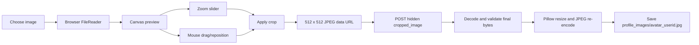
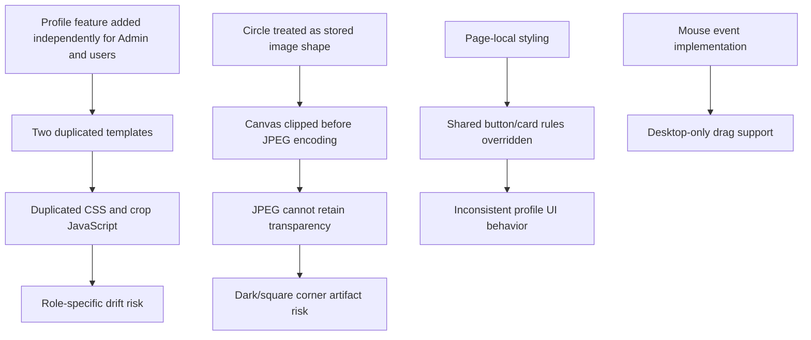
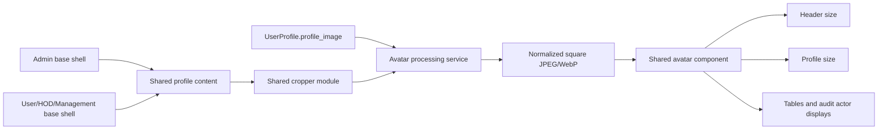

# QCMS Profile and Avatar Master Plan

## 1. Current State Audit

### Scope Reviewed

- Admin header: `frontend/templates/admin_panel/admin_base.html`
- User, HOD, and Management header: `frontend/templates/user_panel/base_user.html`
- Shared header identity: `frontend/templates/shared/header_identity.html`
- Shared avatar renderer: `frontend/templates/shared/avatar.html`
- Shared avatar CSS: `frontend/static/shared/ui_system.css`
- Admin profile: `frontend/templates/admin_panel/admin_profile.html`
- User, HOD, and Management profile: `frontend/templates/user_panel/profile.html`
- Upload/crop backend: `backend/views/user_panel.py`
- Image validation: `backend/upload_validation.py`
- Profile storage: `backend/models.py`

No application code was modified during this audit.

### Role Coverage Matrix

| Surface | Admin | User | HOD | Management | Implementation |
| --- | --- | --- | --- | --- | --- |
| Header avatar | Yes | Yes | Yes | Yes | Shared `header_identity.html` and `avatar.html` |
| Profile page | Admin template | Shared non-Admin template | Shared non-Admin template | Shared non-Admin template | Two nearly identical page templates |
| Image upload | Yes | Yes | Yes | Yes | Shared `_profile_view()` backend |
| Crop/zoom/drag | Yes | Yes | Yes | Yes | Duplicated inline JavaScript in two templates |
| Initials fallback | Yes | Yes | Yes | Yes | Shared `avatar.html` |

### Header Avatar

The header system is currently the strongest part of the implementation.

- All authenticated role headers include `shared/header_identity.html`.
- `header_identity.html` delegates visual rendering to `shared/avatar.html`.
- Header size is fixed at 34px and changes to 32px below 640px.
- The wrapper is transparent, circular, fixed-size, and non-growing.
- Images use `object-fit: cover` and centered object positioning.
- The initials fallback occupies the same dimensions as the image.
- A failed image load hides the image and reveals initials.
- The avatar is aligned with the welcome text through `.topbar-account-group`.

Current enterprise-standard result:

| Requirement | Status |
| --- | --- |
| Compact | Met |
| Circular | Met |
| Consistent role sizing | Met |
| Welcome-text alignment | Met |
| No square/black wrapper | Met in current CSS |
| No layout shift | Mostly met through fixed dimensions |

### Profile Avatar

Both profile pages call the shared avatar renderer with the `profile` size modifier.

- Profile avatar size is 112px.
- The image and initials use the same circular border and dimensions.
- The fallback now uses initials instead of the QCMS logo.
- Crop preview switches the shared component from fallback to image.

The visual renderer is shared, but the surrounding profile page and crop implementation are duplicated.

### Upload and Crop Workflow

Current workflow:



Implemented capabilities:

| Capability | Current State |
| --- | --- |
| Image selection | Native file input |
| Circle crop guide | Yes, canvas overlay with circular aperture |
| Zoom in/out | Slider from 1x to 3x; no dedicated +/- controls |
| Drag/reposition | Mouse only |
| Preview | Canvas plus shared profile avatar preview after Apply |
| Final dimensions | 512 x 512 client output, then server thumbnail max 512 x 512 |
| Final format | JPEG |
| Validation | Final decoded payload, supported image format, 2MB maximum |
| Audit event | Success and rejected-upload events logged |

### Profile Page UI

The current desktop layout is a 1.6fr/1fr grid:

- Left: personal-information card with a two-column field grid.
- Right: stacked profile-image and password cards.
- Below 980px: one-column layout and one-column information fields.

The page is functional and readable, but visually it remains a compact utility form rather than a polished enterprise identity page.

## 2. Problems Found

### High

#### Circular Canvas Encoded as JPEG

The crop script clips the output canvas to a circle and then calls `toDataURL('image/jpeg', 0.92)`. JPEG has no alpha channel, so transparent corners may flatten to dark pixels. Current circular CSS hides those corners, but the stored source can still contain a black square outside the circle and can reappear in emails, exports, browser-native previews, or future components that do not clip perfectly.

Affected area:

- Crop output in both profile templates around `saveCrop()`.
- Stored image generated by `_save_profile_image_from_data_url()`.

Recommended correction: save a clean square crop and apply circular presentation in the avatar component. The crop UI may retain a circular guide.

#### Complete Profile Template Duplication

Admin and non-Admin profile templates differ only in the base template they extend. Layout, inline CSS, forms, crop modal, and approximately the full JavaScript implementation are duplicated.

Risk:

- Fixes can be applied to one role surface but missed on another.
- Accessibility and mobile improvements require duplicate changes.
- Crop behavior can drift between Admin and other roles.

### Medium

#### Cropper Has Desktop-Only Dragging

Dragging uses `mousedown`, `mousemove`, and `mouseup`. It does not use Pointer Events or touch events, so repositioning is unreliable or unavailable on phones and tablets.

#### Crop Modal Accessibility Is Incomplete

The modal lacks:

- `role="dialog"` and `aria-modal="true"`.
- Programmatic title association.
- Focus entry and focus trapping.
- Escape-key close behavior.
- Focus restoration.
- Keyboard-accessible image repositioning.

#### Zoom Controls Are Under-Specified

Only an unlabeled range slider is present. There are no explicit Zoom In, Zoom Out, Reset, or displayed zoom-value controls. This falls short of a LinkedIn-style crop experience.

#### Inline CSS Conflicts With Shared UI Rules

Profile templates redefine `.panel-card`, `.btn`, `.btn-primary`, and `.btn-muted` after shared CSS loads. This creates cascade coupling and means profile buttons/cards do not reliably follow the global button/card system.

#### Double JPEG Compression

The browser creates a JPEG at quality 0.92, then Pillow converts it to RGB and saves it again at quality 85. This adds avoidable compression loss, especially around faces, hair, and fine detail.

#### Old Avatar Files May Be Orphaned

Saving a replacement image does not explicitly remove the previous storage object. Storage backends may create uniquely named files, producing unused profile images over time.

#### File Selection and Apply Flow Is Fragile

- Selecting a file does not automatically open the crop dialog.
- “Crop & Preview” silently does nothing before a file is loaded.
- “Save Image” can be submitted before Apply, resulting in a backend validation message.
- No loading, disabled, or successful-save state is attached to image controls.

### Low

#### Header Depends Directly on `request.user.userprofile`

The shared header assumes every authenticated user has a `UserProfile`. This is consistent with normal QCMS provisioning but is tightly coupled and can fail for manually created Django users or incomplete migrations.

#### Inline Image Error Handler

The shared avatar uses an inline `onerror` handler. It works, but a strict future Content Security Policy may block inline handlers.

#### Profile Avatar Size Is Modest

112px is functional but does not provide the presence expected from a premium identity page. A 128px to 144px profile avatar would better support image inspection without becoming decorative.

#### Missing Remove/Reset Action

Users can replace an avatar but cannot intentionally return to initials.

## 3. Root Cause Analysis



The main architectural distinction should be:

- Stored avatar: a clean, normalized square image.
- Display avatar: circular clipping supplied by the shared component.
- Crop experience: one reusable, accessible client module.
- Profile page: one shared content template with thin role-specific shells only where necessary.

## 4. Recommended Architecture



Recommended ownership:

| Concern | Recommended Owner |
| --- | --- |
| Avatar markup | `shared/avatar.html` |
| Avatar visual tokens | Dedicated shared avatar CSS or avatar section in `ui_system.css` |
| Profile page content | One shared profile-content partial |
| Profile page styling | One static profile CSS file |
| Crop interactions | One static JavaScript module |
| Image normalization | Dedicated backend service/helper |
| Validation | Existing upload validation module |
| Role routing | Existing profile views |

## 5. Avatar Component Strategy

Retain the current shared component concept and formalize its API.

Recommended component inputs:

- User/profile object.
- Size token: `xs`, `header`, `md`, `profile`.
- Optional element ID.
- Optional link wrapper handled by the caller.
- Accessible label mode.

Recommended size tokens:

| Token | Size | Use |
| --- | --- | --- |
| `xs` | 24px | Future compact actor lists |
| `header` | 34px desktop / 32px mobile | All authenticated headers |
| `md` | 48px | Future user rows or cards |
| `profile` | 128px | Profile identity area |

Rules:

- Wrapper always has explicit width, height, and `flex-basis`.
- Image always uses `display:block`, `object-fit:cover`, and `border-radius:50%`.
- No parent background behind image avatars.
- Initials use the exact same geometry and border.
- Broken images fall back through shared JavaScript, not inline handlers.
- The component must never infer profile routing; routing remains in `header_identity.html`.

## 6. Cropper Strategy

### Recommended Approach

Use a proven, locally packaged cropper library such as Cropper.js, or build one shared module using Pointer Events if external dependencies are intentionally avoided. A mature cropper is preferred because touch, wheel zoom, bounds, image orientation, and accessibility are easy to get subtly wrong.

Required behavior:

1. Selecting an image opens the crop modal immediately.
2. Circular guide with a square normalized output.
3. Mouse, touch, pen, and trackpad support.
4. Zoom slider plus explicit minus, plus, and reset buttons.
5. Drag/reposition with boundary enforcement.
6. Keyboard Escape, focus trap, focus restoration, and labeled controls.
7. Client preview before upload.
8. Server revalidation and one normalization pass.
9. Remove or replace the previous storage object transactionally.
10. Disable Save until a valid crop exists.

Quality recommendation:

- Crop to a square source at 512px or 768px.
- Prefer one server-side encoding pass.
- Use JPEG with a deliberate background fill or WebP when deployment support is confirmed.
- Apply EXIF orientation before processing.
- Strip metadata unless there is a business requirement to preserve it.

## 7. Header Strategy

The current header architecture should remain shared.

Recommended final arrangement:

```text
[Page title]                         [Avatar] [Welcome, Name] [Bell]
```

Standards:

- Fixed avatar dimensions prevent layout shift.
- Avatar and welcome text share a centered flex row.
- Header avatar remains the first account signal.
- Welcome text truncates rather than pushing the bell off-screen.
- Mobile may hide the welcome text while retaining avatar and bell.
- Header background must never leak through the image wrapper as a square.
- Use the same neutral border as the profile avatar, with contrast verified against the header color.

No separate Admin/HOD/Management/User header avatar markup should be introduced.

## 8. Profile UI Redesign Strategy

### Option A: Corporate

Layout structure:

- Two-column information form.
- Compact identity panel above or beside the information grid.
- Password section separated by a clear horizontal divider.

Avatar placement:

- 112px to 120px at the top-left of the identity area.
- Name, role, department, and project aligned beside it.

Card design:

- Flat white surfaces.
- 1px neutral borders.
- Minimal shadow and 8px radius.

Button design:

- Compact solid primary Save button.
- Neutral secondary Change/Cancel controls.
- Little or no hover movement.

Responsive behavior:

- Identity row stacks at tablet width.
- Information fields move from two columns to one.

Assessment: reliable and conservative, but visually close to the current system.

### Option B: Modern Enterprise

Layout structure:

- Full-width identity header with avatar, name, role, and account status.
- Main content below in two columns: personal information and security.
- Image-edit action attached directly to the avatar.

Avatar placement:

- 128px circular avatar partially aligned with the identity header band.
- Small camera/edit icon button at the lower edge.

Card design:

- Quiet white sections with subtle borders and restrained shadows.
- 8px radius and clear section hierarchy.
- Information presented as readable definition rows rather than many nested mini-cards.

Button design:

- Shared global buttons with consistent focus, hover, loading, and disabled states.
- Explicit “Change photo”, “Save photo”, and “Update password” actions.

Responsive behavior:

- Identity header remains horizontal on tablet and stacks cleanly on mobile.
- Security section moves below personal information.
- Crop dialog uses nearly full viewport width on mobile.

Assessment: best balance of enterprise polish, clarity, maintainability, and QCMS operational tone.

### Option C: Premium Executive

Layout structure:

- Large identity masthead with avatar, full name, role, department, project, and status.
- Personal details and security presented as spacious bands below.

Avatar placement:

- 144px avatar with stronger visual prominence and a refined border treatment.

Card design:

- More whitespace, stronger typography hierarchy, and carefully layered surfaces.
- Minimal number of cards; no card nesting.

Button design:

- Refined icon-plus-label controls, modest elevation, and polished transitions.

Responsive behavior:

- Masthead becomes centered on mobile.
- Details become a single-column reading flow.
- Cropper becomes a dedicated full-screen mobile sheet.

Assessment: visually strongest, but requires the most design QA and may feel excessive for frequent operational users.

## 9. Risks

| Risk | Impact | Mitigation |
| --- | --- | --- |
| Crop-output format change alters existing avatars | Medium | Preserve existing files; normalize only on replacement or controlled migration |
| Shared profile consolidation changes role-specific navigation | Medium | Keep thin Admin/non-Admin shell templates and share only content |
| Cropper dependency increases frontend footprint | Low/Medium | Bundle locally, pin version, and load only on profile pages |
| Touch and keyboard behavior regressions | Medium | Add Playwright mobile and keyboard acceptance coverage |
| Old files accumulate | Medium | Delete replaced files after successful new-file persistence |
| Strict CSP blocks inline handlers/scripts | Medium | Move handlers and crop code into static modules |
| Large source images affect browser memory | Medium | Enforce pre-decode limits and downscale preview safely |
| Missing `UserProfile` breaks header include | Low | Guarantee profile creation or use a defensive context helper |

## 10. Final Recommended Design

Adopt **Option B: Modern Enterprise**.

Final recommendation:

1. Keep `shared/avatar.html` as the only avatar renderer.
2. Store a normalized square source image; use CSS for circular presentation.
3. Move avatar styling into one dedicated shared component section/file with named size tokens.
4. Replace duplicated Admin/User profile bodies with one shared profile-content partial.
5. Move profile CSS and crop JavaScript out of templates into static assets.
6. Use a locally bundled mature cropper with pointer/touch support, explicit zoom controls, reset, keyboard behavior, and accessible modal semantics.
7. Use a 128px profile avatar and the existing compact 34px header avatar.
8. Present identity first, followed by personal information and security sections.
9. Reuse global button states rather than redefining `.btn` inside profile templates.
10. Add visual acceptance coverage for image/fallback avatars at desktop, tablet, and mobile widths.

### Affected Visual Areas

No screenshots were generated during this code-only audit. The identifiable visual verification areas are:

- Top-right account cluster on every authenticated page.
- Profile Image section on `/admin-panel/profile/`.
- Profile Image section on `/user/profile/` for User, HOD, and Management.
- Crop modal at desktop and mobile widths.
- Header behavior below 640px where welcome text is hidden.
- Broken/missing image fallback in both header and profile sizes.

### Acceptance Criteria for a Future Implementation

- No black or square pixels are visible around avatars on any background.
- Stored avatar source has no unintended dark corner artifact.
- Admin, User, HOD, and Management render the same component.
- Image and initials variants have identical dimensions.
- Selecting a file opens an accessible cropper.
- Zoom, drag, reset, Apply, Cancel, and Save work with mouse, touch, and keyboard.
- Profile images remain sharp at header and profile sizes.
- Replacing an avatar does not leave orphaned files.
- Profile pages contain no duplicated crop scripts or avatar CSS.
